# Informe de Proyecto — Sistema de Planificación de Producción Farmacéutica

> **Versión:** 1.0
> **Fecha:** Marzo 2026
> **Estado:** Etapa de diseño y arquitectura

---

## Tabla de contenidos

1. [Introducción](#1-introducción)
2. [Justificación](#2-justificación)
3. [Definiciones del proyecto](#3-definiciones-del-proyecto)
   - 3.1 [Objetivo general](#31-objetivo-general)
   - 3.2 [Objetivos específicos](#32-objetivos-específicos)
4. [Definiciones del sistema](#4-definiciones-del-sistema)
   - 4.1 [Objetivo general del sistema](#41-objetivo-general-del-sistema)
   - 4.2 [Límites](#42-límites)
   - 4.3 [Alcance](#43-alcance)
5. [Conocimiento del negocio](#5-conocimiento-del-negocio)
   - 5.1 [Diagrama de dominio](#51-diagrama-de-dominio)
   - 5.2 [Procesos de negocio](#52-procesos-de-negocio)
6. [Propuesta de solución](#6-propuesta-de-solución)
   - 6.1 [Propuesta funcional](#61-propuesta-funcional)
   - 6.2 [Propuesta técnica](#62-propuesta-técnica)
7. [Diagrama de arquitectura](#7-diagrama-de-arquitectura)
   - 7.1 [Descripción de capas](#71-descripción-de-capas)
   - 7.2 [Diagrama completo](#72-diagrama-completo)
8. [Requerimientos](#8-requerimientos)
   - 8.1 [Requerimientos funcionales](#81-requerimientos-funcionales)
   - 8.2 [Requerimientos no funcionales](#82-requerimientos-no-funcionales)
9. [Inicio del análisis](#9-inicio-del-análisis)
   - 9.1 [Actores del sistema](#91-actores-del-sistema)
   - 9.2 [Diagrama de casos de uso](#92-diagrama-de-casos-de-uso)
   - 9.3 [Listado de casos de uso](#93-listado-de-casos-de-uso)
10. [Trazabilidad](#10-trazabilidad)
    - 10.1 [Requerimientos funcionales → Casos de uso](#101-requerimientos-funcionales--casos-de-uso)
    - 10.2 [Casos de uso → Objetivos específicos](#102-casos-de-uso--objetivos-específicos)
    - 10.3 [Requerimientos funcionales → Módulo y etapa de desarrollo](#103-requerimientos-funcionales--módulo-y-etapa-de-desarrollo)
11. [Especificaciones de casos de uso](#11-especificaciones-de-casos-de-uso)
    - 11.1 [Autenticación](#111-autenticación)
    - 11.2 [Catálogo](#112-catálogo)
    - 11.3 [Planificación](#113-planificación)
    - 11.4 [Ejecución](#114-ejecución)
    - 11.5 [Historial y estadísticas](#115-historial-y-estadísticas)
    - 11.6 [Casos de uso automatizados](#116-casos-de-uso-automatizados)
12. [Diagramas de secuencia](#12-diagramas-de-secuencia)
    - 12.1 [Autenticación](#121-autenticación)
    - 12.2 [Catálogo](#122-catálogo)
    - 12.3 [Planificación](#123-planificación)
    - 12.4 [Ejecución](#124-ejecución)
    - 12.5 [Historial y estadísticas](#125-historial-y-estadísticas)
    - 12.6 [Automatizados](#126-automatizados)
13. [Diagramas de clases del análisis](#13-diagramas-de-clases-del-análisis)
    - 13.1 [CU-001 — Autenticación](#131-cu-001--autenticación)
    - 13.2 [CU-002 — Gestionar productos](#132-cu-002--gestionar-productos)
    - 13.3 [CU-003 — Definir receta de producto](#133-cu-003--definir-receta-de-producto)
    - 13.4 [CU-004 — Gestionar equipos físicos](#134-cu-004--gestionar-equipos-físicos)
    - 13.5 [CU-005 — Crear lote de producción](#135-cu-005--crear-lote-de-producción)
    - 13.6 [CU-006 — Asignar etapa a equipo y horario](#136-cu-006--asignar-etapa-a-equipo-y-horario)
    - 13.7 [CU-007 — Formar campaña de producción](#137-cu-007--formar-campaña-de-producción)
    - 13.8 [CU-008 — Evaluar impacto de deshacer campaña](#138-cu-008--evaluar-impacto-de-deshacer-campaña)
    - 13.9 [CU-009 — Programar actividad paralela](#139-cu-009--programar-actividad-paralela)
    - 13.10 [CU-010 a CU-012 — Vistas del Gantt](#1310-cu-010-a-cu-012--vistas-del-gantt)
    - 13.11 [CU-013 — Registrar inicio de etapa](#1311-cu-013--registrar-inicio-de-etapa)
    - 13.12 [CU-014 — Registrar fin de etapa](#1312-cu-014--registrar-fin-de-etapa)
    - 13.13 [CU-015 — Mover proceso a nuevo horario](#1313-cu-015--mover-proceso-a-nuevo-horario)
    - 13.14 [CU-016 — Pausar proceso](#1314-cu-016--pausar-proceso)
    - 13.15 [CU-017 — Reanudar proceso](#1315-cu-017--reanudar-proceso)
    - 13.16 [CU-018 — Registrar ejecución parcial](#1316-cu-018--registrar-ejecución-parcial)
    - 13.17 [CU-019 — Reprogramar proceso con motivo](#1317-cu-019--reprogramar-proceso-con-motivo)
    - 13.18 [CU-020 — Consultar estado del equipo](#1318-cu-020--consultar-estado-del-equipo)
    - 13.19 [CU-021 — Consultar historial de lote](#1319-cu-021--consultar-historial-de-lote)
    - 13.20 [CU-022 — Consultar divergencias pendientes](#1320-cu-022--consultar-divergencias-pendientes)
    - 13.21 [CU-023 — Consultar estadísticas de duración](#1321-cu-023--consultar-estadísticas-de-duración)
    - 13.22 [CU-024 — Detectar conflicto de disponibilidad](#1322-cu-024--detectar-conflicto-de-disponibilidad)
    - 13.23 [CU-025 — Emitir alerta preventiva de límite](#1323-cu-025--emitir-alerta-preventiva-de-límite)
    - 13.24 [CU-026 — Sugerir formación de campaña](#1324-cu-026--sugerir-formación-de-campaña)
    - 13.25 [CU-027 — Recalcular fechas de actividades paralelas](#1325-cu-027--recalcular-fechas-de-actividades-paralelas)
    - 13.26 [CU-028 — Detectar y alertar divergencia confirmada](#1326-cu-028--detectar-y-alertar-divergencia-confirmada)
    - 13.27 [CU-029 — Sincronizar plan en tiempo real](#1327-cu-029--sincronizar-plan-en-tiempo-real)
    - 13.28 [CU-030 — Recalcular estadísticas de duración](#1328-cu-030--recalcular-estadísticas-de-duración)
14. [Diagrama de Gantt](#14-diagrama-de-gantt)
15. [Diagramas de clases del diseño](#15-diagramas-de-clases-del-diseño)
    - 15.1 [CU-001 — Autenticación](#151-cu-001--autenticación)
    - 15.2 [CU-002 — Gestionar productos](#152-cu-002--gestionar-productos)
    - 15.3 [CU-003 — Definir receta de producto](#153-cu-003--definir-receta-de-producto)
    - 15.4 [CU-004 — Gestionar equipos físicos](#154-cu-004--gestionar-equipos-físicos)
    - 15.5 [CU-005 — Crear lote de producción](#155-cu-005--crear-lote-de-producción)
    - 15.6 [CU-006 — Asignar etapa a equipo y horario](#156-cu-006--asignar-etapa-a-equipo-y-horario)
    - 15.7 [CU-007 — Formar campaña de producción](#157-cu-007--formar-campaña-de-producción)
    - 15.8 [CU-008 — Evaluar impacto de deshacer campaña](#158-cu-008--evaluar-impacto-de-deshacer-campaña)
    - 15.9 [CU-009 — Programar actividad paralela](#159-cu-009--programar-actividad-paralela)
    - 15.10 [CU-010 a CU-012 — Vistas del Gantt](#1510-cu-010-a-cu-012--vistas-del-gantt)
    - 15.11 [CU-013 — Registrar inicio de etapa](#1511-cu-013--registrar-inicio-de-etapa)
    - 15.12 [CU-014 — Registrar fin de etapa](#1512-cu-014--registrar-fin-de-etapa)
    - 15.13 [CU-015 — Mover proceso a nuevo horario](#1513-cu-015--mover-proceso-a-nuevo-horario)
    - 15.14 [CU-016 — Pausar proceso](#1514-cu-016--pausar-proceso)
    - 15.15 [CU-017 — Reanudar proceso](#1515-cu-017--reanudar-proceso)
    - 15.16 [CU-018 — Registrar ejecución parcial](#1516-cu-018--registrar-ejecución-parcial)
    - 15.17 [CU-019 — Reprogramar proceso con motivo](#1517-cu-019--reprogramar-proceso-con-motivo)
    - 15.18 [CU-020 — Consultar estado del equipo](#1518-cu-020--consultar-estado-del-equipo)
    - 15.19 [CU-021 — Consultar historial de lote](#1519-cu-021--consultar-historial-de-lote)
    - 15.20 [CU-022 — Consultar divergencias pendientes](#1520-cu-022--consultar-divergencias-pendientes)
    - 15.21 [CU-023 — Consultar estadísticas de duración](#1521-cu-023--consultar-estadísticas-de-duración)
    - 15.22 [CU-024 — Detectar conflicto de disponibilidad](#1522-cu-024--detectar-conflicto-de-disponibilidad)
    - 15.23 [CU-025 — Emitir alerta preventiva de límite](#1523-cu-025--emitir-alerta-preventiva-de-límite)
    - 15.24 [CU-026 — Sugerir formación de campaña](#1524-cu-026--sugerir-formación-de-campaña)
    - 15.25 [CU-027 — Recalcular fechas de actividades paralelas](#1525-cu-027--recalcular-fechas-de-actividades-paralelas)
    - 15.26 [CU-028 — Detectar y alertar divergencia confirmada](#1526-cu-028--detectar-y-alertar-divergencia-confirmada)
    - 15.27 [CU-029 — Sincronizar plan en tiempo real](#1527-cu-029--sincronizar-plan-en-tiempo-real)
    - 15.28 [CU-030 — Recalcular estadísticas de duración](#1528-cu-030--recalcular-estadísticas-de-duración)
16. [Etapa de implementación](#16-etapa-de-implementación)
    - 16.1 [Diagrama de despliegue — Entorno de desarrollo](#161-diagrama-de-despliegue--entorno-de-desarrollo)
    - 16.2 [Diagrama de despliegue — Entorno de producción](#162-diagrama-de-despliegue--entorno-de-producción)
    - 16.3 [Descripción de nodos y artefactos](#163-descripción-de-nodos-y-artefactos)
17. [Etapa de pruebas](#17-etapa-de-pruebas)
    - 17.1 [Estrategia de pruebas](#171-estrategia-de-pruebas)
    - 17.2 [Planes de prueba por caso de uso](#172-planes-de-prueba-por-caso-de-uso)
18. [Diagrama de entidad-relación](#18-diagrama-de-entidad-relación)
    - 18.1 [Diagrama](#181-diagrama)
    - 18.2 [Notas de diseño de la base de datos](#182-notas-de-diseño-de-la-base-de-datos)

---

## 1. Introducción

El presente informe describe el diseño y planificación del desarrollo de un **sistema de planificación y seguimiento de producción farmacéutica** destinado a reemplazar el flujo de trabajo actual de un laboratorio real, que opera sobre un archivo de Google Sheets utilizado como timeline tipo Gantt.

El laboratorio gestiona la fabricación de medicamentos (comprimidos, cápsulas y sus distintas presentaciones) a través de múltiples equipos físicos: granuladoras, comprimidoras, paila de recubrimiento, blisteras y líneas de empaque. Cada producto sigue una ruta de producción variable, con dependencias secuenciales estrictas, límites de tiempo entre etapas intermedias, y aprobaciones de control de calidad que condicionan el avance del proceso.

La planificación de producción involucra tres roles diferenciados:

- **Programador:** construye el plan a un horizonte de tres meses a partir de una instrucción del Jefe de Planificación.
- **Coordinador de Producción:** ajusta el plan en tiempo real según lo que ocurre en el laboratorio día a día.
- **Responsables de Equipo:** consultan el estado actual de lo programado para su equipo.

El sistema a desarrollar no genera automáticamente el plan de producción ni produce documentación regulatoria. Su función es asistir a los usuarios en traducir la instrucción del Jefe de Planificación a un timeline ejecutable, mantenerlo actualizado frente a la realidad, registrar lo que efectivamente ocurrió, y alertar cuando la ejecución se desvía de las restricciones definidas en la receta del producto.

---

## 2. Justificación

El sistema actual basado en Google Sheets presenta limitaciones estructurales que generan riesgos operativos concretos y cotidianos:

| Problema | Impacto operativo |
|---|---|
| Procesos que se borran al copiar/pegar celdas | Pérdida irreversible de información de planificación |
| Procesos duplicados en distintas partes del timeline | Inconsistencia y confusión sobre qué está vigente |
| Sin detección de conflictos de recursos | Dos procesos pueden asignarse al mismo equipo en el mismo horario sin ningún aviso |
| Sin estados de proceso | No existe distinción entre lo planificado y lo realmente ejecutado |
| Sin historial de cambios | Si algo se modifica o borra, no hay registro de qué era antes ni quién lo cambió |
| Tiempos de proceso basados en intuición | Las estimaciones no se apoyan en mediciones reales de ejecuciones anteriores |
| Campañas de producción gestionadas informalmente | Dependen de la memoria del planificador; el ahorro de tiempos de setup no se calcula ni se comunica |
| Actividades paralelas fuera del timeline | La impresión de aluminio y la preparación de estuches no se gestionan junto al plan principal |
| Aprobaciones de QA invisibles | No aparecen en el timeline; generan sorpresas y demoras no planificadas |
| Límites de tiempo entre etapas invisibles | Se pueden violar sin que nadie lo detecte, generando informes de divergencia tardíos o incompletos |
| Ejecuciones parciales sin registro | No hay trazabilidad de cuánto se procesó de cada presentación ni en qué momento |
| Comunicación entre roles informal y tardía | El Programador se entera de los ajustes del Coordinador solo cuando va a emitir una orden |
| Granularidad de días sin horas laborales | No permite ajustes precisos en la programación ni cálculos reales de disponibilidad |

La dependencia de una hoja de cálculo como sistema crítico de planificación representa un riesgo para la continuidad operativa del laboratorio. La pérdida o corrupción accidental de datos, la ausencia de validaciones automáticas y la falta de trazabilidad son incompatibles con las exigencias de calidad y auditoría propias de la industria farmacéutica.

Este proyecto busca resolver esas limitaciones mediante un sistema diseñado específicamente sobre el modelo de dominio real del laboratorio, con entidades con identidad propia, acciones explícitas y validadas, y registro inmutable de todo lo ocurrido.

---

## 3. Definiciones del proyecto

### 3.1 Objetivo general

Desarrollar un sistema web full-stack de planificación y seguimiento de producción farmacéutica que reemplace el uso de Google Sheets como herramienta de gestión del timeline productivo, garantizando integridad de la información, detección proactiva de conflictos de recursos, trazabilidad completa del ciclo de vida de cada lote, y comunicación en tiempo real entre los distintos roles del proceso.

---

### 3.2 Objetivos específicos

**1. Modelar el dominio farmacéutico con fidelidad**
Representar en el sistema las entidades reales del laboratorio: productos con recetas y rutas de producción variables, lotes con su árbol de bifurcación dosis/presentación, equipos físicos con sus calendarios de disponibilidad, campañas de producción, actividades paralelas, etapas de QA, y límites de tiempo entre etapas.

**2. Reemplazar la manipulación directa del Gantt por acciones nombradas y validadas**
Implementar un conjunto de acciones explícitas (registrar inicio, registrar fin, mover proceso, pausar, registrar parcial, reprogramar) que validan su impacto antes de aplicarse: conflictos de recursos, etapas dependientes afectadas, campañas comprometidas, y límites de tiempo en riesgo.

**3. Detectar y comunicar conflictos y divergencias en tiempo real**
Implementar dos modos de alerta: preventivo durante la planificación y reprogramación, y confirmado cuando los tiempos reales de ejecución superan los límites definidos en la receta, proveyendo los datos objetivos necesarios para el informe de divergencia manual.

**4. Construir un historial de ejecución inmutable**
Registrar de forma append-only, con autor y timestamp, cada cambio de estado, reprogramación, ejecución parcial y divergencia detectada, haciendo que los errores sean recuperables y que el sistema sea auditable.

**5. Proveer un Gantt interactivo con granularidad horaria**
Integrar DHTMLX Gantt con React y TypeScript para ofrecer tres vistas del mismo plan: por equipo/recurso (vista clásica), por lote (todas las etapas atravesando equipos), y por recurso crítico (foco en Paila de Recubrimiento, GVH y GVS).

**6. Sincronizar el estado del plan entre roles en tiempo real**
Implementar comunicación mediante WebSockets (Socket.io) para que los cambios realizados por el Coordinador sean visibles inmediatamente para el Programador y los Responsables de Equipo, sin necesidad de refrescar la página.

**7. Construir estadística de duraciones basada en datos reales**
Acumular tiempos reales de ejecución por combinación producto + etapa + equipo para reemplazar progresivamente las estimaciones manuales iniciales por valores calculados con indicador de nivel de confianza.

**8. Gestionar campañas de producción como entidad explícita**
Modelar las campañas con reducción automática de tiempos de setup, sugerencia proactiva cuando se detectan lotes del mismo producto en proximidad temporal, y cálculo de impacto si una campaña se deshace.

**9. Integrar actividades paralelas al timeline productivo**
Incluir en el plan la impresión de aluminio y la preparación de estuches como entidades con dependencias temporales calculadas hacia atrás desde las etapas productivas que alimentan, con recálculo automático si esas etapas se reprograman.

**10. Deployar el sistema en un entorno reproducible y documentado**
Containerizar la aplicación con Docker y deployarla en Railway con PostgreSQL y Redis managed, documentando la arquitectura, las instrucciones de instalación y un seed de datos de demostración para uso como portfolio.

---

## 4. Definiciones del sistema

### 4.1 Objetivo general del sistema

El sistema tiene por objeto proveer a los equipos de planificación y coordinación de un laboratorio farmacéutico una herramienta centralizada, confiable y trazable para gestionar el timeline de producción. Debe asistir al Programador en traducir la instrucción del Jefe de Planificación en un plan ejecutable, permitir al Coordinador de Producción ajustarlo en tiempo real frente a los eventos del laboratorio, y ofrecer a los Responsables de Equipo visibilidad inmediata sobre lo programado para sus recursos, garantizando en todo momento la integridad de los datos y el registro permanente de lo ocurrido.

---

### 4.2 Límites

Los límites definen explícitamente lo que el sistema **no hace**, para evitar ambigüedades de alcance durante el desarrollo.

**El sistema no genera el plan de producción.**
La instrucción de qué lotes fabricar y en qué cantidades proviene del Jefe de Planificación en forma de archivo externo (Excel). El sistema recibe esa instrucción como input y asiste a los usuarios en ejecutarla; no calcula ni propone de forma autónoma qué producir.

**El sistema no genera documentación regulatoria.**
No produce órdenes de producción, informes de divergencia, registros de batch ni ningún otro documento exigido por la normativa farmacéutica. Cuando detecta una divergencia, reúne y presenta los datos objetivos necesarios (lote, etapas, límite definido, tiempo real, timestamps), pero la confección del documento regulatorio se realiza manualmente y fuera del sistema.

**El sistema no controla equipos físicos.**
No tiene integración con PLCs, sensores ni sistemas SCADA. Todos los datos de inicio, fin y estado de los procesos son ingresados manualmente por el Coordinador de Producción.

**El sistema no gestiona materiales ni inventario.**
La disponibilidad de materias primas, materiales de acondicionamiento y cualquier otro insumo es información externa. El sistema puede recibir el motivo de una reprogramación ("materiales no aprobados"), pero no tiene módulo de gestión de stock ni integración con sistemas de compras o almacenes.

**El sistema no gestiona recursos humanos.**
No considera la disponibilidad de operarios, turnos de personal ni ausencias. El calendario de disponibilidad modelado corresponde exclusivamente a los equipos físicos del laboratorio.

**El sistema no tiene módulo de reportes regulatorios.**
No genera reportes de calidad, no certifica procesos ni tiene salida en formatos regulatorios (FDA, ANMAT, EMA). Es una herramienta operativa interna de planificación.

**Los roles son tres y están fijos.**
El sistema contempla exactamente tres roles: Programador, Coordinador de Producción y Responsable de Equipo. No incluye gestión de usuarios administrables desde la UI, alta de nuevos roles, ni configuración de permisos en tiempo de ejecución.

---

### 4.3 Alcance

El alcance define las capacidades concretas que el sistema **sí cubre** en su versión inicial.

#### Gestión del catálogo
- Alta, edición y baja de productos con sus recetas completas: secuencia de etapas, tipo de equipo requerido por etapa, límites de tiempo entre etapas consecutivas, etapas de QA intermedias, y punto de bifurcación dosis/presentación.
- Alta, edición y baja de equipos físicos con sus calendarios de disponibilidad: horario laboral del laboratorio, mantenimientos programados y bloqueos por falla.
- Validación de reglas del dominio al guardar recetas (por ejemplo: todo lote que pase por GVH debe tener GVS inmediatamente después).

#### Planificación del timeline
- Creación de lotes asociados a un producto y su receta, con identificador único de lote farmacéutico.
- Asignación de cada etapa del lote a un equipo físico específico y un rango horario con granularidad horaria sobre calendario laboral.
- Detección de conflictos de disponibilidad de equipos antes de confirmar cualquier asignación.
- Alertas preventivas cuando el intervalo planificado entre etapas consecutivas supera el límite definido en la receta.
- Formación de campañas de producción: agrupación explícita de lotes del mismo producto en el mismo equipo de forma consecutiva, con cálculo automático de reducción de tiempos de setup.
- Sugerencia proactiva de campañas cuando se detectan lotes del mismo producto en proximidad temporal.
- Programación de actividades paralelas (impresión de aluminio, preparación de estuches) con fechas límite calculadas hacia atrás desde la etapa productiva que alimentan.
- Recálculo automático de fechas límite de actividades paralelas cuando la etapa productiva asociada se reprograma.
- Tres vistas del mismo plan: por equipo/recurso (Gantt clásico), por lote (todas las etapas atravesando equipos), y por recurso crítico (foco en Paila de Recubrimiento, GVH y GVS).

#### Ejecución y seguimiento en tiempo real
- Acciones nombradas y explícitas para el Coordinador: registrar inicio, registrar fin, mover proceso, pausar, adelantar, registrar ejecución parcial, reprogramar con motivo.
- Previsualización del impacto de cada acción antes de confirmarla: conflictos de recursos, etapas dependientes afectadas, campañas comprometidas, límites de tiempo en riesgo.
- Registro de ejecuciones parciales con cantidad procesada por instancia, por rama (combinación dosis/presentación) del lote.
- Estados completos de cada etapa de proceso: planificada, iniciada, en curso, terminada, pausada, cancelada.
- Detección de divergencias confirmadas: cuando los tiempos reales registrados superan el límite de tiempo definido en la receta, el sistema alerta con los datos objetivos al Programador y al Coordinador.
- Vista de solo lectura filtrada por equipo para los Responsables de Equipo.
- Sincronización en tiempo real entre todos los roles mediante WebSockets: los cambios son visibles de forma inmediata sin necesidad de refrescar la página.

#### Historial y trazabilidad
- Registro inmutable (append-only) de todos los eventos: cambios de estado, reprogramaciones con motivo, ejecuciones parciales con cantidades, divergencias detectadas. Enforzado a nivel de base de datos con triggers de PostgreSQL.
- Trazabilidad completa del ciclo de vida de un lote: desde su creación hasta su despacho, incluyendo cada rama del árbol dosis/presentación.
- Visualización del historial de un lote con todos sus eventos ordenados cronológicamente.

#### Estadísticas de duración
- Acumulación de tiempos reales de ejecución por combinación producto + etapa + equipo físico.
- Cálculo de promedios y desvíos estadísticos a medida que se acumulan datos, mediante jobs asíncronos (BullMQ).
- Indicador de nivel de confianza de cada estimación según la cantidad de ejecuciones registradas.
- Al inicio del sistema, las estimaciones son ingresadas manualmente; se reemplazan progresivamente por los valores calculados.

#### Autenticación y roles
- Autenticación con sesión persistente mediante Better Auth.
- Tres roles con interfaces diferenciadas: Programador (construcción del plan), Coordinador de Producción (ajuste en tiempo real), Responsable de Equipo (lectura filtrada por equipo).
- Redirección automática al dashboard correspondiente según el rol al iniciar sesión.

#### Infraestructura y deployment
- Entorno de desarrollo reproducible mediante Docker Compose con PostgreSQL y Redis.
- Deployment en Railway con PostgreSQL y Redis managed.
- Seed de datos de demostración para visualización del sistema como portfolio.

---

## 5. Conocimiento del negocio

### 5.1 Diagrama de dominio

El diagrama representa las entidades principales del sistema y sus relaciones. Refleja directamente el modelo de dominio del laboratorio tal como está definido en la documentación del proyecto.

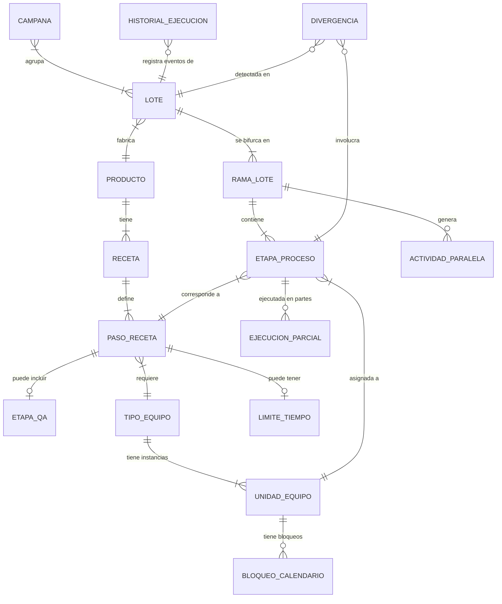

**Notas sobre el modelo:**

- `RECETA` es la fuente de verdad sobre cómo se fabrica un `PRODUCTO`. Es estable en el tiempo y se toma como snapshot al crear un `LOTE`.
- `RAMA_LOTE` representa cada combinación dosis/presentación. Antes del punto de bifurcación (Acondicionamiento), el lote tiene una única rama (el tronco). A partir de ahí, cada dosis + presentación es una unidad de ejecución independiente.
- `LIMITE_TIEMPO` es un atributo de la transición entre dos `PASO_RECETA` consecutivos, no de la etapa en sí. No toda transición tiene límite.
- `ETAPA_QA` está modelada como etapa especial dentro de la receta, con duración estimada y capacidad de bloquear el avance al paso siguiente.
- `HISTORIAL_EJECUCION` es append-only. No admite UPDATE ni DELETE; esto se enforza con triggers de PostgreSQL.
- `CAMPANA` agrupa dos o más `LOTE` del mismo producto asignados consecutivamente al mismo equipo, con reducción calculada de tiempos de setup.

---

### 5.2 Procesos de negocio

Se describen los tres procesos principales del sistema, correspondientes a los flujos de trabajo de cada rol.

---

#### Proceso 1 — Construcción del plan (Programador)

El Programador recibe la instrucción del Jefe de Planificación y construye el timeline de los próximos tres meses.

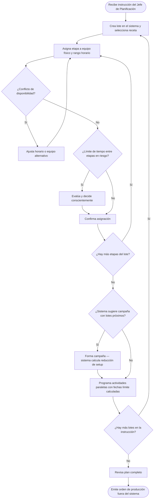

---

#### Proceso 2 — Ajuste en ejecución (Coordinador de Producción)

El Coordinador opera sobre el plan activo día a día, registrando lo que realmente ocurre en el laboratorio.

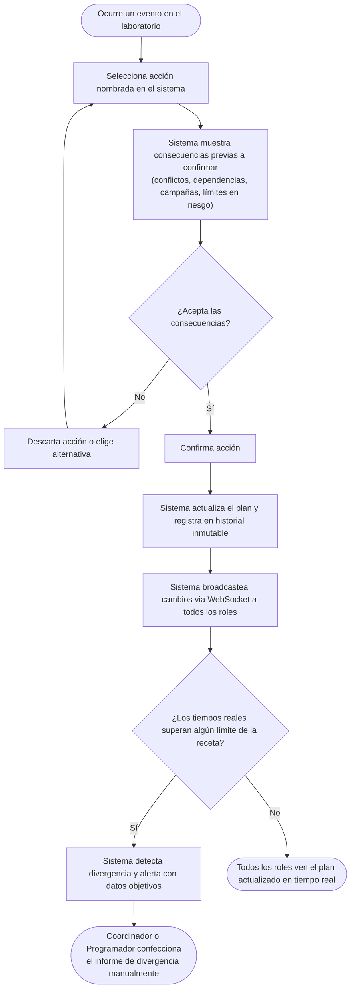

---

#### Proceso 3 — Ciclo de vida de una etapa de proceso

Cada etapa de proceso recorre un conjunto de estados explícitos. Ningún cambio de estado ocurre por manipulación directa; siempre es resultado de una acción nombrada del Coordinador.

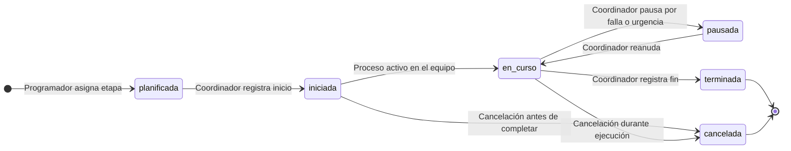

> Cada transición de estado queda registrada en `HISTORIAL_EJECUCION` con autor, timestamp y motivo. Si el tiempo entre el fin de una etapa y el inicio de la siguiente supera el límite definido en la receta, se registra una `DIVERGENCIA` y se emite una alerta.

---

## 6. Propuesta de solución

### 6.1 Propuesta funcional

La propuesta funcional describe las capacidades del sistema organizadas por módulo, tal como las experimentan los usuarios de cada rol.

---

#### Módulo de Catálogo

Es el punto de partida del sistema. El Programador configura aquí las entidades estables que no cambian con el tiempo y que son la base de toda la planificación.

**Gestión de productos y recetas**

Por cada producto se define su receta completa: la secuencia ordenada de etapas productivas, el tipo de equipo que requiere cada una, los límites de tiempo máximo permitido entre etapas consecutivas (cuando aplica), las etapas de aprobación de QA intermedias con su duración estimada y si bloquean o no el avance, y el punto de bifurcación donde el lote se divide en ramas por dosis y presentación.

El sistema valida la consistencia de las recetas al guardarlas. Por ejemplo, si una receta incluye el paso GVH, el sistema verifica que el paso siguiente sea obligatoriamente GVS (mezclado final). Estas reglas del dominio no se documentan en un manual externo, sino que están modeladas en el sistema.

**Gestión de equipos físicos**

Por cada equipo físico se registra su tipo (Comprimidora, Paila, GVS, GVH, Blistera, etc.), su identificador individual, y su calendario de disponibilidad: horario laboral del laboratorio, mantenimientos programados y bloqueos por fallas. La disponibilidad de equipos es la fuente de verdad que el sistema consulta para detectar conflictos.

---

#### Módulo de Planificación

Es el espacio de trabajo del Programador. A partir de la instrucción del Jefe de Planificación, construye el timeline de producción para los próximos tres meses.

**Creación de lotes y asignación de etapas**

El Programador crea cada lote indicando el producto y la cantidad. El sistema instancia automáticamente las etapas del proceso a partir de la receta del producto. Luego, el Programador asigna cada etapa a un equipo físico específico (dentro del tipo requerido por la receta) y define el rango horario de ejecución con granularidad horaria sobre el calendario laboral real, no en días calendario.

Antes de confirmar cada asignación, el sistema muestra en tiempo real si el equipo seleccionado está disponible en el rango propuesto. Si hay un conflicto, lo alerta antes de que el usuario confirme. Si el intervalo planificado entre dos etapas consecutivas supera el límite definido en la receta, el sistema emite una alerta preventiva, pero no bloquea: el usuario decide conscientemente y la asignación queda registrada.

**Campañas de producción**

Cuando el Programador detecta —o el sistema sugiere proactivamente— que hay dos o más lotes del mismo producto en proximidad temporal, puede agruparlos en una campaña. El sistema calcula automáticamente la reducción de tiempos de limpieza y setup entre lotes, y muestra el impacto de deshacerla si un lote de la campaña sufre demoras en sus materiales.

**Actividades paralelas**

El Programador programa la impresión de aluminio y la preparación de estuches como actividades integradas al plan. El sistema calcula hacia atrás la fecha límite de cada actividad en función del horario planificado de la etapa productiva que alimenta. Si esa etapa se reprograma, las fechas límite de las actividades paralelas se recalculan automáticamente.

**Vistas del Gantt**

El Programador dispone de tres vistas del mismo plan, todas en tiempo real:

| Vista | Descripción |
|---|---|
| **Por equipo / recurso** | Gantt clásico. Filas = equipos físicos. Columnas = tiempo. Muestra todos los procesos asignados a cada equipo. |
| **Por lote** | Todas las etapas de un lote atravesando los distintos equipos. Permite ver la cadena completa de producción de un lote de un vistazo. |
| **Por recurso crítico** | Foco en los cuellos de botella: Paila de Recubrimiento, GVH y GVS. Resalta su nivel de ocupación y los conflictos potenciales. |

---

#### Módulo de Ejecución

Es el espacio de trabajo del Coordinador de Producción. Opera sobre el plan activo en horizonte de dos a tres días, registrando lo que realmente ocurre en el laboratorio.

**Acciones nombradas y validadas**

Ningún cambio se aplica por manipulación directa del timeline. El Coordinador ejecuta acciones explícitas con nombre:

| Acción | Descripción |
|---|---|
| Registrar inicio | Marca el comienzo real de una etapa de proceso |
| Registrar fin | Marca el fin real, con el horario efectivo |
| Mover proceso | Reprograma una etapa a un nuevo rango horario |
| Pausar proceso | Interrumpe una etapa en curso por falla o urgencia |
| Reanudar proceso | Reactiva una etapa pausada |
| Registrar parcial | Registra que solo se procesó una parte de la rama, indicando la cantidad |
| Reprogramar con motivo | Cambia horario con registro del motivo (materiales no aprobados, urgencia comercial, falla de equipo, etc.) |

Antes de confirmar cualquiera de estas acciones, el sistema muestra las consecuencias: conflictos de recursos generados, etapas dependientes afectadas, campañas comprometidas, y límites de tiempo en riesgo.

**Ejecuciones parciales**

Cuando el Coordinador decide procesar solo una parte de una rama del lote (por ejemplo, ante un cuello de botella en la Paila), registra la cantidad procesada. El número de lote farmacéutico no cambia; el sistema registra la ejecución parcial y mantiene el estado de la etapa como incompleta hasta que la suma de las ejecuciones alcance la cantidad total de la rama.

**Detección de divergencias**

Cuando los tiempos reales registrados superan el límite de tiempo definido en la receta para una transición entre etapas, el sistema detecta la divergencia y alerta inmediatamente al Programador y al Coordinador con los datos objetivos: lote, etapas involucradas, límite definido en la receta, tiempo real transcurrido y timestamp de detección. El sistema no genera el informe de divergencia; provee los datos para que el responsable lo confeccione manualmente según el proceso regulatorio del laboratorio.

**Vista de los Responsables de Equipo**

Los Responsables de Equipo acceden a una vista de solo lectura filtrada por su equipo. Muestra los procesos planificados, los horarios asignados y el estado actual de cada proceso. Se actualiza en tiempo real mediante WebSockets sin necesidad de refrescar la página.

---

#### Módulo de Historial y Estadísticas

**Historial de ejecución inmutable**

Cada evento del sistema queda registrado de forma permanente: cambios de estado con autor y timestamp, reprogramaciones con motivo, ejecuciones parciales con cantidades, y divergencias detectadas con sus datos completos. El historial es append-only: no admite modificaciones ni eliminaciones. Esta restricción se enforza a nivel de base de datos mediante triggers de PostgreSQL, no solo a nivel de aplicación.

El Programador puede consultar el historial completo de cualquier lote: ver su ciclo de vida desde la creación hasta el despacho, incluyendo cada rama del árbol dosis/presentación y todos los eventos ocurridos.

**Estadísticas de duración**

El sistema construye estadística de duraciones reales por combinación producto + etapa + equipo físico. Al inicio del proyecto, las estimaciones de duración se ingresan manualmente. A medida que se acumulan datos de ejecuciones reales, el sistema recalcula automáticamente promedios y desvíos mediante jobs asíncronos. Cada estimación muestra un indicador de nivel de confianza que refleja la cantidad de datos disponibles.

---

### 6.2 Propuesta técnica

#### Stack tecnológico

| Capa | Tecnología | Justificación |
|---|---|---|
| **Frontend framework** | React + TypeScript | Complejidad de UI con componentes de estado compartido; tipos compartidos end-to-end con el backend |
| **Build tool** | Vite | Arranque instantáneo, hot reload sin fricción en desarrollo |
| **Estilos** | Tailwind CSS | Control total sobre la UI sin abstracciones intermedias |
| **Estado servidor** | TanStack Query | Sincronización de datos remotos, caché y revalidación automática |
| **Estado cliente** | Zustand | Minimalista, sin ceremonia, predecible para estado de UI local |
| **Componente Gantt** | DHTMLX Gantt (OSS) | Gantt interactivo con granularidad horaria, múltiples recursos y drag-and-drop; no se reinventa desde cero |
| **Backend framework** | Node.js + Fastify + TypeScript | Performance superior a Express, tipos compartidos con el frontend, ecosistema moderno |
| **Base de datos** | PostgreSQL | Relaciones complejas, ACID, tipo nativo `tsrange` para detección de conflictos en rangos de tiempo, triggers para historial inmutable |
| **ORM** | Prisma | Type-safety end-to-end, migraciones declarativas, integración con TypeScript |
| **Tiempo real** | Socket.io | WebSockets con fallback automático, rooms por rol para broadcasting selectivo |
| **Caché + Queue broker** | Redis | Caché de disponibilidad de equipos + broker de BullMQ |
| **Jobs asíncronos** | BullMQ | Cálculo periódico de estadísticas de duración y procesamiento de notificaciones de divergencia |
| **Autenticación** | Better Auth | Gestión de roles, sesiones persistentes, sin la complejidad de Auth0 |
| **Contenedores** | Docker + Docker Compose | Entorno de desarrollo reproducible, idéntico al de producción |
| **Deployment** | Railway | PostgreSQL y Redis managed, deploy automático desde GitHub |

---

#### Arquitectura general

El sistema adopta una arquitectura de **monolito modular**: los límites entre módulos son explícitos en el código, pero no hay separación de deployment. Esta decisión evita la sobrecarga operacional de microservicios para el tamaño del equipo y el proyecto, manteniendo al mismo tiempo una separación de responsabilidades clara.

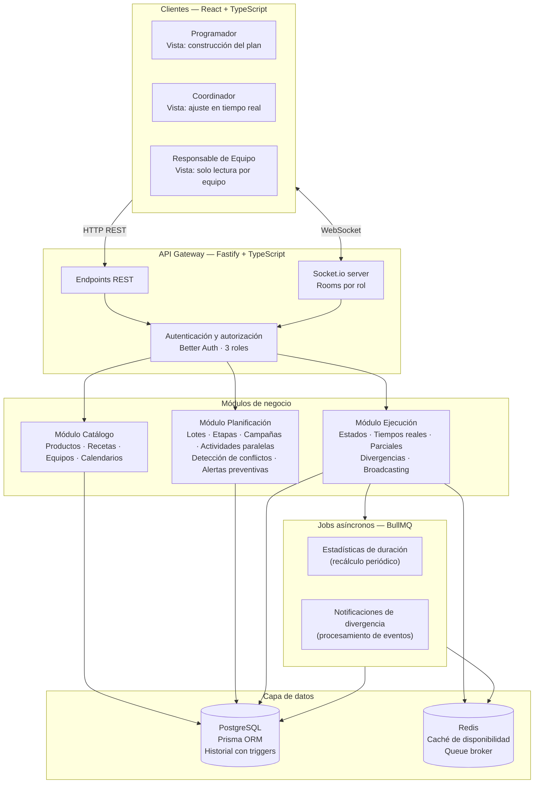

---

#### Módulos del backend

**Módulo Catálogo**
Gestiona las entidades estables del dominio: productos, recetas, secuencia de pasos de receta, tipo de equipo requerido por paso, límites de tiempo entre etapas, equipos físicos y sus calendarios de disponibilidad. Es la base sobre la que se construye todo lo demás. Cambia poco en el tiempo.

**Módulo Planificación**
Gestiona el plan activo: lotes planificados, asignación de etapas a equipos y rangos horarios, formación de campañas, programación de actividades paralelas. Contiene la lógica de detección de conflictos de disponibilidad (usando el tipo `tsrange` de PostgreSQL) y la validación de límites de tiempo en modo preventivo. Expone los endpoints que el Programador utiliza principalmente.

**Módulo Ejecución**
Gestiona el estado real del plan: transiciones de estado de los procesos, registro de tiempos reales de inicio y fin, ejecuciones parciales con cantidades, detección de divergencias confirmadas, y broadcasting de eventos vía WebSocket a las rooms correspondientes. Contiene la lógica que el Coordinador utiliza principalmente. Alimenta el módulo de estadísticas con los datos de ejecución.

**Módulo Estadísticas** *(job asíncrono — BullMQ)*
Recalcula duraciones promedio y desvíos por combinación producto + etapa + equipo a medida que se acumulan datos reales en el historial. No expone endpoints de escritura; solo de lectura.

**Módulo Notificaciones** *(job asíncrono — BullMQ)*
Procesa eventos de divergencia detectados por el Módulo de Ejecución y genera las alertas para los roles correspondientes (Programador y Coordinador) vía WebSocket.

---

#### Modelo de datos — estructura conceptual

```
products
  └── recipes
        └── recipe_steps (equipment_type, order, time_limit_to_next?)
              └── qa_steps (duration_estimate, blocks_next)

equipment_types
  └── equipment_units (calendario de disponibilidad)

lots (product_id, recipe_snapshot, lifecycle_status)
  └── lot_branches (dose, presentation_type)
        └── process_stages (recipe_step_id, equipment_unit_id, tsrange, status)
              └── stage_executions (quantity_processed, started_at, ended_at)

campaigns (lot_ids[], equipment_unit_id, setup_reduction_minutes)

parallel_activities (lot_branch_id, type, deadline, status)

execution_history (append-only, trigger enforced)
  └── event_type, entity_id, actor_id, timestamp, payload

divergences (lot_id, from_stage_id, to_stage_id, limit_minutes, actual_minutes, detected_at)
```

La detección de conflictos de disponibilidad de equipos se implementa mediante el tipo nativo `tsrange` de PostgreSQL, que permite consultas del tipo "encontrar todos los procesos cuyo rango de tiempo se solapa con el propuesto" en una sola query con índice GiST, sin lógica de iteración en la capa de aplicación.

---

#### Tiempo real con WebSockets

Socket.io organiza las conexiones en **rooms por rol**: una room para Programadores, una para Coordinadores, y rooms individuales por equipo físico para los Responsables. Cuando el Coordinador confirma una acción, el Módulo de Ejecución emite eventos a las rooms relevantes:

| Evento | Destinatarios |
|---|---|
| Cambio de estado de una etapa | Room del rol Programador + Room del equipo afectado |
| Divergencia detectada | Room del rol Programador + Room del rol Coordinador |
| Reprogramación de etapa | Todas las rooms |
| Alerta de campaña comprometida | Room del rol Programador |

Redis actúa como adapter de Socket.io, lo que prepara la arquitectura para escalar a múltiples instancias del servidor sin romper el broadcasting entre ellas.

---

#### Infraestructura

```
Desarrollo local                     Producción (Railway)
─────────────────                    ────────────────────
Docker Compose                       Deploy desde GitHub (main)
  ├── app (Node.js + React build)    PostgreSQL managed
  ├── postgres                       Redis managed
  └── redis                          Variables de entorno via Railway
```

El entorno de desarrollo local replica exactamente el entorno de producción mediante Docker Compose. Las variables de entorno sensibles (strings de conexión, secrets de sesión) se gestionan mediante `.env` en desarrollo y variables de entorno de Railway en producción, nunca commiteadas al repositorio.

---

## 7. Diagrama de arquitectura

### 7.1 Descripción de capas

El sistema se organiza en seis capas con responsabilidades bien definidas. Cada capa se comunica únicamente con las capas adyacentes; ningún módulo salta niveles para acceder directamente a la base de datos sin pasar por la capa de negocio.

---

#### Capa 1 — Presentación

**Tecnologías:** React · TypeScript · Vite · Tailwind CSS · TanStack Query · Zustand · DHTMLX Gantt · Socket.io client

Es la capa con la que interactúan los usuarios. Se divide en tres interfaces diferenciadas según el rol, más un conjunto de estado compartido que las sirve a todas.

**Interfaz del Programador**
La más compleja del sistema. Contiene el componente Gantt (DHTMLX) con sus tres vistas: por equipo/recurso, por lote, y por recurso crítico. También incluye las pantallas de gestión del catálogo (productos, recetas, equipos) y las interfaces para formar campañas y programar actividades paralelas. Todas las interacciones que modifican el plan son validadas antes de enviarse al backend.

**Interfaz del Coordinador de Producción**
Centrada en el horizonte inmediato (día actual y próximos 2-3 días). Presenta las acciones nombradas disponibles para cada etapa de proceso activa, el panel de previsualización de impacto antes de confirmar cualquier cambio, el formulario de registro de ejecuciones parciales, y el panel de alertas de divergencia con los datos objetivos.

**Interfaz de los Responsables de Equipo**
Vista de solo lectura filtrada por el equipo del usuario. No contiene formularios ni acciones. Se actualiza en tiempo real mediante WebSocket sin intervención del usuario.

**Estado compartido**
- **TanStack Query** gestiona el estado del servidor: fetching, caché, revalidación automática y sincronización de datos remotos. Evita inconsistencias entre lo que el usuario ve y lo que existe en el backend.
- **Zustand** gestiona el estado local de la UI: filtros activos, vista seleccionada del Gantt, modales abiertos, y datos temporales de formularios en progreso.
- **Socket.io client** mantiene la conexión WebSocket con el servidor y enrutea los eventos entrantes hacia las actualizaciones de estado correspondientes en TanStack Query y Zustand.

---

#### Capa 2 — Comunicación

**Protocolos:** HTTP/REST · WebSocket (Socket.io)

Es el canal entre el frontend y el backend. No contiene lógica de negocio; su rol es transportar datos.

- **HTTP/REST** maneja todas las operaciones de lectura y escritura que no requieren latencia sub-segundo: crear lotes, asignar etapas, consultar el catálogo, leer el historial. TanStack Query gestiona el ciclo de vida de estas peticiones desde el frontend.
- **WebSocket** maneja la comunicación bidireccional en tiempo real. El frontend se subscribe a eventos y el backend los emite selectivamente. Se usa para broadcasting de cambios de estado, alertas de divergencia y actualizaciones del Gantt que deben reflejarse en todos los clientes conectados sin que ellos hagan polling.

---

#### Capa 3 — API Gateway

**Tecnologías:** Fastify · TypeScript · Better Auth · Socket.io server

Es el punto de entrada único al sistema. Toda petición —HTTP o WebSocket— pasa por esta capa antes de llegar a la lógica de negocio.

**Better Auth** intercepta cada request entrante, valida la sesión y determina el rol del usuario. Cada endpoint y cada room de WebSocket tiene sus permisos declarados: el Coordinador no puede acceder a los endpoints del catálogo, los Responsables no pueden acceder a ningún endpoint de escritura.

**El router de Fastify** organiza los endpoints en tres prefijos alineados con los módulos de negocio: `/api/catalog`, `/api/planning` y `/api/execution`. Cada prefijo tiene sus propios schemas de validación de entrada (JSON Schema) y sus propios handlers que delegan a los servicios del módulo correspondiente.

**El servidor de Socket.io** gestiona las conexiones WebSocket y las organiza en rooms: `planner` (todos los Programadores conectados), `coordinator` (todos los Coordinadores), y `equipment/:id` (una room por cada equipo físico, donde se suscriben los Responsables de ese equipo). El broadcasting selectivo se implementa emitiendo a la room correspondiente, no a todos los clientes.

---

#### Capa 4 — Negocio

**Tecnologías:** TypeScript · Prisma ORM

Es el núcleo del sistema. Contiene toda la lógica de dominio del laboratorio farmacéutico. Se organiza en tres módulos con responsabilidades separadas.

**Módulo Catálogo**
Gestiona las entidades estables: productos, recetas con sus pasos y reglas de transición, equipos físicos y sus calendarios. Al guardar o modificar una receta, valida las reglas del dominio (por ejemplo, GVH → GVS obligatorio). No expone lógica de tiempo real.

**Módulo Planificación**
Gestiona el plan activo. Cuando el Programador asigna una etapa a un equipo y rango horario, este módulo consulta la disponibilidad del equipo usando el tipo `tsrange` de PostgreSQL: una sola query con índice GiST detecta todos los solapamientos sin iterar en la capa de aplicación. También valida los límites de tiempo entre etapas en modo preventivo, gestiona la formación de campañas y el cálculo de fechas límite de actividades paralelas.

**Módulo Ejecución**
Gestiona el estado real del plan. Aplica las transiciones de estado de las etapas de proceso, registra los tiempos reales de inicio y fin, acumula ejecuciones parciales con sus cantidades, y compara los tiempos reales contra los límites definidos en la receta para detectar divergencias confirmadas. Cuando detecta una divergencia o un cambio de estado relevante, emite el evento correspondiente al servidor de Socket.io (Capa 3) para que se distribuya a las rooms apropiadas. También encola trabajos en BullMQ para el recálculo de estadísticas y el procesamiento de notificaciones.

---

#### Capa 5 — Procesamiento asíncrono

**Tecnologías:** BullMQ · Redis

Maneja operaciones que no necesitan respuesta inmediata y que sería costoso ejecutar en el ciclo de request/response.

**Job de estadísticas de duración**
Se ejecuta periódicamente. Lee el historial de ejecuciones reales acumuladas en PostgreSQL, calcula promedios y desvíos estándar por combinación producto + etapa + equipo físico, y actualiza los valores de estimación en la base de datos. El nivel de confianza de cada estimación se actualiza en función de la cantidad de muestras disponibles.

**Job de notificaciones de divergencia**
Se dispara por evento cuando el Módulo de Ejecución detecta y encola una divergencia. Recupera los datos completos del evento (lote, etapas, límite, tiempo real, timestamp), y emite la alerta vía Socket.io a las rooms `planner` y `coordinator`. Desacopla la detección de la divergencia de su comunicación a los usuarios.

---

#### Capa 6 — Datos

**Tecnologías:** PostgreSQL · Prisma ORM · Redis

Es la capa de persistencia. Ningún componente de las capas superiores accede a ella directamente salvo a través de la interfaz que Prisma expone.

**PostgreSQL** almacena el schema principal del dominio y el historial de ejecución. El historial está protegido por triggers de base de datos que rechazan cualquier operación `UPDATE` o `DELETE` sobre esa tabla, garantizando la inmutabilidad a nivel de motor, no solo de aplicación. La detección de conflictos de disponibilidad de equipos se implementa con columnas de tipo `tsrange` e índices `GiST`, que permiten consultas de solapamiento eficientes en una sola operación.

**Redis** cumple tres roles: actúa como caché de la disponibilidad de equipos (evita recalcularla en cada request de planificación), como broker de colas para BullMQ (almacena y distribuye los jobs asíncronos), y como adapter de Socket.io (permite que múltiples instancias del servidor de Node.js compartan el estado de las rooms, preparando la arquitectura para escalar horizontalmente sin romper el broadcasting).

---

### 7.2 Diagrama completo

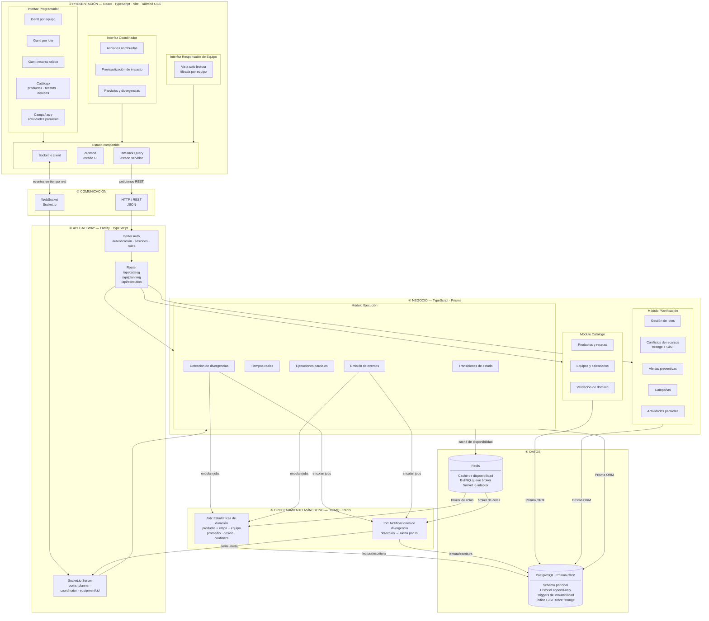

---

## 8. Requerimientos

### 8.1 Requerimientos funcionales

Los requerimientos funcionales describen las capacidades que el sistema debe tener desde el punto de vista del comportamiento observable. Se organizan por módulo y se codifican con el prefijo `RF`.

| Código | Requerimiento | Módulo | Prioridad |
|---|---|---|---|
| RF-001 | El sistema debe permitir crear, editar y eliminar productos con su información básica (nombre, descripción). | Catálogo | Alta |
| RF-002 | El sistema debe permitir definir la receta completa de un producto: secuencia de etapas productivas, tipo de equipo requerido por etapa, dependencias entre etapas, límites de tiempo entre etapas consecutivas (cuando aplique), etapas de QA intermedias con duración estimada y flag de bloqueo, y punto de bifurcación dosis/presentación. | Catálogo | Alta |
| RF-003 | El sistema debe validar la consistencia de las recetas al guardarlas, rechazando configuraciones que violen las reglas del dominio (por ejemplo: si existe el paso GVH, el paso siguiente debe ser obligatoriamente GVS). | Catálogo | Alta |
| RF-004 | El sistema debe permitir crear, editar y eliminar equipos físicos, especificando su tipo, identificador individual y calendario de disponibilidad (horario laboral, mantenimientos programados, bloqueos por falla). | Catálogo | Alta |
| RF-005 | El sistema debe permitir crear lotes de producción asociados a un producto, asignándoles un número de lote farmacéutico único y tomando un snapshot de la receta vigente al momento de la creación. | Planificación | Alta |
| RF-006 | El sistema debe permitir asignar cada etapa de proceso de un lote a un equipo físico del tipo requerido por la receta y a un rango horario específico, con granularidad horaria sobre el calendario laboral real. | Planificación | Alta |
| RF-007 | El sistema debe detectar conflictos de disponibilidad de equipos en tiempo real y alertar al usuario antes de que confirme una asignación que solape con otra existente en el mismo equipo. | Planificación | Alta |
| RF-008 | El sistema debe emitir una alerta preventiva cuando el intervalo de tiempo planificado entre dos etapas consecutivas supere el límite definido en la receta. La alerta no bloquea; el usuario puede confirmar conscientemente. | Planificación | Alta |
| RF-009 | El sistema debe permitir agrupar dos o más lotes del mismo producto en una campaña de producción, calculando automáticamente la reducción de tiempos de setup y limpieza entre lotes. | Planificación | Alta |
| RF-010 | El sistema debe sugerir proactivamente la formación de una campaña cuando detecte dos o más lotes del mismo producto asignados al mismo equipo en proximidad temporal. | Planificación | Media |
| RF-011 | El sistema debe calcular el impacto de deshacer una campaña existente (por ejemplo, si los materiales de un lote se demoran) y presentarlo al usuario antes de confirmar la acción. | Planificación | Media |
| RF-012 | El sistema debe permitir programar actividades paralelas (impresión de aluminio, preparación de estuches) como entidades integradas al plan, calculando automáticamente su fecha límite hacia atrás desde la etapa productiva que alimentan. | Planificación | Alta |
| RF-013 | El sistema debe recalcular automáticamente las fechas límite de las actividades paralelas cuando la etapa productiva asociada se reprograma. | Planificación | Alta |
| RF-014 | El sistema debe ofrecer tres vistas del timeline: por equipo/recurso (Gantt clásico), por lote (todas las etapas de un lote atravesando equipos), y por recurso crítico (Paila de Recubrimiento, GVH y GVS). | Planificación | Alta |
| RF-015 | El sistema debe permitir al Coordinador de Producción ejecutar las siguientes acciones nombradas sobre etapas de proceso: registrar inicio, registrar fin, mover proceso a nuevo horario, pausar, reanudar, registrar ejecución parcial con cantidad, y reprogramar con motivo. | Ejecución | Alta |
| RF-016 | El sistema debe mostrar al Coordinador las consecuencias de cada acción antes de confirmarla: conflictos de recursos generados, etapas dependientes afectadas, campañas comprometidas, y límites de tiempo en riesgo. | Ejecución | Alta |
| RF-017 | El sistema debe gestionar el ciclo de vida completo de cada etapa de proceso con los siguientes estados: planificada, iniciada, en curso, terminada, pausada y cancelada, aplicando solo las transiciones válidas según el estado actual. | Ejecución | Alta |
| RF-018 | El sistema debe permitir registrar ejecuciones parciales de una etapa, indicando la cantidad procesada en cada instancia. Una etapa se considera completa cuando la suma de sus ejecuciones alcanza la cantidad total de la rama. | Ejecución | Alta |
| RF-019 | El sistema debe detectar automáticamente divergencias cuando los tiempos reales registrados entre etapas consecutivas superen el límite definido en la receta, y alertar inmediatamente al Programador y al Coordinador con los datos objetivos: lote, etapas involucradas, límite definido, tiempo real transcurrido y timestamp de detección. | Ejecución | Alta |
| RF-020 | El sistema debe proporcionar a los Responsables de Equipo una vista de solo lectura filtrada por su equipo, mostrando los procesos planificados, horarios y estado actual de cada etapa. | Ejecución | Alta |
| RF-021 | El sistema debe sincronizar el estado del plan entre todos los usuarios conectados en tiempo real mediante WebSockets: los cambios realizados por el Coordinador deben reflejarse en las interfaces del Programador y los Responsables de Equipo sin necesidad de refrescar la página. | Tiempo real | Alta |
| RF-022 | El sistema debe registrar de forma inmutable y permanente todos los eventos del sistema: cambios de estado de etapas, reprogramaciones con motivo, ejecuciones parciales con cantidades, y divergencias detectadas con sus datos completos. Cada registro debe incluir el actor que originó el evento y su timestamp. | Historial | Alta |
| RF-023 | El sistema debe permitir consultar el historial completo de un lote, mostrando todos sus eventos ordenados cronológicamente, incluyendo el estado de cada rama del árbol dosis/presentación. | Historial | Alta |
| RF-024 | El sistema debe permitir visualizar las divergencias registradas con sus datos objetivos para que el responsable pueda confeccionar el informe regulatorio manualmente. | Historial | Alta |
| RF-025 | El sistema debe calcular estadísticas de duración real por combinación producto + etapa + equipo físico (promedio y desvío estándar) a medida que se acumulan ejecuciones en el historial. | Estadísticas | Media |
| RF-026 | El sistema debe mostrar un indicador de nivel de confianza junto a cada estimación de duración, reflejando la cantidad de ejecuciones reales disponibles como base de cálculo. | Estadísticas | Media |
| RF-027 | El sistema debe autenticar a los usuarios con sesión persistente y redirigirlos automáticamente al dashboard correspondiente según su rol al iniciar sesión. | Autenticación | Alta |
| RF-028 | El sistema debe controlar el acceso por rol en cada endpoint y en cada room de WebSocket: el Coordinador no puede acceder a operaciones del catálogo, los Responsables de Equipo no tienen acceso a ningún endpoint de escritura. | Autenticación | Alta |

---

### 8.2 Requerimientos no funcionales

Los requerimientos no funcionales describen las restricciones de calidad, rendimiento y operación del sistema. Se codifican con el prefijo `RNF`.

| Código | Requerimiento | Categoría | Prioridad |
|---|---|---|---|
| RNF-001 | La detección de conflictos de disponibilidad de equipos debe completarse en menos de 500 ms desde que el usuario propone una asignación, de modo que la experiencia del Programador en el Gantt no se vea interrumpida. | Rendimiento | Alta |
| RNF-002 | La actualización del Gantt y demás vistas ante un evento WebSocket debe reflejarse en pantalla en menos de 1 segundo desde que el Coordinador confirma una acción. | Rendimiento | Alta |
| RNF-003 | Los jobs asíncronos de recálculo de estadísticas no deben impactar en el tiempo de respuesta de los endpoints de planificación y ejecución; deben ejecutarse en background de forma desacoplada. | Rendimiento | Media |
| RNF-004 | El historial de ejecución debe ser inmutable a nivel de motor de base de datos: triggers de PostgreSQL deben rechazar cualquier operación `UPDATE` o `DELETE` sobre la tabla, independientemente de la capa de aplicación. | Confiabilidad | Alta |
| RNF-005 | El sistema no debe permitir la pérdida de jobs de BullMQ ante un reinicio del servidor; las colas deben persistir en Redis con configuración de reintentos. | Confiabilidad | Alta |
| RNF-006 | Ante una desconexión temporal del WebSocket, el cliente debe reconectarse automáticamente y sincronizar el estado que pudo haberse perdido durante la desconexión. | Confiabilidad | Alta |
| RNF-007 | Cada endpoint del backend debe validar el rol del usuario autenticado antes de procesar la request. Las rutas de escritura deben estar explícitamente restringidas a los roles autorizados. | Seguridad | Alta |
| RNF-008 | Ninguna credencial, string de conexión ni secret debe estar commiteado en el repositorio. El sistema debe utilizar variables de entorno para toda configuración sensible. | Seguridad | Alta |
| RNF-009 | Las sesiones de usuario deben tener un tiempo de expiración configurado. Las peticiones con sesión vencida deben redirigirse al login. | Seguridad | Alta |
| RNF-010 | Todos los endpoints deben validar el schema de los datos de entrada (JSON Schema en Fastify) y rechazar con error descriptivo cualquier request que no cumpla la estructura esperada. | Seguridad | Alta |
| RNF-011 | La interfaz de cada rol debe presentar únicamente las funciones correspondientes a ese rol: el Programador no debe ver las acciones nombradas del Coordinador, y los Responsables de Equipo no deben ver ningún control de edición. | Usabilidad | Alta |
| RNF-012 | El sistema debe mostrar siempre las consecuencias de una acción antes de requerir confirmación. Ningún cambio irreversible en el plan debe aplicarse con un solo clic sin una previsualización de impacto. | Usabilidad | Alta |
| RNF-013 | La arquitectura de WebSockets debe soportar múltiples instancias del servidor Node.js sin romper el broadcasting entre ellas, mediante el adapter de Redis para Socket.io. | Escalabilidad | Media |
| RNF-014 | El código del backend debe organizarse en módulos con responsabilidades separadas y sin dependencias circulares entre ellos (Catálogo, Planificación, Ejecución, Estadísticas, Notificaciones). | Mantenibilidad | Alta |
| RNF-015 | Los tipos TypeScript del dominio deben estar definidos en el paquete `shared` del monorepo y ser consumidos tanto por el frontend como por el backend, eliminando duplicación y garantizando consistencia. | Mantenibilidad | Alta |
| RNF-016 | El entorno de desarrollo local debe ser reproducible en cualquier máquina con un único comando (`docker compose up`), sin dependencias de configuración manual del sistema operativo. | Operabilidad | Alta |
| RNF-017 | El entorno de producción debe ser equivalente al entorno de desarrollo local; las mismas imágenes Docker deben poder ejecutarse tanto en local como en Railway sin modificaciones. | Operabilidad | Alta |

---

## 9. Inicio del análisis

### 9.1 Actores del sistema

Un actor representa cualquier entidad externa que interactúa con el sistema. Se identifican cuatro actores: tres humanos con roles diferenciados y un actor de sistema que representa los procesos automatizados.

---

#### Actor 1 — Programador

**Tipo:** Actor primario humano

**Descripción:** Es el usuario responsable de construir y mantener el plan de producción a nivel estratégico. Trabaja con un horizonte de tres meses y su fuente de input es la instrucción del Jefe de Planificación (archivo Excel externo al sistema). Es el usuario que más interactúa con el catálogo del sistema: crea productos, define recetas, configura equipos. Es también el principal consumidor de las vistas del Gantt. Antes de emitir una orden de producción, revisa el estado actualizado del plan incluyendo todos los ajustes del Coordinador desde la última revisión.

**Capacidades en el sistema:** Gestión completa del catálogo (productos, recetas, equipos), creación de lotes, asignación de etapas, formación de campañas, programación de actividades paralelas, consulta de las tres vistas del Gantt, consulta del historial de lotes, consulta de divergencias pendientes y consulta de estadísticas de duración.

**Restricciones:** No puede registrar eventos de ejecución (inicio, fin, pausas, parciales). Esas acciones son exclusivas del Coordinador de Producción.

---

#### Actor 2 — Coordinador de Producción

**Tipo:** Actor primario humano

**Descripción:** Es el usuario más activo del sistema en el día a día. Opera sobre el plan con un horizonte de dos a tres días y es quien más sufre las limitaciones del sistema actual (Google Sheets). Su función es ajustar el plan en tiempo real frente a lo que realmente ocurre en el laboratorio: equipos que se liberan antes de lo previsto, fallas, urgencias comerciales, materiales que no llegan a tiempo. No construye el plan desde cero; trabaja sobre lo que el Programador planificó, refinándolo y actualizándolo frente a la realidad.

**Capacidades en el sistema:** Ejecución de todas las acciones nombradas sobre etapas de proceso (registrar inicio, registrar fin, mover, pausar, reanudar, registrar ejecución parcial, reprogramar con motivo), visualización del impacto de cada acción antes de confirmarla, recepción de alertas de divergencia con datos objetivos, y consulta de divergencias pendientes.

**Restricciones:** No puede crear ni modificar productos, recetas ni equipos del catálogo. No puede crear lotes ni armar el plan desde cero.

---

#### Actor 3 — Responsable de Equipo

**Tipo:** Actor primario humano

**Descripción:** Representa a los supervisores o encargados de cada equipo físico del laboratorio (por ejemplo: el responsable de la Paila, el responsable de las Comprimidoras). Su necesidad es simple: saber qué está programado para su equipo, cuándo empieza y cuándo termina cada proceso, y cuál es el estado actual. Es un consumidor de información, no un editor del plan. Su experiencia con el sistema actual es de incertidumbre: no siempre tiene la información actualizada, y cuando el Coordinador hace cambios, se entera tarde.

**Capacidades en el sistema:** Consulta de la vista de solo lectura filtrada por su equipo, con actualización en tiempo real mediante WebSocket. No tiene acceso a ninguna función de edición.

**Restricciones:** Solo lectura. No puede realizar ninguna acción que modifique el plan. Su vista está filtrada exclusivamente por el equipo al que pertenece.

---

#### Actor 4 — Sistema

**Tipo:** Actor secundario (automatizado)

**Descripción:** Representa los procesos automáticos del sistema que se ejecutan sin intervención humana directa. Incluye los jobs asíncronos de BullMQ (recálculo de estadísticas de duración, procesamiento de notificaciones de divergencia), las validaciones automáticas disparadas por acciones de los actores humanos (detección de conflictos, alertas preventivas, sugerencia de campañas, recálculo de fechas de actividades paralelas, detección de divergencias confirmadas), y el broadcasting en tiempo real mediante WebSocket. No es un usuario; es el propio sistema actuando de forma autónoma en respuesta a eventos.

**Capacidades:** Detectar conflictos de disponibilidad al asignar una etapa, emitir alertas preventivas de límite de tiempo, sugerir formación de campañas, recalcular fechas de actividades paralelas ante reprogramaciones, detectar divergencias confirmadas al comparar tiempos reales contra la receta, sincronizar el plan en tiempo real entre roles, y recalcular estadísticas de duración de forma periódica.

---

### 9.2 Diagrama de casos de uso

El diagrama muestra la relación entre los cuatro actores y los grupos de casos de uso del sistema. Los actores humanos se ubican a la izquierda; el actor Sistema, a la derecha. Las líneas representan interacción directa con el grupo de funcionalidades correspondiente.

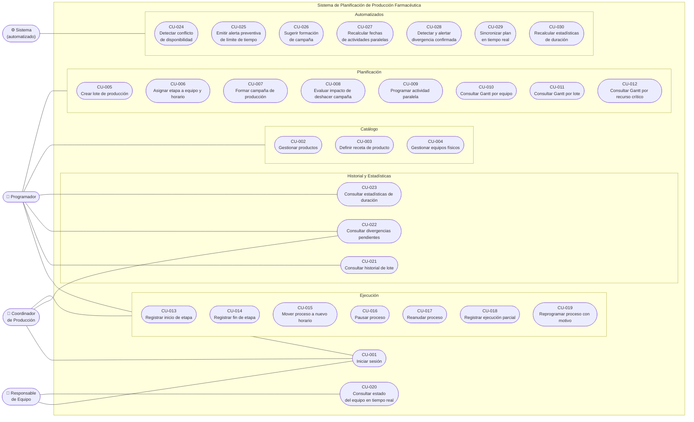

---

### 9.3 Listado de casos de uso

La siguiente tabla lista todos los casos de uso identificados con su código, nombre, actor iniciador, descripción y los requerimientos funcionales que cubre.

| Código | Nombre | Actor | Descripción | RF |
|---|---|---|---|---|
| CU-001 | Iniciar sesión | Programador / Coordinador / Responsable | El usuario ingresa sus credenciales y el sistema valida la sesión, asignándole la interfaz correspondiente a su rol. | RF-027, RF-028 |
| CU-002 | Gestionar productos | Programador | El Programador crea, edita o elimina un producto del catálogo con su información básica. | RF-001 |
| CU-003 | Definir receta de producto | Programador | El Programador construye o modifica la receta completa de un producto: secuencia de etapas, tipo de equipo por etapa, límites de tiempo entre etapas, etapas de QA y punto de bifurcación. El sistema valida la consistencia de la receta al guardarla. | RF-002, RF-003 |
| CU-004 | Gestionar equipos físicos | Programador | El Programador crea, edita o elimina un equipo físico y configura su calendario de disponibilidad. | RF-004 |
| CU-005 | Crear lote de producción | Programador | El Programador crea un nuevo lote asociado a un producto, asignándole su número de lote farmacéutico. El sistema instancia las etapas del proceso a partir del snapshot de la receta vigente. | RF-005 |
| CU-006 | Asignar etapa a equipo y horario | Programador | El Programador asigna una etapa de proceso a un equipo físico del tipo requerido y define su rango horario. El sistema detecta conflictos de disponibilidad y emite alertas preventivas de límites de tiempo antes de confirmar. | RF-006, RF-007, RF-008 |
| CU-007 | Formar campaña de producción | Programador | El Programador agrupa dos o más lotes del mismo producto en una campaña. El sistema calcula la reducción de tiempos de setup. | RF-009, RF-010 |
| CU-008 | Evaluar impacto de deshacer campaña | Programador | El Programador solicita ver las consecuencias de deshacer una campaña existente (por ejemplo, por demora de materiales de un lote), y decide si procede. | RF-011 |
| CU-009 | Programar actividad paralela | Programador | El Programador registra una actividad paralela (impresión de aluminio o preparación de estuches) asociada a una rama del lote. El sistema calcula automáticamente su fecha límite hacia atrás. | RF-012, RF-013 |
| CU-010 | Consultar Gantt por equipo | Programador | El Programador visualiza el timeline completo organizado por equipo físico (vista Gantt clásica). | RF-014 |
| CU-011 | Consultar Gantt por lote | Programador | El Programador visualiza todas las etapas de un lote específico atravesando los distintos equipos. | RF-014 |
| CU-012 | Consultar Gantt por recurso crítico | Programador | El Programador visualiza el nivel de ocupación y los conflictos potenciales de los recursos críticos: Paila de Recubrimiento, GVH y GVS. | RF-014 |
| CU-013 | Registrar inicio de etapa | Coordinador | El Coordinador indica que una etapa planificada comenzó a ejecutarse, con el horario real de inicio. | RF-015, RF-017 |
| CU-014 | Registrar fin de etapa | Coordinador | El Coordinador indica que una etapa en curso finalizó, con el horario real de fin. El sistema verifica si el tiempo transcurrido desde la etapa anterior superó el límite de la receta. | RF-015, RF-017, RF-019 |
| CU-015 | Mover proceso a nuevo horario | Coordinador | El Coordinador reprograma una etapa a un nuevo rango horario. El sistema muestra el impacto antes de confirmar. | RF-015, RF-016 |
| CU-016 | Pausar proceso | Coordinador | El Coordinador interrumpe una etapa en curso por falla de equipo u otra causa. El sistema registra el evento en el historial. | RF-015, RF-017 |
| CU-017 | Reanudar proceso | Coordinador | El Coordinador reactiva una etapa que estaba pausada. El sistema muestra el impacto en etapas dependientes. | RF-015, RF-016, RF-017 |
| CU-018 | Registrar ejecución parcial | Coordinador | El Coordinador indica que solo se procesó una parte de la rama de un lote, especificando la cantidad procesada. El sistema acumula las ejecuciones y actualiza el estado de completitud de la etapa. | RF-015, RF-018 |
| CU-019 | Reprogramar proceso con motivo | Coordinador | El Coordinador reprograma una etapa indicando el motivo (materiales no aprobados, urgencia comercial, falla de equipo, etc.). El motivo queda registrado en el historial. | RF-015, RF-016 |
| CU-020 | Consultar estado del equipo en tiempo real | Responsable de Equipo | El Responsable visualiza los procesos planificados para su equipo, con horarios y estado actual. La vista se actualiza automáticamente ante cualquier cambio sin necesidad de refrescar. | RF-020, RF-021 |
| CU-021 | Consultar historial de lote | Programador | El Programador consulta el ciclo de vida completo de un lote: todos sus eventos ordenados cronológicamente, incluyendo el estado de cada rama del árbol dosis/presentación. | RF-022, RF-023 |
| CU-022 | Consultar divergencias pendientes | Programador / Coordinador | El usuario consulta la lista de divergencias detectadas con sus datos objetivos, para proceder a la confección manual del informe regulatorio. | RF-024 |
| CU-023 | Consultar estadísticas de duración | Programador | El Programador consulta los promedios y desvíos de duración calculados por combinación producto + etapa + equipo, con su nivel de confianza. | RF-025, RF-026 |
| CU-024 | Detectar conflicto de disponibilidad | Sistema | Al recibir una propuesta de asignación (CU-006, CU-015, CU-019), el sistema verifica si el equipo ya tiene un proceso asignado en el rango horario propuesto y alerta al usuario antes de confirmar. | RF-007 |
| CU-025 | Emitir alerta preventiva de límite de tiempo | Sistema | Al confirmar o reprogramar una asignación (CU-006, CU-015, CU-019), el sistema verifica si el intervalo planificado entre etapas consecutivas supera el límite de la receta y emite una advertencia. | RF-008 |
| CU-026 | Sugerir formación de campaña | Sistema | Al asignar o reprogramar etapas, el sistema detecta si hay lotes del mismo producto en proximidad temporal en el mismo equipo y sugiere proactivamente la formación de una campaña. | RF-010 |
| CU-027 | Recalcular fechas de actividades paralelas | Sistema | Cuando una etapa productiva es reprogramada (CU-015, CU-019), el sistema recalcula automáticamente las fechas límite de todas las actividades paralelas que dependen de ella. | RF-013 |
| CU-028 | Detectar y alertar divergencia confirmada | Sistema | Al registrar el inicio real de una etapa (CU-013), el sistema compara el tiempo transcurrido desde el fin de la etapa anterior contra el límite definido en la receta. Si lo supera, registra la divergencia y emite una alerta inmediata al Programador y al Coordinador. | RF-019 |
| CU-029 | Sincronizar plan en tiempo real | Sistema | Ante cualquier cambio en el plan (CU-013 al CU-019), el sistema emite los eventos correspondientes vía WebSocket a las rooms de los roles afectados, actualizando sus interfaces sin intervención del usuario. | RF-021 |
| CU-030 | Recalcular estadísticas de duración | Sistema | El sistema ejecuta periódicamente un job asíncrono que lee el historial de ejecuciones reales acumuladas y recalcula promedios, desvíos y nivel de confianza por combinación producto + etapa + equipo. | RF-025, RF-026 |

---

## 10. Trazabilidad

La trazabilidad permite verificar la coherencia interna del documento: que cada requerimiento está cubierto por al menos un caso de uso, que cada caso de uso contribuye a al menos un objetivo del proyecto, y que cada requerimiento tiene asignado un módulo y una etapa de desarrollo concreta. Las tres matrices se leen de forma independiente y se complementan entre sí.

---

### 10.1 Requerimientos funcionales → Casos de uso

Verifica que cada requerimiento funcional está cubierto por al menos un caso de uso, y que cada caso de uso tiene al menos un requerimiento que lo justifica.

| RF | Descripción resumida | Casos de uso que lo cubren |
|---|---|---|
| RF-001 | Gestionar productos | CU-002 |
| RF-002 | Definir receta completa | CU-003 |
| RF-003 | Validar consistencia de receta | CU-003 |
| RF-004 | Gestionar equipos físicos y calendarios | CU-004 |
| RF-005 | Crear lote de producción | CU-005 |
| RF-006 | Asignar etapa a equipo y horario | CU-006 |
| RF-007 | Detectar conflictos de disponibilidad | CU-006, CU-024 |
| RF-008 | Alertar límite de tiempo preventivo | CU-006, CU-025 |
| RF-009 | Formar campaña de producción | CU-007 |
| RF-010 | Sugerir campaña proactivamente | CU-007, CU-026 |
| RF-011 | Evaluar impacto de deshacer campaña | CU-008 |
| RF-012 | Programar actividad paralela | CU-009 |
| RF-013 | Recalcular fechas de actividades paralelas | CU-009, CU-027 |
| RF-014 | Tres vistas del Gantt | CU-010, CU-011, CU-012 |
| RF-015 | Acciones nombradas del Coordinador | CU-013, CU-014, CU-015, CU-016, CU-017, CU-018, CU-019 |
| RF-016 | Previsualizar impacto antes de confirmar | CU-015, CU-017, CU-019 |
| RF-017 | Ciclo de vida completo de etapa de proceso | CU-013, CU-014, CU-016, CU-017 |
| RF-018 | Registrar ejecuciones parciales | CU-018 |
| RF-019 | Detectar y alertar divergencia confirmada | CU-014, CU-028 |
| RF-020 | Vista solo lectura por equipo | CU-020 |
| RF-021 | Sincronización en tiempo real | CU-020, CU-029 |
| RF-022 | Historial de ejecución inmutable | CU-021 |
| RF-023 | Consultar historial de lote | CU-021 |
| RF-024 | Consultar divergencias pendientes | CU-022 |
| RF-025 | Estadísticas de duración por combinación | CU-023, CU-030 |
| RF-026 | Indicador de nivel de confianza | CU-023, CU-030 |
| RF-027 | Autenticación con redirección por rol | CU-001 |
| RF-028 | Control de acceso por rol | CU-001 |

---

### 10.2 Casos de uso → Objetivos específicos

Verifica que cada caso de uso contribuye a al menos un objetivo específico del proyecto, y que cada objetivo tiene al menos un caso de uso que lo materializa.

Los objetivos específicos (OE) son los definidos en la sección 3.2:

| Código | Objetivo específico |
|---|---|
| OE-01 | Modelar el dominio farmacéutico con fidelidad |
| OE-02 | Reemplazar la manipulación directa del Gantt por acciones nombradas y validadas |
| OE-03 | Detectar y comunicar conflictos y divergencias en tiempo real |
| OE-04 | Construir un historial de ejecución inmutable |
| OE-05 | Proveer un Gantt interactivo con granularidad horaria |
| OE-06 | Sincronizar el estado del plan entre roles en tiempo real |
| OE-07 | Construir estadística de duraciones basada en datos reales |
| OE-08 | Gestionar campañas de producción como entidad explícita |
| OE-09 | Integrar actividades paralelas al timeline productivo |
| OE-10 | Deployar el sistema en un entorno reproducible y documentado |

| CU | Nombre | Objetivos que cubre |
|---|---|---|
| CU-001 | Iniciar sesión | OE-10 |
| CU-002 | Gestionar productos | OE-01 |
| CU-003 | Definir receta de producto | OE-01 |
| CU-004 | Gestionar equipos físicos | OE-01 |
| CU-005 | Crear lote de producción | OE-01, OE-05 |
| CU-006 | Asignar etapa a equipo y horario | OE-02, OE-03, OE-05 |
| CU-007 | Formar campaña de producción | OE-08 |
| CU-008 | Evaluar impacto de deshacer campaña | OE-08 |
| CU-009 | Programar actividad paralela | OE-09 |
| CU-010 | Consultar Gantt por equipo | OE-05 |
| CU-011 | Consultar Gantt por lote | OE-05 |
| CU-012 | Consultar Gantt por recurso crítico | OE-05 |
| CU-013 | Registrar inicio de etapa | OE-02, OE-04 |
| CU-014 | Registrar fin de etapa | OE-02, OE-03, OE-04 |
| CU-015 | Mover proceso a nuevo horario | OE-02, OE-03 |
| CU-016 | Pausar proceso | OE-02, OE-04 |
| CU-017 | Reanudar proceso | OE-02, OE-03, OE-04 |
| CU-018 | Registrar ejecución parcial | OE-01, OE-02, OE-04 |
| CU-019 | Reprogramar proceso con motivo | OE-02, OE-03, OE-04 |
| CU-020 | Consultar estado del equipo en tiempo real | OE-06 |
| CU-021 | Consultar historial de lote | OE-04 |
| CU-022 | Consultar divergencias pendientes | OE-03, OE-04 |
| CU-023 | Consultar estadísticas de duración | OE-07 |
| CU-024 | Detectar conflicto de disponibilidad | OE-03 |
| CU-025 | Emitir alerta preventiva de límite de tiempo | OE-03 |
| CU-026 | Sugerir formación de campaña | OE-08 |
| CU-027 | Recalcular fechas de actividades paralelas | OE-09 |
| CU-028 | Detectar y alertar divergencia confirmada | OE-03, OE-04 |
| CU-029 | Sincronizar plan en tiempo real | OE-06 |
| CU-030 | Recalcular estadísticas de duración | OE-07 |

**Cobertura de objetivos:**

| OE | Casos de uso que lo cubren |
|---|---|
| OE-01 | CU-002, CU-003, CU-004, CU-005, CU-018 |
| OE-02 | CU-006, CU-013, CU-014, CU-015, CU-016, CU-017, CU-018, CU-019 |
| OE-03 | CU-006, CU-014, CU-015, CU-017, CU-019, CU-022, CU-024, CU-025, CU-028 |
| OE-04 | CU-013, CU-014, CU-016, CU-017, CU-018, CU-019, CU-021, CU-022, CU-028 |
| OE-05 | CU-005, CU-006, CU-010, CU-011, CU-012 |
| OE-06 | CU-020, CU-029 |
| OE-07 | CU-023, CU-030 |
| OE-08 | CU-007, CU-008, CU-026 |
| OE-09 | CU-009, CU-027 |
| OE-10 | CU-001 |

---

### 10.3 Requerimientos funcionales → Módulo y etapa de desarrollo

Verifica que cada requerimiento funcional tiene asignado un módulo del sistema responsable de implementarlo y una etapa de desarrollo concreta donde se construye.

| RF | Descripción resumida | Módulo | Etapa |
|---|---|---|---|
| RF-001 | Gestionar productos | Catálogo | Etapa 1 — Catálogo |
| RF-002 | Definir receta completa | Catálogo | Etapa 1 — Catálogo |
| RF-003 | Validar consistencia de receta | Catálogo | Etapa 1 — Catálogo |
| RF-004 | Gestionar equipos físicos y calendarios | Catálogo | Etapa 1 — Catálogo |
| RF-005 | Crear lote de producción | Planificación | Etapa 2 — Planificación y Gantt |
| RF-006 | Asignar etapa a equipo y horario | Planificación | Etapa 2 — Planificación y Gantt |
| RF-007 | Detectar conflictos de disponibilidad | Planificación | Etapa 2 — Planificación y Gantt |
| RF-008 | Alertar límite de tiempo preventivo | Planificación | Etapa 2 — Planificación y Gantt |
| RF-009 | Formar campaña de producción | Planificación | Etapa 2 — Planificación y Gantt |
| RF-010 | Sugerir campaña proactivamente | Planificación | Etapa 2 — Planificación y Gantt |
| RF-011 | Evaluar impacto de deshacer campaña | Planificación | Etapa 2 — Planificación y Gantt |
| RF-012 | Programar actividad paralela | Planificación | Etapa 2 — Planificación y Gantt |
| RF-013 | Recalcular fechas de actividades paralelas | Planificación | Etapa 2 — Planificación y Gantt |
| RF-014 | Tres vistas del Gantt | Planificación | Etapa 2 — Planificación y Gantt |
| RF-015 | Acciones nombradas del Coordinador | Ejecución | Etapa 3 — Ejecución y Tiempo Real |
| RF-016 | Previsualizar impacto antes de confirmar | Ejecución | Etapa 3 — Ejecución y Tiempo Real |
| RF-017 | Ciclo de vida completo de etapa de proceso | Ejecución | Etapa 3 — Ejecución y Tiempo Real |
| RF-018 | Registrar ejecuciones parciales | Ejecución | Etapa 3 — Ejecución y Tiempo Real |
| RF-019 | Detectar y alertar divergencia confirmada | Ejecución | Etapa 3 — Ejecución y Tiempo Real |
| RF-020 | Vista solo lectura por equipo | Ejecución | Etapa 3 — Ejecución y Tiempo Real |
| RF-021 | Sincronización en tiempo real | Ejecución | Etapa 3 — Ejecución y Tiempo Real |
| RF-022 | Historial de ejecución inmutable | Historial | Etapa 4 — Historial y Estadísticas |
| RF-023 | Consultar historial de lote | Historial | Etapa 4 — Historial y Estadísticas |
| RF-024 | Consultar divergencias pendientes | Historial | Etapa 4 — Historial y Estadísticas |
| RF-025 | Estadísticas de duración por combinación | Estadísticas | Etapa 4 — Historial y Estadísticas |
| RF-026 | Indicador de nivel de confianza | Estadísticas | Etapa 4 — Historial y Estadísticas |
| RF-027 | Autenticación con redirección por rol | Autenticación | Etapa 0 — Fundación |
| RF-028 | Control de acceso por rol | Autenticación | Etapa 0 — Fundación |

**Distribución por etapa:**

| Etapa | RFs que implementa | Cantidad |
|---|---|---|
| Etapa 0 — Fundación | RF-027, RF-028 | 2 |
| Etapa 1 — Catálogo | RF-001, RF-002, RF-003, RF-004 | 4 |
| Etapa 2 — Planificación y Gantt | RF-005 al RF-014 | 10 |
| Etapa 3 — Ejecución y Tiempo Real | RF-015 al RF-021 | 7 |
| Etapa 4 — Historial y Estadísticas | RF-022 al RF-026 | 5 |
| Etapa 5 — Polish y Deployment | *(sin RFs nuevos; consolida y documenta lo construido)* | — |

---

## 11. Especificaciones de casos de uso

Cada especificación describe el comportamiento esperado del sistema ante la interacción de un actor. Se incluyen las precondiciones necesarias para que el caso de uso pueda ejecutarse, las postcondiciones que deben cumplirse al finalizar, el flujo principal (camino feliz), los flujos alternativos (variaciones válidas del flujo) y los flujos de excepción (situaciones de error o condición no esperada). Los casos de uso automatizados (CU-024 a CU-030) no tienen flujos alternativos ni de excepción en el sentido clásico, ya que son procesos internos del sistema; se documentan con su flujo de ejecución y condiciones de disparo.

---

### 11.1 Autenticación

---

#### CU-001 — Iniciar sesión

| | |
|---|---|
| **Actor(es)** | Programador, Coordinador de Producción, Responsable de Equipo |
| **Precondiciones** | El usuario tiene credenciales válidas registradas en el sistema. |
| **Postcondiciones** | Se crea una sesión persistente para el usuario y es redirigido al dashboard correspondiente a su rol. |
| **RF asociados** | RF-027, RF-028 |

**Flujo principal**

1. El usuario accede a la pantalla de inicio de sesión.
2. Ingresa su dirección de email y contraseña.
3. El sistema valida las credenciales mediante Better Auth.
4. El sistema identifica el rol asignado al usuario.
5. El sistema crea una sesión persistente.
6. El sistema redirige al dashboard correspondiente: Programador → vista de planificación; Coordinador → vista de ejecución; Responsable → vista de equipo.

**Flujos alternativos**

- **FA-1 — Sesión activa preexistente:** Si el usuario ya tiene una sesión válida activa, el sistema lo redirige directamente al dashboard sin mostrar el formulario de login.

**Flujos de excepción**

- **FE-1 — Credenciales incorrectas:** El sistema muestra un mensaje de error genérico ("Email o contraseña incorrectos") sin indicar cuál de los dos falló. No se crea sesión.
- **FE-2 — Cuenta inactiva:** El sistema informa que la cuenta no está habilitada y no crea sesión.
- **FE-3 — Sesión expirada:** Si el usuario intenta acceder a una ruta protegida con sesión vencida, el sistema lo redirige a la pantalla de login con un mensaje informativo.

---

### 11.2 Catálogo

---

#### CU-002 — Gestionar productos

| | |
|---|---|
| **Actor(es)** | Programador |
| **Precondiciones** | El Programador está autenticado. |
| **Postcondiciones** | El producto fue creado, editado o eliminado del catálogo y los cambios están persistidos. |
| **RF asociados** | RF-001 |

**Flujo principal (crear)**

1. El Programador accede a la sección de productos del catálogo.
2. Selecciona "Nuevo producto".
3. Ingresa nombre y descripción del producto.
4. Confirma la creación.
5. El sistema valida que el nombre no esté duplicado.
6. El sistema persiste el producto y lo muestra en el listado.

**Flujos alternativos**

- **FA-1 — Editar producto:** El Programador selecciona un producto existente, modifica nombre o descripción, y confirma. El sistema actualiza los datos.
- **FA-2 — Eliminar producto:** El Programador solicita eliminar un producto. El sistema verifica que no tenga lotes activos ni receta asociada con lotes vigentes. Si la verificación es exitosa, elimina el producto.

**Flujos de excepción**

- **FE-1 — Nombre duplicado:** El sistema rechaza la creación o edición e informa que ya existe un producto con ese nombre.
- **FE-2 — Eliminación con lotes activos:** El sistema rechaza la eliminación e informa cuántos lotes activos dependen del producto.

---

#### CU-003 — Definir receta de producto

| | |
|---|---|
| **Actor(es)** | Programador |
| **Precondiciones** | Existe al menos un producto. Existen tipos de equipo definidos en el catálogo. |
| **Postcondiciones** | La receta fue guardada, validada y asociada al producto. Las etapas, límites de tiempo y punto de bifurcación quedan persistidos. |
| **RF asociados** | RF-002, RF-003 |

**Flujo principal**

1. El Programador selecciona un producto del catálogo.
2. Accede a la sección "Receta".
3. Agrega etapas en orden, especificando para cada una: nombre y tipo de equipo requerido.
4. Entre etapas consecutivas, define opcionalmente el límite de tiempo máximo permitido (en horas).
5. Agrega etapas de QA entre etapas productivas donde corresponda, indicando duración estimada y si bloquean el avance.
6. Marca el punto de bifurcación (la etapa a partir de la cual el lote se ramifica en dosis y presentaciones).
7. Guarda la receta.
8. El sistema ejecuta las validaciones de dominio sobre la receta completa.
9. Validaciones exitosas → el sistema persiste la receta y la asocia al producto.

**Flujos alternativos**

- **FA-1 — Modificar receta existente:** El Programador edita una receta ya guardada. Si el producto tiene lotes activos que usan esa receta, el sistema advierte que los lotes ya creados mantienen el snapshot de la receta anterior y que solo los nuevos lotes usarán la versión actualizada.
- **FA-2 — Agregar etapa de QA:** El Programador puede insertar etapas de QA en cualquier punto de la secuencia entre etapas productivas.

**Flujos de excepción**

- **FE-1 — Violación GVH → GVS:** Si la receta incluye el paso GVH y el paso inmediatamente siguiente no es GVS, el sistema rechaza el guardado e informa la regla violada.
- **FE-2 — Sin punto de bifurcación:** Si el Programador no define el punto de bifurcación, el sistema rechaza el guardado con un mensaje explicativo.
- **FE-3 — Secuencia vacía:** El sistema no permite guardar una receta sin al menos una etapa productiva.

---

#### CU-004 — Gestionar equipos físicos

| | |
|---|---|
| **Actor(es)** | Programador |
| **Precondiciones** | El Programador está autenticado. Existen tipos de equipo predefinidos en el sistema (GVS, GVH, Comprimidora, Paila, Blistera, Línea de Empaque, etc.). |
| **Postcondiciones** | El equipo físico fue creado, editado o eliminado, con su calendario de disponibilidad persistido. |
| **RF asociados** | RF-004 |

**Flujo principal (crear)**

1. El Programador accede a la sección de equipos del catálogo.
2. Selecciona "Nuevo equipo".
3. Selecciona el tipo de equipo.
4. Ingresa un identificador único para la unidad (por ejemplo: "Comprimidora 1").
5. Define el calendario de disponibilidad: horario laboral diario (hora de inicio y fin por día de la semana).
6. Opcionalmente agrega bloqueos por mantenimiento programado (fecha, hora inicio, hora fin, motivo).
7. Confirma la creación.
8. El sistema persiste el equipo con su calendario.

**Flujos alternativos**

- **FA-1 — Editar calendario:** El Programador modifica el horario laboral o agrega/elimina bloqueos de mantenimiento en un equipo existente.
- **FA-2 — Agregar bloqueo por falla:** El Programador registra un bloqueo no programado (falla de equipo) con fecha, hora y motivo. El sistema detecta si hay etapas ya asignadas en ese rango y alerta al Programador.
- **FA-3 — Eliminar equipo:** El Programador solicita eliminar un equipo físico. El sistema verifica que no tenga etapas activas asignadas.

**Flujos de excepción**

- **FE-1 — Identificador duplicado:** El sistema rechaza la creación si ya existe un equipo con el mismo identificador dentro del mismo tipo.
- **FE-2 — Eliminación con etapas asignadas:** El sistema rechaza la eliminación e informa cuántas etapas activas están asignadas al equipo.

---

### 11.3 Planificación

---

#### CU-005 — Crear lote de producción

| | |
|---|---|
| **Actor(es)** | Programador |
| **Precondiciones** | Existe al menos un producto con receta completa. El Programador ha recibido la instrucción del Jefe de Planificación. |
| **Postcondiciones** | El lote fue creado con número de lote único, se tomó un snapshot de la receta vigente, y las etapas de proceso fueron instanciadas en estado "planificada". |
| **RF asociados** | RF-005 |

**Flujo principal**

1. El Programador accede al módulo de planificación y selecciona "Nuevo lote".
2. Selecciona el producto de la lista del catálogo.
3. Ingresa el número de lote farmacéutico (identificador único del laboratorio).
4. El sistema muestra la receta vigente del producto seleccionado para revisión.
5. El Programador confirma la creación.
6. El sistema toma un snapshot inmutable de la receta en su estado actual.
7. El sistema crea el lote con estado de ciclo de vida "planificado".
8. El sistema instancia las etapas de proceso a partir del snapshot, todas en estado "planificada" y sin equipo ni horario asignado aún.

**Flujos alternativos**

- **FA-1 — Producto sin receta completa:** El sistema alerta al Programador antes de permitir la creación, indicando que la receta está incompleta y listando qué falta.

**Flujos de excepción**

- **FE-1 — Número de lote duplicado:** El sistema rechaza la creación e informa que ya existe un lote con ese número.

---

#### CU-006 — Asignar etapa a equipo y horario

| | |
|---|---|
| **Actor(es)** | Programador |
| **Precondiciones** | Existe al menos una etapa de proceso sin asignar. Existen equipos físicos del tipo requerido por esa etapa con calendario configurado. |
| **Postcondiciones** | La etapa queda asignada al equipo y rango horario seleccionados. Se dispararon las validaciones de conflicto y límites de tiempo. |
| **RF asociados** | RF-006, RF-007, RF-008 |

**Flujo principal**

1. El Programador selecciona una etapa sin asignar desde el Gantt o la vista por lote.
2. Selecciona un equipo físico del tipo requerido por la receta.
3. Define el rango horario propuesto (inicio y fin) sobre el calendario laboral del equipo.
4. El sistema ejecuta CU-024: consulta si el equipo tiene solapamientos de `tsrange` en el rango propuesto.
5. Sin conflicto → el sistema ejecuta CU-025: calcula el intervalo con la etapa anterior y lo compara contra el límite de la receta.
6. Sin alerta de límite → el sistema muestra la vista previa de la asignación.
7. El Programador confirma.
8. El sistema persiste la asignación.
9. El sistema ejecuta CU-026 (verificar sugerencia de campaña) y CU-027 (recalcular actividades paralelas) si corresponde.

**Flujos alternativos**

- **FA-1 — Conflicto de disponibilidad detectado:** En el paso 4, CU-024 devuelve un conflicto. El sistema muestra el detalle del solapamiento (etapa conflictiva, lote, horario). El Programador ajusta el horario o selecciona otro equipo del mismo tipo y vuelve al paso 3.
- **FA-2 — Alerta preventiva de límite:** En el paso 5, CU-025 detecta que el intervalo supera el límite. El sistema muestra la advertencia con el límite definido y el intervalo calculado. El Programador decide conscientemente si continúa o ajusta.

**Flujos de excepción**

- **FE-1 — Equipo no disponible en ningún horario del día:** El sistema informa que el equipo está completamente bloqueado en la fecha seleccionada y sugiere buscar en otro día o usar otro equipo del mismo tipo.

---

#### CU-007 — Formar campaña de producción

| | |
|---|---|
| **Actor(es)** | Programador |
| **Precondiciones** | Existen dos o más lotes del mismo producto con etapas asignadas al mismo tipo de equipo en proximidad temporal. |
| **Postcondiciones** | La campaña fue creada como entidad explícita. Los tiempos de setup entre lotes fueron recalculados aplicando la reducción correspondiente. |
| **RF asociados** | RF-009, RF-010 |

**Flujo principal**

1. El Programador accede a la gestión de campañas o responde a una sugerencia del sistema (CU-026).
2. Selecciona los lotes a incluir en la campaña (mismo producto, mismo equipo, orden consecutivo).
3. El sistema calcula la reducción de tiempo de setup y limpieza entre los lotes seleccionados.
4. El sistema muestra el ahorro de tiempo resultante y el nuevo cronograma con los lotes compactados.
5. El Programador confirma la formación de la campaña.
6. El sistema crea la entidad campaña vinculando los lotes y aplicando la reducción de tiempos.

**Flujos alternativos**

- **FA-1 — Creación manual sin sugerencia:** El Programador inicia la formación de campaña directamente sin haber recibido una sugerencia del sistema. El flujo es idéntico desde el paso 2.

**Flujos de excepción**

- **FE-1 — Lotes de distintos productos:** El sistema no permite formar una campaña con lotes de productos diferentes e informa la restricción.
- **FE-2 — Lotes ya pertenecen a otra campaña:** El sistema informa que uno o más lotes seleccionados ya están en una campaña activa y ofrece la opción de reorganizar.

---

#### CU-008 — Evaluar impacto de deshacer campaña

| | |
|---|---|
| **Actor(es)** | Programador |
| **Precondiciones** | Existe una campaña activa con dos o más lotes. |
| **Postcondiciones** | La campaña fue disuelta o se mantuvo intacta según la decisión del Programador. Los tiempos de setup fueron revertidos si se disolvió. |
| **RF asociados** | RF-011 |

**Flujo principal**

1. El Programador selecciona una campaña existente.
2. Solicita "Evaluar disolución de campaña".
3. El sistema calcula el impacto: tiempo de setup/limpieza que se recupera entre lotes, desplazamiento de los lotes afectados y de sus etapas dependientes.
4. El sistema muestra el resumen del impacto: tiempo adicional total, etapas afectadas y nuevo cronograma estimado.
5. El Programador decide:
   - **Confirmar disolución** → el sistema deshace la campaña, revierte la reducción de tiempos y actualiza el cronograma.
   - **Cancelar** → no se aplica ningún cambio.

**Flujos alternativos**

- **FA-1 — Disolución parcial:** El Programador quiere sacar solo uno de los lotes de la campaña (por ejemplo, el demorado) y mantener el resto en campaña. El sistema recalcula la reducción para los lotes restantes y crea una campaña nueva sin el lote removido.

**Flujos de excepción**

- **FE-1 — Campaña con etapas ya iniciadas:** Si alguna etapa de los lotes de la campaña ya está en ejecución, el sistema advierte que la disolución no afectará las etapas ya ejecutadas, solo las futuras.

---

#### CU-009 — Programar actividad paralela

| | |
|---|---|
| **Actor(es)** | Programador |
| **Precondiciones** | Existe una rama de lote (combinación dosis/presentación) cuya etapa productiva de referencia está asignada y tiene rango horario definido. |
| **Postcondiciones** | La actividad paralela fue creada con su fecha límite calculada automáticamente hacia atrás desde la etapa de referencia. |
| **RF asociados** | RF-012, RF-013 |

**Flujo principal**

1. El Programador selecciona una rama de lote en el Gantt.
2. Selecciona "Agregar actividad paralela".
3. Elige el tipo de actividad: impresión de aluminio o preparación de estuches.
4. El sistema identifica la etapa productiva de referencia (Acondicionamiento para aluminio; Empaque para estuches).
5. El sistema calcula automáticamente la fecha límite restando el tiempo de anticipación requerido desde el horario de inicio de la etapa de referencia.
6. El sistema muestra la fecha límite calculada y el tiempo disponible para completar la actividad.
7. El Programador confirma.
8. El sistema persiste la actividad paralela con su fecha límite.

**Flujos alternativos**

- **FA-1 — Etapa de referencia no asignada aún:** El sistema informa que no puede calcular la fecha límite hasta que la etapa de referencia tenga horario asignado. Ofrece guardar la actividad como "pendiente de fecha" para calcularla automáticamente cuando se asigne la etapa.

**Flujos de excepción**

- **FE-1 — Fecha límite ya pasada:** Si la etapa de referencia está programada tan pronto que la fecha límite calculada cae en el pasado o en las próximas horas, el sistema emite una alerta urgente indicando que la actividad ya debería estar en curso o completada.

---

#### CU-010 — Consultar Gantt por equipo

| | |
|---|---|
| **Actor(es)** | Programador |
| **Precondiciones** | El Programador está autenticado. |
| **Postcondiciones** | El Gantt se muestra con los equipos como filas y el tiempo como columnas. |
| **RF asociados** | RF-014 |

**Flujo principal**

1. El Programador selecciona la vista "Por equipo" en el módulo de planificación.
2. El sistema renderiza el Gantt con una fila por equipo físico y barras de proceso para cada etapa asignada.
3. Cada barra muestra: nombre del producto, número de lote, estado de la etapa y duración.
4. El Programador puede filtrar por rango de fechas, producto o estado de etapa.
5. El Programador puede navegar horizontalmente por el horizonte de planificación (tres meses).
6. El Programador puede hacer clic en una barra para ver el detalle de la etapa.

**Flujos alternativos**

- **FA-1 — Sin etapas asignadas:** El sistema muestra el Gantt con las filas de equipo vacías e informa que no hay etapas planificadas para el período seleccionado.

---

#### CU-011 — Consultar Gantt por lote

| | |
|---|---|
| **Actor(es)** | Programador |
| **Precondiciones** | Existe al menos un lote con etapas asignadas. |
| **Postcondiciones** | El Gantt muestra la cadena completa de etapas del lote seleccionado atravesando los distintos equipos. |
| **RF asociados** | RF-014 |

**Flujo principal**

1. El Programador selecciona un lote específico desde el listado o buscándolo por número.
2. Selecciona la vista "Por lote".
3. El sistema renderiza todas las etapas del lote en orden de la receta, mostrando el equipo asignado a cada una.
4. El sistema muestra claramente el punto de bifurcación y, a partir de ahí, las ramas independientes por dosis y presentación.
5. El sistema resalta visualmente los intervalos entre etapas que superan el límite de la receta.

**Flujos alternativos**

- **FA-1 — Lote con etapas parcialmente asignadas:** Las etapas sin equipo ni horario se muestran como bloques sin posición temporal, al final de la cadena.

---

#### CU-012 — Consultar Gantt por recurso crítico

| | |
|---|---|
| **Actor(es)** | Programador |
| **Precondiciones** | El Programador está autenticado. Existen equipos de tipo Paila, GVH o GVS en el catálogo. |
| **Postcondiciones** | El Programador visualiza el nivel de ocupación y los potenciales conflictos de los recursos críticos del laboratorio. |
| **RF asociados** | RF-014 |

**Flujo principal**

1. El Programador selecciona la vista "Recurso crítico".
2. El sistema muestra tres sub-vistas: Paila de Recubrimiento, GVH y GVS.
3. Para cada recurso, muestra: ocupación sobre el horizonte de planificación, períodos libres, y alertas de conflicto o sobre-asignación.
4. El Programador puede hacer clic en cualquier período para acceder al detalle de la etapa asignada.

**Flujos alternativos**

- **FA-1 — Recurso sin asignaciones:** El sub-panel del recurso se muestra vacío con una indicación de disponibilidad total.

---

### 11.4 Ejecución

---

#### CU-013 — Registrar inicio de etapa

| | |
|---|---|
| **Actor(es)** | Coordinador de Producción |
| **Precondiciones** | Existe una etapa en estado "planificada" con equipo y horario asignados. |
| **Postcondiciones** | La etapa transiciona a estado "iniciada". El tiempo real de inicio queda registrado en el historial inmutable. |
| **RF asociados** | RF-015, RF-017 |

**Flujo principal**

1. El Coordinador localiza la etapa en su vista de trabajo (día actual y próximos días).
2. Selecciona la acción "Registrar inicio".
3. El sistema muestra la vista previa: etapa afectada, horario real de inicio (por defecto: hora actual, editable), notas de impacto si las hubiera.
4. El Coordinador confirma.
5. El sistema transiciona la etapa al estado "iniciada".
6. El sistema registra el timestamp real de inicio.
7. El sistema registra el evento en `execution_history` (append-only) con actor, timestamp y payload.
8. El sistema dispara CU-029 (broadcast en tiempo real a todos los roles).

**Flujos alternativos**

- **FA-1 — Inicio con horario ajustado:** El Coordinador modifica el horario de inicio antes de confirmar (por ejemplo, el proceso comenzó hace 15 minutos). El sistema acepta el timestamp editado.

**Flujos de excepción**

- **FE-1 — Etapa no está en estado "planificada":** El sistema rechaza la acción e informa el estado actual de la etapa.

---

#### CU-014 — Registrar fin de etapa

| | |
|---|---|
| **Actor(es)** | Coordinador de Producción |
| **Precondiciones** | Existe una etapa en estado "iniciada" o "en curso". |
| **Postcondiciones** | La etapa transiciona a estado "terminada". El tiempo real de fin queda registrado. Si se detecta divergencia, se dispara CU-028. |
| **RF asociados** | RF-015, RF-017, RF-019 |

**Flujo principal**

1. El Coordinador selecciona una etapa activa en su vista de trabajo.
2. Selecciona la acción "Registrar fin".
3. El sistema calcula el tiempo transcurrido desde el inicio real.
4. El sistema verifica si el tiempo desde el fin de la etapa anterior supera el límite definido en la receta.
5. Sin divergencia → el sistema muestra la vista previa de finalización.
6. El Coordinador confirma.
7. El sistema transiciona la etapa al estado "terminada".
8. El sistema registra el timestamp real de fin.
9. El sistema registra el evento en el historial.
10. El sistema dispara CU-029 (broadcast).

**Flujos alternativos**

- **FA-1 — Fin con horario ajustado:** El Coordinador modifica el timestamp de fin (el proceso terminó hace tiempo y se está registrando ahora). El sistema recalcula la verificación de divergencia con el horario ajustado.
- **FA-2 — Divergencia detectada:** En el paso 4, el límite es superado. El sistema dispara CU-028 antes de mostrar la vista previa. La alerta se muestra al Coordinador con los datos objetivos. El Coordinador puede igualmente confirmar el fin de la etapa; la divergencia queda registrada independientemente.

---

#### CU-015 — Mover proceso a nuevo horario

| | |
|---|---|
| **Actor(es)** | Coordinador de Producción |
| **Precondiciones** | Existe una etapa en estado "planificada" o "pausada". |
| **Postcondiciones** | La etapa fue reprogramada al nuevo rango horario. El impacto fue validado y el evento registrado en el historial. |
| **RF asociados** | RF-015, RF-016 |

**Flujo principal**

1. El Coordinador selecciona una etapa en su vista de trabajo.
2. Selecciona la acción "Mover proceso".
3. Ingresa el nuevo rango horario propuesto.
4. El sistema evalúa el impacto: ejecuta CU-024 (conflictos), CU-025 (límites de tiempo), identifica etapas dependientes afectadas y campañas comprometidas.
5. El sistema presenta el resumen de impacto antes de pedir confirmación.
6. El Coordinador confirma.
7. El sistema actualiza el rango horario de la etapa.
8. El sistema dispara CU-027 (recalcular actividades paralelas) si corresponde.
9. El sistema registra el evento de movimiento en el historial con actor y timestamp.
10. El sistema dispara CU-029 (broadcast).

**Flujos alternativos**

- **FA-1 — Coordinador descarta tras ver el impacto:** En el paso 5, el Coordinador decide no aplicar el movimiento. No se produce ningún cambio.

**Flujos de excepción**

- **FE-1 — Nuevo horario en conflicto irresoluble:** El sistema informa el conflicto. El Coordinador debe elegir otro horario o equipo alternativo.

---

#### CU-016 — Pausar proceso

| | |
|---|---|
| **Actor(es)** | Coordinador de Producción |
| **Precondiciones** | Existe una etapa en estado "iniciada" o "en curso". |
| **Postcondiciones** | La etapa transiciona a estado "pausada". El evento de pausa queda registrado en el historial con el motivo indicado. |
| **RF asociados** | RF-015, RF-017 |

**Flujo principal**

1. El Coordinador selecciona una etapa activa.
2. Selecciona la acción "Pausar proceso".
3. Ingresa el motivo de la pausa (falla de equipo, espera de materiales, urgencia, otro).
4. El sistema muestra el impacto: equipo liberado temporalmente, etapas dependientes que pueden verse afectadas.
5. El Coordinador confirma.
6. El sistema transiciona la etapa al estado "pausada".
7. El sistema registra el evento en el historial con motivo, actor y timestamp.
8. El sistema dispara CU-029 (broadcast).

---

#### CU-017 — Reanudar proceso

| | |
|---|---|
| **Actor(es)** | Coordinador de Producción |
| **Precondiciones** | Existe una etapa en estado "pausada". |
| **Postcondiciones** | La etapa transiciona a estado "en curso". El tiempo de pausa queda registrado. Se verifican límites de tiempo si corresponde. |
| **RF asociados** | RF-015, RF-016, RF-017 |

**Flujo principal**

1. El Coordinador selecciona una etapa pausada.
2. Selecciona la acción "Reanudar proceso".
3. El sistema calcula el tiempo de pausa transcurrido.
4. El sistema verifica si el tiempo acumulado desde la etapa anterior (incluyendo la pausa) supera el límite de la receta y muestra alerta preventiva si corresponde.
5. El sistema muestra el nuevo rango horario estimado para la continuación y el impacto en etapas dependientes.
6. El Coordinador confirma.
7. El sistema transiciona la etapa al estado "en curso".
8. El sistema registra el evento de reanudación en el historial.
9. El sistema dispara CU-029 (broadcast).

**Flujos alternativos**

- **FA-1 — Alerta de límite por duración de la pausa:** En el paso 4, el sistema detecta que el tiempo de pausa superó el límite de la receta. Muestra la alerta con los datos objetivos. El Coordinador puede reanudarlo igualmente; la situación quedará registrada como divergencia si se confirma el fin.

---

#### CU-018 — Registrar ejecución parcial

| | |
|---|---|
| **Actor(es)** | Coordinador de Producción |
| **Precondiciones** | Existe una etapa en estado "iniciada" o "en curso" sobre una rama de lote con cantidad total definida. |
| **Postcondiciones** | La ejecución parcial queda registrada con la cantidad procesada. El estado de completitud de la etapa se actualiza. Si la suma de parciales iguala el total, la etapa transiciona a "terminada". |
| **RF asociados** | RF-015, RF-018 |

**Flujo principal**

1. El Coordinador selecciona una etapa activa de una rama de lote.
2. Selecciona la acción "Registrar ejecución parcial".
3. Ingresa la cantidad procesada en esta instancia y el rango horario real de la ejecución.
4. El sistema calcula: total acumulado hasta ahora + nueva cantidad vs. cantidad total de la rama.
5. El sistema muestra: cantidad procesada en esta instancia, acumulado total, cantidad restante.
6. El Coordinador confirma.
7. El sistema crea un registro de `stage_execution` con la cantidad, horario real de inicio y fin.
8. Si acumulado = total de la rama → el sistema transiciona la etapa a "terminada".
9. Si acumulado < total → la etapa permanece en su estado actual, marcada como "parcialmente completa".
10. El sistema registra el evento en el historial.
11. El sistema dispara CU-029 (broadcast).

**Flujos de excepción**

- **FE-1 — Cantidad ingresada supera el restante:** El sistema rechaza el registro e informa la cantidad máxima aceptable para esta instancia.

---

#### CU-019 — Reprogramar proceso con motivo

| | |
|---|---|
| **Actor(es)** | Coordinador de Producción |
| **Precondiciones** | Existe una etapa en cualquier estado no terminal ("planificada", "iniciada", "en curso", "pausada"). |
| **Postcondiciones** | La etapa fue reprogramada al nuevo horario. El motivo de reprogramación quedó registrado en el historial. |
| **RF asociados** | RF-015, RF-016 |

**Flujo principal**

1. El Coordinador selecciona una etapa en su vista de trabajo.
2. Selecciona la acción "Reprogramar con motivo".
3. Ingresa el nuevo rango horario propuesto.
4. Selecciona el motivo de la lista predefinida: materiales no aprobados, urgencia comercial, falla de equipo, reasignación de prioridad, otro (con campo de texto libre).
5. El sistema evalúa el impacto: ejecuta CU-024 (conflictos), CU-025 (límites de tiempo), identifica etapas dependientes y campañas comprometidas.
6. El sistema presenta el resumen de impacto.
7. El Coordinador confirma.
8. El sistema actualiza el rango horario de la etapa.
9. El sistema registra el evento de reprogramación en el historial con motivo, actor y timestamp.
10. El sistema dispara CU-027 y CU-029 según corresponda.

**Flujos alternativos**

- **FA-1 — Coordinador descarta tras ver el impacto:** No se aplica ningún cambio.

---

### 11.5 Historial y estadísticas

---

#### CU-020 — Consultar estado del equipo en tiempo real

| | |
|---|---|
| **Actor(es)** | Responsable de Equipo |
| **Precondiciones** | El Responsable está autenticado. Su perfil tiene asignado un equipo físico del catálogo. |
| **Postcondiciones** | El Responsable visualiza el estado actualizado de las etapas de su equipo. La vista se actualiza en tiempo real sin intervención del usuario. |
| **RF asociados** | RF-020, RF-021 |

**Flujo principal**

1. El Responsable inicia sesión y accede a su dashboard.
2. El sistema muestra la vista de solo lectura filtrada por el equipo asignado a su perfil.
3. La vista muestra: etapas planificadas para hoy y los próximos días, horarios asignados, estado actual de cada etapa (planificada / iniciada / en curso / terminada / pausada).
4. El cliente establece una conexión WebSocket con el servidor y se une a la room `equipment/:id` correspondiente.
5. Ante cualquier cambio en una etapa del equipo (CU-029), la vista se actualiza automáticamente.
6. El Responsable puede navegar entre días para ver el plan de la semana.

---

#### CU-021 — Consultar historial de lote

| | |
|---|---|
| **Actor(es)** | Programador |
| **Precondiciones** | Existe al menos un lote con eventos registrados en el historial de ejecución. |
| **Postcondiciones** | El Programador visualiza el ciclo de vida completo del lote seleccionado con todos sus eventos en orden cronológico. |
| **RF asociados** | RF-022, RF-023 |

**Flujo principal**

1. El Programador accede al módulo de historial.
2. Busca un lote por número de lote o por producto.
3. El sistema recupera todos los registros de `execution_history` asociados al lote y a sus ramas.
4. El sistema renderiza los eventos en orden cronológico: creación del lote, asignaciones, cambios de estado, reprogramaciones con motivo, ejecuciones parciales con cantidades, divergencias detectadas.
5. El sistema muestra la estructura del árbol: etapas del tronco (pre-bifurcación) y luego las ramas por dosis y presentación con sus eventos individuales.
6. El Programador puede filtrar por tipo de evento o por rango de fechas.

---

#### CU-022 — Consultar divergencias pendientes

| | |
|---|---|
| **Actor(es)** | Programador, Coordinador de Producción |
| **Precondiciones** | Existe al menos una divergencia registrada en la tabla `divergences`. |
| **Postcondiciones** | El usuario visualiza las divergencias con sus datos objetivos. Puede marcar las que ya tienen informe confeccionado. |
| **RF asociados** | RF-024 |

**Flujo principal**

1. El usuario accede a la sección de divergencias.
2. El sistema muestra la lista de divergencias registradas, ordenadas por fecha de detección (más recientes primero).
3. Cada divergencia muestra: número de lote, producto, etapas involucradas (de / a), límite definido en la receta, tiempo real transcurrido, diferencia sobre el límite, y timestamp de detección.
4. El usuario selecciona una divergencia para ver su detalle completo.
5. El usuario marca la divergencia como "informe confeccionado" una vez que completó el proceso regulatorio manual.
6. El sistema registra el acknowledgment en el historial.

**Flujos alternativos**

- **FA-1 — Filtrar por estado:** El usuario puede filtrar entre divergencias "pendientes de informe" y "con informe confeccionado".

---

#### CU-023 — Consultar estadísticas de duración

| | |
|---|---|
| **Actor(es)** | Programador |
| **Precondiciones** | Existen estimaciones de duración configuradas (manuales o calculadas sobre ejecuciones reales). |
| **Postcondiciones** | El Programador visualiza las estadísticas de duración con su nivel de confianza para informar decisiones de planificación. |
| **RF asociados** | RF-025, RF-026 |

**Flujo principal**

1. El Programador accede al módulo de estadísticas.
2. Selecciona filtros: producto, tipo de etapa, equipo físico específico.
3. El sistema muestra: duración promedio, desvío estándar, cantidad de ejecuciones reales que componen la estadística, y nivel de confianza (Bajo / Medio / Alto según la cantidad de muestras).
4. El sistema indica si el valor es una estimación manual (sin ejecuciones reales aún) o un valor calculado.
5. El Programador usa esta información para definir duraciones al asignar etapas en el Gantt.

---

### 11.6 Casos de uso automatizados

Los siguientes casos de uso son ejecutados por el Sistema sin intervención directa de un usuario humano. Se documentan con su condición de disparo, flujo de ejecución y resultado esperado.

---

#### CU-024 — Detectar conflicto de disponibilidad

| | |
|---|---|
| **Tipo** | Automatizado |
| **Disparado por** | CU-006, CU-015, CU-019 |
| **Precondiciones** | Se propone asignar una etapa a un equipo físico en un rango horario determinado. |
| **Postcondiciones** | Se devuelve el resultado de la verificación: sin conflicto o con detalle del solapamiento encontrado. |
| **RF asociados** | RF-007 |

**Flujo**

1. El sistema recibe el par `(equipment_unit_id, tsrange_propuesto)`.
2. El sistema ejecuta una consulta PostgreSQL usando el operador `&&` sobre columnas de tipo `tsrange` con índice GiST: busca etapas existentes en ese equipo cuyo rango se solape con el propuesto.
3. Solapamiento encontrado → devuelve el detalle del conflicto: etapa conflictiva, lote, rango horario ocupado.
4. Sin solapamiento → devuelve resultado limpio; el flujo del caso de uso llamador continúa.

---

#### CU-025 — Emitir alerta preventiva de límite de tiempo

| | |
|---|---|
| **Tipo** | Automatizado |
| **Disparado por** | CU-006, CU-015, CU-019 |
| **Precondiciones** | Se propone una asignación para una etapa que tiene una etapa anterior en la receta con límite de tiempo definido para la transición. |
| **Postcondiciones** | Se emite una advertencia preventiva si el intervalo supera el límite, o no se produce ninguna acción si está dentro del límite. |
| **RF asociados** | RF-008 |

**Flujo**

1. El sistema recupera el límite de tiempo de la transición entre la etapa anterior y la etapa propuesta desde la receta.
2. Calcula el intervalo: fin de la etapa anterior (horario real si ya terminó, planificado si no) → inicio propuesto de la etapa actual.
3. Intervalo > límite → emite alerta preventiva con: nombre de las etapas, límite definido (en horas), intervalo calculado y diferencia.
4. Intervalo ≤ límite, o la transición no tiene límite definido → no emite alerta.

---

#### CU-026 — Sugerir formación de campaña

| | |
|---|---|
| **Tipo** | Automatizado |
| **Disparado por** | CU-006 (al confirmar una asignación) |
| **Precondiciones** | Una etapa fue asignada a un equipo físico. |
| **Postcondiciones** | Se emite una sugerencia de campaña al Programador si se detectan lotes del mismo producto en proximidad, o no se produce ninguna acción. |
| **RF asociados** | RF-010 |

**Flujo**

1. Tras confirmar la asignación, el sistema busca otras etapas del mismo tipo asignadas al mismo equipo para lotes del mismo producto, en un rango de proximidad temporal configurable.
2. Lotes en proximidad encontrados → el sistema emite una notificación al Programador sugiriendo la formación de una campaña, indicando los lotes involucrados y el ahorro estimado de tiempo de setup.
3. Sin lotes en proximidad → no se produce ninguna acción.

---

#### CU-027 — Recalcular fechas de actividades paralelas

| | |
|---|---|
| **Tipo** | Automatizado |
| **Disparado por** | CU-006, CU-015, CU-019, CU-008 |
| **Precondiciones** | Una etapa productiva que actúa como referencia de una o más actividades paralelas fue reprogramada. |
| **Postcondiciones** | Las fechas límite de todas las actividades paralelas dependientes de esa etapa fueron recalculadas y actualizadas. |
| **RF asociados** | RF-013 |

**Flujo**

1. El sistema detecta que el rango horario de una etapa productiva cambió.
2. Recupera todas las actividades paralelas que referencian esa etapa.
3. Para cada actividad paralela: recalcula la fecha límite restando el tiempo de anticipación requerido desde el nuevo horario de inicio de la etapa.
4. Actualiza la fecha límite en la base de datos.
5. Si alguna nueva fecha límite cae en el pasado o dentro de las próximas 24 horas: emite una alerta urgente al Programador vía Socket.io.

---

#### CU-028 — Detectar y alertar divergencia confirmada

| | |
|---|---|
| **Tipo** | Automatizado |
| **Disparado por** | CU-013 (registrar inicio), CU-014 (registrar fin) |
| **Precondiciones** | Se registró un tiempo real de inicio o fin de una etapa. La transición desde la etapa anterior tiene un límite de tiempo definido en la receta. |
| **Postcondiciones** | Si el límite fue superado: la divergencia queda registrada en la tabla `divergences` y se emite una alerta inmediata al Programador y al Coordinador. |
| **RF asociados** | RF-019 |

**Flujo**

1. Se registra un tiempo real (inicio o fin) para una etapa.
2. El sistema recupera el límite de tiempo de la transición desde la etapa anterior según la receta snapshot del lote.
3. Calcula el tiempo real transcurrido entre el fin real de la etapa anterior y el inicio real de la etapa actual.
4. Tiempo real > límite → el sistema registra la divergencia en `divergences` con: lot_id, from_stage_id, to_stage_id, limit_minutes, actual_minutes, detected_at.
5. El sistema emite el evento de alerta vía Socket.io a las rooms `planner` y `coordinator`, incluyendo todos los datos objetivos.
6. Tiempo real ≤ límite, o la transición no tiene límite → no se produce ninguna acción.

---

#### CU-029 — Sincronizar plan en tiempo real

| | |
|---|---|
| **Tipo** | Automatizado |
| **Disparado por** | CU-013 al CU-019, CU-028 |
| **Precondiciones** | Un evento de modificación del plan ocurrió en el Módulo de Ejecución. |
| **Postcondiciones** | Los clientes conectados en las rooms relevantes reciben el evento y sus interfaces se actualizan sin intervención del usuario. |
| **RF asociados** | RF-021 |

**Flujo**

1. El Módulo de Ejecución registra un evento de modificación.
2. El sistema determina las rooms destino según el tipo de evento: siempre `planner` y `coordinator`; adicionalmente `equipment/:id` si el evento afecta a un equipo específico que tiene Responsables conectados.
3. El sistema emite el evento Socket.io a las rooms determinadas con el payload del cambio.
4. Los clientes conectados reciben el evento: TanStack Query invalida la query correspondiente y refetch automático, o Zustand actualiza el estado local directamente.
5. La interfaz del usuario se actualiza sin recarga de página.

---

#### CU-030 — Recalcular estadísticas de duración

| | |
|---|---|
| **Tipo** | Automatizado |
| **Disparado por** | Job periódico de BullMQ (scheduler configurable) |
| **Precondiciones** | Existen registros de ejecuciones reales completadas en `execution_history` desde el último recálculo. |
| **Postcondiciones** | Las estadísticas de duración por combinación producto + etapa + equipo fueron actualizadas con los nuevos datos. Los niveles de confianza reflejan la cantidad de muestras acumuladas. |
| **RF asociados** | RF-025, RF-026 |

**Flujo**

1. El scheduler de BullMQ dispara el job según el intervalo configurado.
2. El job consulta `execution_history` filtrando ejecuciones completadas con timestamp posterior al último recálculo, agrupadas por combinación `(product_id, recipe_step_id, equipment_unit_id)`.
3. Para cada combinación con nuevos datos: calcula duración promedio (en minutos) y desvío estándar sobre todas las ejecuciones acumuladas históricamente.
4. Asigna nivel de confianza: Bajo (1-5 ejecuciones), Medio (6-20 ejecuciones), Alto (más de 20 ejecuciones).
5. Actualiza los valores en la tabla de estadísticas.
6. El job finaliza y registra el timestamp del recálculo. La próxima ejecución se programa automáticamente.

---

## 12. Diagramas de secuencia

Los diagramas de secuencia muestran la interacción entre los actores y los componentes del sistema para cada caso de uso, en orden cronológico. Los participantes estándar son: el actor que inicia la acción, el **Frontend** (React), el **API** (Fastify), **Auth** (Better Auth middleware), el módulo de negocio responsable, **DB** (PostgreSQL vía Prisma), **WS** (Socket.io server), **Cache** (Redis) y **Queue** (BullMQ). Los casos de uso automatizados (CU-024 a CU-030) no tienen actor humano iniciador; se muestran como procesos internos del sistema.

---

### 12.1 Autenticación

#### CU-001 — Iniciar sesión

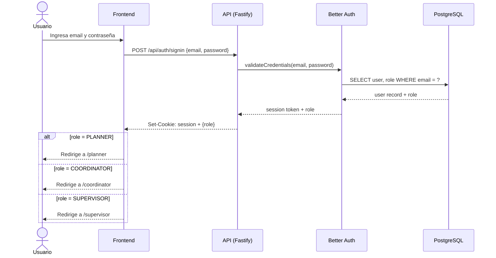

---

### 12.2 Catálogo

#### CU-002 — Gestionar productos

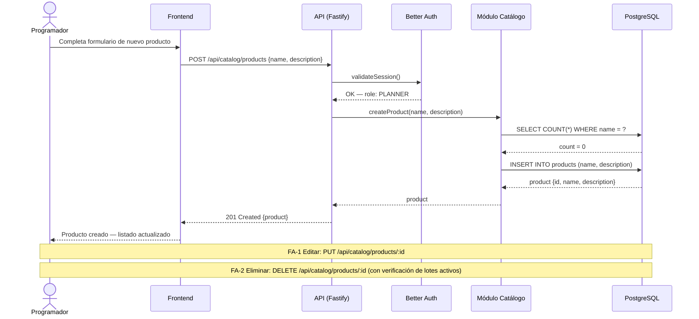

---

#### CU-003 — Definir receta de producto

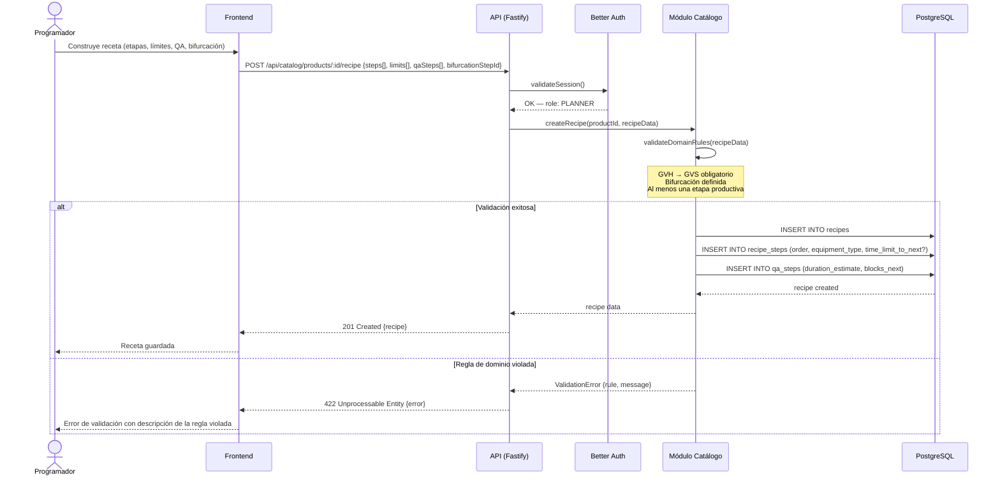

---

#### CU-004 — Gestionar equipos físicos

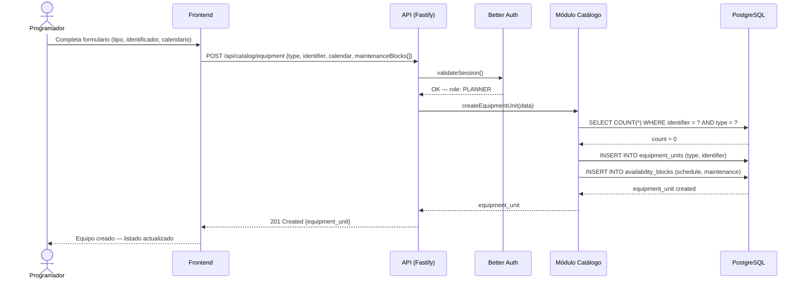

---

### 12.3 Planificación

#### CU-005 — Crear lote de producción

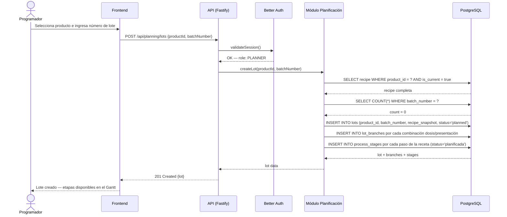

---

#### CU-006 — Asignar etapa a equipo y horario

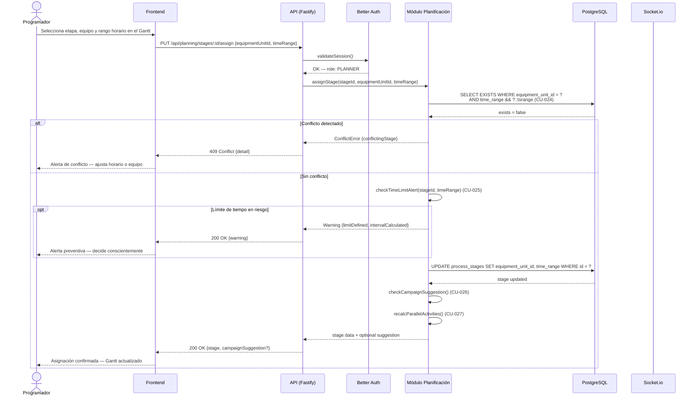

---

#### CU-007 — Formar campaña de producción

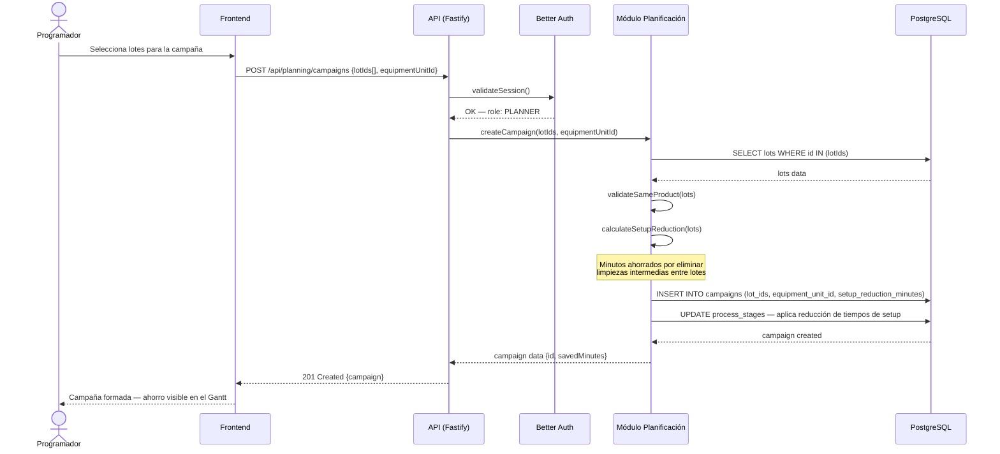

---

#### CU-008 — Evaluar impacto de deshacer campaña

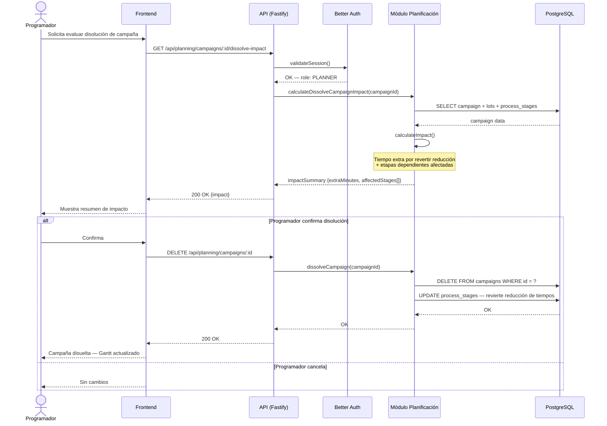

---

#### CU-009 — Programar actividad paralela

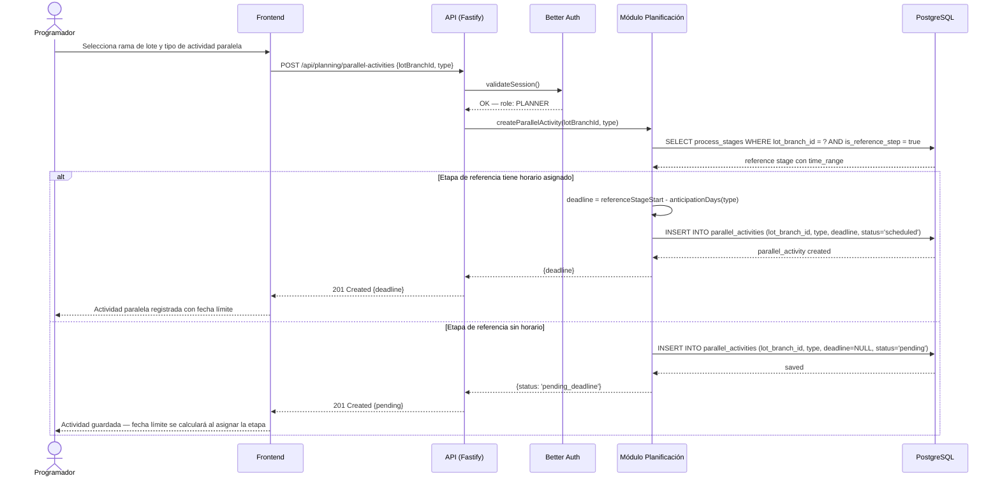

---

#### CU-010 — Consultar Gantt por equipo

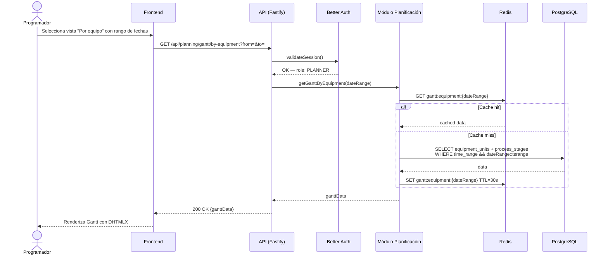

---

#### CU-011 — Consultar Gantt por lote

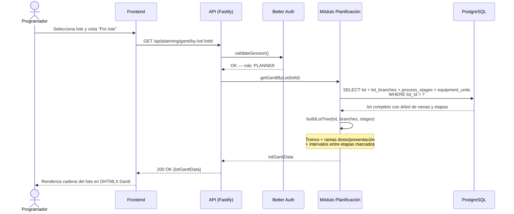

---

#### CU-012 — Consultar Gantt por recurso crítico

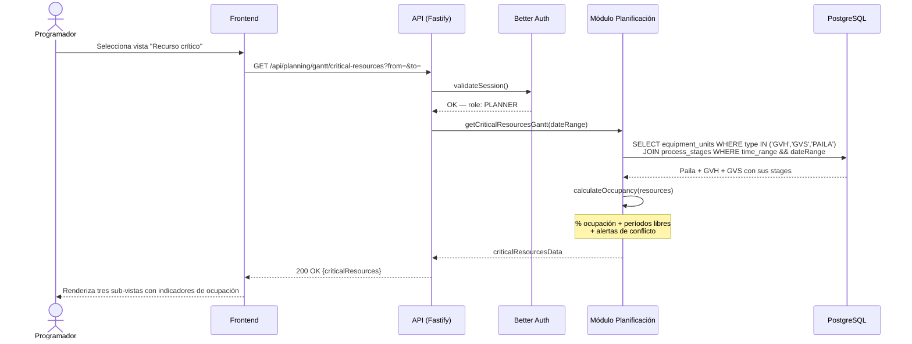

---

### 12.4 Ejecución

#### CU-013 — Registrar inicio de etapa

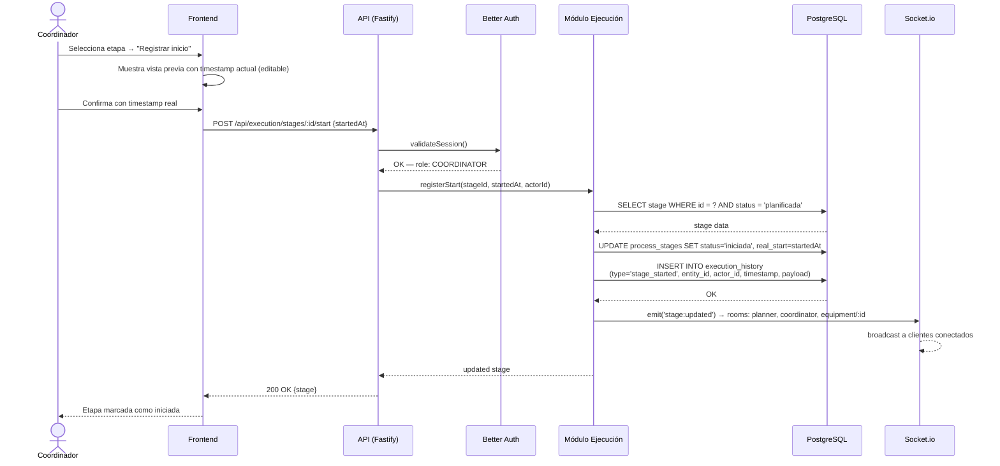

---

#### CU-014 — Registrar fin de etapa

```mermaid
sequenceDiagram
    actor C as Coordinador
    participant FE as Frontend
    participant API as API (Fastify)
    participant Auth as Better Auth
    participant EJEC as Módulo Ejecución
    participant DB as PostgreSQL
    participant WS as Socket.io
    participant Q as BullMQ

    C->>FE: Selecciona etapa activa → "Registrar fin"
    FE->>FE: Muestra vista previa con timestamp actual (editable)
    C->>FE: Confirma con timestamp real
    FE->>API: POST /api/execution/stages/:id/end {endedAt}
    API->>Auth: validateSession()
    Auth-->>API: OK — role: COORDINATOR
    API->>EJEC: registerEnd(stageId, endedAt, actorId)
    EJEC->>DB: SELECT stage + previous_stage + recipe time_limit
    DB-->>EJEC: data
    EJEC->>EJEC: checkTimeLimitViolation(prevEnd, currStart, limit)
    alt Divergencia detectada (CU-028)
        EJEC->>DB: INSERT INTO divergences<br/>(lot_id, from_stage, to_stage, limit_min, actual_min, detected_at)
        EJEC->>Q: enqueue(notificationJob, {divergenceData})
        Q-->>WS: emit('divergence:detected') → rooms: planner, coordinator
    end
    EJEC->>DB: UPDATE process_stages SET status='terminada', real_end=endedAt
    EJEC->>DB: INSERT INTO execution_history (type='stage_ended', ...)
    DB-->>EJEC: OK
    EJEC->>WS: emit('stage:updated') → rooms: planner, coordinator, equipment/:id
    WS-->>WS: broadcast
    EJEC-->>API: updated stage
    API-->>FE: 200 OK {stage, divergence?}
    FE-->>C: Etapa marcada como terminada
```

---

#### CU-015 — Mover proceso a nuevo horario

```mermaid
sequenceDiagram
    actor C as Coordinador
    participant FE as Frontend
    participant API as API (Fastify)
    participant Auth as Better Auth
    participant EJEC as Módulo Ejecución
    participant PLAN as Módulo Planificación
    participant DB as PostgreSQL
    participant WS as Socket.io

    C->>FE: Selecciona etapa → "Mover proceso" → ingresa nuevo horario
    FE->>API: POST /api/execution/stages/:id/move/preview {newTimeRange}
    API->>Auth: validateSession()
    Auth-->>API: OK — role: COORDINATOR
    API->>EJEC: previewMove(stageId, newTimeRange)
    EJEC->>PLAN: checkConflict(equipmentUnitId, newTimeRange) (CU-024)
    PLAN->>DB: SELECT solapamientos tsrange
    DB-->>PLAN: resultado
    PLAN-->>EJEC: conflict result
    EJEC->>EJEC: analyzeDependentStages(stageId)
    EJEC-->>API: impactSummary {conflicts?, affectedStages[], warnings[]}
    API-->>FE: 200 OK {impactSummary}
    FE-->>C: Muestra resumen de impacto
    alt Coordinador confirma
        C->>FE: Confirma
        FE->>API: PUT /api/execution/stages/:id/move {newTimeRange}
        API->>EJEC: applyMove(stageId, newTimeRange, actorId)
        EJEC->>DB: UPDATE process_stages SET time_range = newTimeRange
        EJEC->>DB: INSERT INTO execution_history (type='stage_moved', ...)
        EJEC->>EJEC: recalcParallelActivities() (CU-027)
        DB-->>EJEC: OK
        EJEC->>WS: emit('stage:moved') → rooms: planner, coordinator, equipment/:id
        WS-->>WS: broadcast
        EJEC-->>API: updated stage
        API-->>FE: 200 OK
        FE-->>C: Proceso movido — Gantt actualizado
    else Coordinador cancela
        FE-->>C: Sin cambios
    end
```

---

#### CU-016 — Pausar proceso

```mermaid
sequenceDiagram
    actor C as Coordinador
    participant FE as Frontend
    participant API as API (Fastify)
    participant Auth as Better Auth
    participant EJEC as Módulo Ejecución
    participant DB as PostgreSQL
    participant WS as Socket.io

    C->>FE: Selecciona etapa activa → "Pausar proceso" → ingresa motivo
    FE->>API: POST /api/execution/stages/:id/pause {reason, pausedAt}
    API->>Auth: validateSession()
    Auth-->>API: OK — role: COORDINATOR
    API->>EJEC: pauseStage(stageId, reason, pausedAt, actorId)
    EJEC->>DB: SELECT stage WHERE id = ? AND status IN ('iniciada','en_curso')
    DB-->>EJEC: stage data
    EJEC->>DB: UPDATE process_stages SET status='pausada'
    EJEC->>DB: INSERT INTO execution_history (type='stage_paused', payload={reason})
    DB-->>EJEC: OK
    EJEC->>WS: emit('stage:paused') → rooms: planner, coordinator, equipment/:id
    WS-->>WS: broadcast
    EJEC-->>API: updated stage
    API-->>FE: 200 OK
    FE-->>C: Proceso pausado
```

---

#### CU-017 — Reanudar proceso

```mermaid
sequenceDiagram
    actor C as Coordinador
    participant FE as Frontend
    participant API as API (Fastify)
    participant Auth as Better Auth
    participant EJEC as Módulo Ejecución
    participant DB as PostgreSQL
    participant WS as Socket.io

    C->>FE: Selecciona etapa pausada → "Reanudar proceso"
    FE->>API: GET /api/execution/stages/:id/resume/preview
    API->>Auth: validateSession()
    Auth-->>API: OK — role: COORDINATOR
    API->>EJEC: previewResume(stageId)
    EJEC->>DB: SELECT stage + previous_stage + recipe time_limit
    DB-->>EJEC: data
    EJEC->>EJEC: calculatePauseDuration()
    EJEC->>EJEC: checkTimeLimitAlert(totalElapsed, limit) (CU-025)
    EJEC-->>API: impactSummary {pauseDuration, timeLimitWarning?, newEstimatedEnd}
    API-->>FE: 200 OK {impactSummary}
    FE-->>C: Muestra duración de pausa e impacto
    C->>FE: Confirma reanudación
    FE->>API: POST /api/execution/stages/:id/resume {resumedAt}
    API->>EJEC: applyResume(stageId, resumedAt, actorId)
    EJEC->>DB: UPDATE process_stages SET status='en_curso'
    EJEC->>DB: INSERT INTO execution_history (type='stage_resumed', ...)
    DB-->>EJEC: OK
    EJEC->>WS: emit('stage:resumed') → rooms: planner, coordinator, equipment/:id
    WS-->>WS: broadcast
    EJEC-->>API: OK
    API-->>FE: 200 OK
    FE-->>C: Proceso reanudado
```

---

#### CU-018 — Registrar ejecución parcial

```mermaid
sequenceDiagram
    actor C as Coordinador
    participant FE as Frontend
    participant API as API (Fastify)
    participant Auth as Better Auth
    participant EJEC as Módulo Ejecución
    participant DB as PostgreSQL
    participant WS as Socket.io

    C->>FE: Selecciona etapa → "Registrar parcial" → ingresa cantidad y horario
    FE->>API: POST /api/execution/stages/:id/partial {quantity, startedAt, endedAt}
    API->>Auth: validateSession()
    Auth-->>API: OK — role: COORDINATOR
    API->>EJEC: registerPartialExecution(stageId, quantity, startedAt, endedAt, actorId)
    EJEC->>DB: SELECT stage + lot_branch.total_quantity<br/>+ SUM(stage_executions.quantity_processed)
    DB-->>EJEC: stage data + accumulated
    EJEC->>EJEC: validate(accumulated + quantity <= total)
    alt Cantidad válida
        EJEC->>DB: INSERT INTO stage_executions (quantity_processed, started_at, ended_at)
        EJEC->>DB: INSERT INTO execution_history (type='partial_execution', ...)
        EJEC->>EJEC: checkCompletion(accumulated + quantity, total)
        alt Suma alcanza el total
            EJEC->>DB: UPDATE process_stages SET status='terminada'
        end
        DB-->>EJEC: OK
        EJEC->>WS: emit('stage:partial') → rooms: planner, coordinator, equipment/:id
        WS-->>WS: broadcast
        EJEC-->>API: {remaining, isComplete}
        API-->>FE: 200 OK {remaining, isComplete}
        FE-->>C: Parcial registrado — cantidad restante mostrada
    else Cantidad supera el restante
        EJEC-->>API: ValidationError {maxAllowed}
        API-->>FE: 422 {error}
        FE-->>C: Error — cantidad excede el restante
    end
```

---

#### CU-019 — Reprogramar proceso con motivo

```mermaid
sequenceDiagram
    actor C as Coordinador
    participant FE as Frontend
    participant API as API (Fastify)
    participant Auth as Better Auth
    participant EJEC as Módulo Ejecución
    participant PLAN as Módulo Planificación
    participant DB as PostgreSQL
    participant WS as Socket.io

    C->>FE: Selecciona etapa → "Reprogramar con motivo" → nuevo horario + motivo
    FE->>API: POST /api/execution/stages/:id/reschedule/preview {newTimeRange, reason}
    API->>Auth: validateSession()
    Auth-->>API: OK — role: COORDINATOR
    API->>EJEC: previewReschedule(stageId, newTimeRange)
    EJEC->>PLAN: checkConflict(equipmentUnitId, newTimeRange) (CU-024)
    PLAN->>DB: SELECT solapamientos tsrange
    DB-->>PLAN: resultado
    PLAN-->>EJEC: conflict result
    EJEC->>EJEC: analyzeImpact(stageId)
    note over EJEC: Etapas dependientes afectadas<br/>Campañas comprometidas
    EJEC-->>API: impactSummary
    API-->>FE: 200 OK {impactSummary}
    FE-->>C: Muestra resumen de impacto
    C->>FE: Confirma reprogramación
    FE->>API: PUT /api/execution/stages/:id/reschedule {newTimeRange, reason}
    API->>EJEC: applyReschedule(stageId, newTimeRange, reason, actorId)
    EJEC->>DB: UPDATE process_stages SET time_range = newTimeRange
    EJEC->>DB: INSERT INTO execution_history (type='stage_rescheduled', payload={reason})
    EJEC->>EJEC: recalcParallelActivities() (CU-027)
    DB-->>EJEC: OK
    EJEC->>WS: emit('stage:rescheduled') → rooms: planner, coordinator, equipment/:id
    WS-->>WS: broadcast
    EJEC-->>API: OK
    API-->>FE: 200 OK
    FE-->>C: Proceso reprogramado con motivo registrado
```

---

### 12.5 Historial y estadísticas

#### CU-020 — Consultar estado del equipo en tiempo real

```mermaid
sequenceDiagram
    actor R as Responsable de Equipo
    participant FE as Frontend
    participant API as API (Fastify)
    participant Auth as Better Auth
    participant EJEC as Módulo Ejecución
    participant DB as PostgreSQL
    participant WS as Socket.io

    R->>FE: Accede al dashboard
    FE->>API: GET /api/execution/equipment/:id/view
    API->>Auth: validateSession()
    Auth-->>API: OK — role: SUPERVISOR, equipmentId
    API->>EJEC: getEquipmentView(equipmentId, dateRange)
    EJEC->>DB: SELECT process_stages WHERE equipment_unit_id = ?<br/>AND time_range && currentWeek
    DB-->>EJEC: stages data
    EJEC-->>API: equipmentView
    API-->>FE: 200 OK {stages}
    FE-->>R: Renderiza vista de solo lectura
    FE->>WS: socket.join('equipment/:id')
    note over FE,WS: Suscripción a la room del equipo
    loop Mientras el usuario está conectado
        WS-->>FE: emit('stage:updated') ante cualquier cambio (CU-029)
        FE-->>R: Actualización automática sin recarga de página
    end
```

---

#### CU-021 — Consultar historial de lote

```mermaid
sequenceDiagram
    actor P as Programador
    participant FE as Frontend
    participant API as API (Fastify)
    participant Auth as Better Auth
    participant HIST as Módulo Historial
    participant DB as PostgreSQL

    P->>FE: Busca lote por número o producto
    FE->>API: GET /api/history/lots/:lotId
    API->>Auth: validateSession()
    Auth-->>API: OK — role: PLANNER
    API->>HIST: getLotHistory(lotId)
    HIST->>DB: SELECT execution_history WHERE entity_id IN (lot, branches, stages)<br/>ORDER BY timestamp ASC
    DB-->>HIST: history events
    HIST->>DB: SELECT lot + lot_branches + process_stages (estado actual)
    DB-->>HIST: lot tree
    HIST->>HIST: buildLotTimeline(events, lotTree)
    HIST-->>API: lotTimeline
    API-->>FE: 200 OK {timeline}
    FE-->>P: Renderiza ciclo de vida con árbol dosis/presentación
```

---

#### CU-022 — Consultar divergencias pendientes

```mermaid
sequenceDiagram
    actor U as Programador / Coordinador
    participant FE as Frontend
    participant API as API (Fastify)
    participant Auth as Better Auth
    participant HIST as Módulo Historial
    participant DB as PostgreSQL

    U->>FE: Accede a sección de divergencias
    FE->>API: GET /api/history/divergences?status=pending
    API->>Auth: validateSession()
    Auth-->>API: OK — role: PLANNER o COORDINATOR
    API->>HIST: getDivergences(filters)
    HIST->>DB: SELECT divergences JOIN lots JOIN process_stages<br/>WHERE acknowledged = false ORDER BY detected_at DESC
    DB-->>HIST: divergences list
    HIST-->>API: divergences
    API-->>FE: 200 OK {divergences}
    FE-->>U: Lista con datos objetivos por divergencia
    opt Usuario marca como "informe confeccionado"
        U->>FE: "Marcar como informada"
        FE->>API: PATCH /api/history/divergences/:id/acknowledge
        API->>HIST: acknowledgeDivergence(divergenceId, actorId)
        HIST->>DB: UPDATE divergences SET acknowledged = true
        HIST->>DB: INSERT INTO execution_history (type='divergence_acknowledged', ...)
        DB-->>HIST: OK
        HIST-->>API: OK
        API-->>FE: 200 OK
        FE-->>U: Divergencia marcada como informada
    end
```

---

#### CU-023 — Consultar estadísticas de duración

```mermaid
sequenceDiagram
    actor P as Programador
    participant FE as Frontend
    participant API as API (Fastify)
    participant Auth as Better Auth
    participant STATS as Módulo Estadísticas
    participant DB as PostgreSQL

    P->>FE: Selecciona filtros (producto, etapa, equipo)
    FE->>API: GET /api/stats/durations?productId=&stepId=&equipmentId=
    API->>Auth: validateSession()
    Auth-->>API: OK — role: PLANNER
    API->>STATS: getDurationStats(filters)
    STATS->>DB: SELECT avg_minutes, std_deviation, sample_count, confidence_level<br/>FROM duration_stats WHERE filters
    DB-->>STATS: stats data
    STATS-->>API: durationStats
    API-->>FE: 200 OK {stats}
    FE-->>P: Promedio + desvío + nivel de confianza + tipo (manual/calculado)
```

---

### 12.6 Automatizados

#### CU-024 — Detectar conflicto de disponibilidad

```mermaid
sequenceDiagram
    participant CALLER as Módulo llamador (Plan / Ejec)
    participant DB as PostgreSQL

    CALLER->>DB: SELECT EXISTS(<br/>  SELECT 1 FROM process_stages<br/>  WHERE equipment_unit_id = :id<br/>  AND time_range && :proposed::tsrange<br/>  AND id != :currentStageId<br/>)
    DB-->>CALLER: exists = true / false
    alt exists = true
        CALLER->>DB: SELECT id, lot_id, time_range FROM process_stages<br/>WHERE equipment_unit_id = :id AND time_range && :proposed
        DB-->>CALLER: conflicting stage detail
        CALLER-->>CALLER: retorna ConflictError {conflictingStage}
    else exists = false
        CALLER-->>CALLER: retorna OK — continúa flujo
    end
```

---

#### CU-025 — Emitir alerta preventiva de límite de tiempo

```mermaid
sequenceDiagram
    participant CALLER as Módulo llamador (Plan / Ejec)
    participant DB as PostgreSQL

    CALLER->>DB: SELECT time_limit_to_next FROM recipe_steps<br/>WHERE id = :previousStepId
    DB-->>CALLER: time_limit (nullable)
    alt time_limit definido
        CALLER->>CALLER: interval = proposedStart - previousStageEnd
        alt interval > time_limit
            CALLER-->>CALLER: retorna Warning {limit, interval, difference}
        else interval <= time_limit
            CALLER-->>CALLER: retorna OK — sin alerta
        end
    else time_limit = NULL
        CALLER-->>CALLER: retorna OK — transición sin límite
    end
```

---

#### CU-026 — Sugerir formación de campaña

```mermaid
sequenceDiagram
    participant PLAN as Módulo Planificación
    participant DB as PostgreSQL
    participant WS as Socket.io

    note over PLAN: Disparado tras confirmar CU-006
    PLAN->>DB: SELECT process_stages s2<br/>JOIN lots l2 ON s2.lot_id = l2.id<br/>WHERE l2.product_id = :currentProductId<br/>AND s2.equipment_unit_id = :equipmentUnitId<br/>AND s2.time_range -|- :assignedRange<br/>AND s2.lot_id != :currentLotId
    DB-->>PLAN: nearby lots of same product
    alt Lotes en proximidad encontrados
        PLAN->>PLAN: estimateSetupReduction(lots)
        PLAN->>WS: emit('campaign:suggestion', {lots, savedMinutes}) → room: planner
        WS-->>WS: Programador recibe sugerencia en su interfaz
    else Sin lotes próximos
        note over PLAN: Sin acción
    end
```

---

#### CU-027 — Recalcular fechas de actividades paralelas

```mermaid
sequenceDiagram
    participant CALLER as Módulo llamador (Plan / Ejec)
    participant DB as PostgreSQL
    participant WS as Socket.io

    note over CALLER: Disparado cuando una etapa productiva cambia de horario
    CALLER->>DB: SELECT * FROM parallel_activities<br/>WHERE reference_stage_id = :stageId
    DB-->>CALLER: parallel activities list
    loop Por cada actividad paralela
        CALLER->>CALLER: newDeadline = newStageStart - anticipationDays(activityType)
        CALLER->>DB: UPDATE parallel_activities SET deadline = newDeadline WHERE id = ?
        alt newDeadline < NOW() + 24h
            CALLER->>WS: emit('parallel_activity:urgent', {activity, newDeadline}) → room: planner
        end
    end
    DB-->>CALLER: OK
```

---

#### CU-028 — Detectar y alertar divergencia confirmada

```mermaid
sequenceDiagram
    participant EJEC as Módulo Ejecución
    participant DB as PostgreSQL
    participant Q as BullMQ
    participant WS as Socket.io

    note over EJEC: Disparado por CU-013 o CU-014
    EJEC->>DB: SELECT time_limit_to_next FROM recipe_steps<br/>WHERE id = :previousStep
    DB-->>EJEC: time_limit (nullable)
    alt time_limit definido
        EJEC->>EJEC: actualMinutes = currentStageStart - previousStageEnd
        alt actualMinutes > time_limit
            EJEC->>DB: INSERT INTO divergences<br/>(lot_id, from_stage_id, to_stage_id,<br/>limit_minutes, actual_minutes, detected_at)
            DB-->>EJEC: divergence created
            EJEC->>Q: enqueue(notificationJob, {divergenceId, lot, stages, limit, actual})
            Q-->>WS: Job procesado → emit('divergence:detected', payload)<br/>→ rooms: planner, coordinator
            WS-->>WS: Alerta en tiempo real a Programador y Coordinador
        else actualMinutes <= time_limit
            note over EJEC: Sin divergencia — continúa flujo normal
        end
    else sin time_limit
        note over EJEC: Transición sin restricción — sin acción
    end
```

---

#### CU-029 — Sincronizar plan en tiempo real

```mermaid
sequenceDiagram
    participant EJEC as Módulo Ejecución
    participant WS as Socket.io Server
    participant RD as Redis (adapter)
    participant C1 as Cliente Programador
    participant C2 as Cliente Coordinador
    participant C3 as Cliente Responsable

    note over EJEC: Disparado por CU-013 al CU-019
    EJEC->>WS: emit(event, payload, rooms: ['planner','coordinator','equipment/:id'])
    WS->>RD: publish event via Redis adapter
    note over RD: Garantiza broadcast en<br/>múltiples instancias del servidor
    RD-->>WS: distributed broadcast
    WS-->>C1: event (room: planner)
    WS-->>C2: event (room: coordinator)
    WS-->>C3: event (room: equipment/:id)
    C1-->>C1: TanStack Query invalida query → refetch automático
    C2-->>C2: TanStack Query invalida query → refetch automático
    C3-->>C3: Zustand actualiza estado → UI re-renderiza
```

---

#### CU-030 — Recalcular estadísticas de duración

```mermaid
sequenceDiagram
    participant SCH as BullMQ Scheduler
    participant JOB as Job: Estadísticas
    participant DB as PostgreSQL

    SCH->>JOB: trigger(recalcStatsJob)
    JOB->>DB: SELECT last_recalc FROM stats_metadata
    DB-->>JOB: lastRecalc timestamp
    JOB->>DB: SELECT stage_executions JOIN process_stages JOIN lots<br/>WHERE ended_at > lastRecalc<br/>GROUP BY (product_id, recipe_step_id, equipment_unit_id)
    DB-->>JOB: new executions grouped
    loop Por cada combinación con nuevos datos
        JOB->>DB: SELECT ALL executions para esa combinación
        DB-->>JOB: all executions
        JOB->>JOB: avg = MEAN(durations)<br/>std = STDDEV(durations)<br/>confidence = classify(sampleCount)
        JOB->>DB: UPSERT duration_stats<br/>(product_id, recipe_step_id, equipment_unit_id,<br/>avg_minutes, std_deviation, sample_count, confidence_level)
    end
    JOB->>DB: UPDATE stats_metadata SET last_recalc = NOW()
    DB-->>JOB: OK
    JOB-->>SCH: Completado — próxima ejecución programada

```

---

## 13. Diagramas de clases del análisis

Los diagramas de clases del análisis identifican, para cada caso de uso, las clases participantes según su rol en el patrón de análisis ECB (Entity–Control–Boundary): las clases **boundary** representan la interfaz entre el actor y el sistema (formularios, vistas, endpoints); las clases **control** encapsulan la lógica de negocio del caso de uso; y las clases **entity** representan la información persistente del dominio. Los casos de uso automatizados no tienen clase boundary humana; en su lugar se indica la clase que actúa como disparador interno.

---

### 13.1 CU-001 — Autenticación

```mermaid
classDiagram
    class LoginForm {
        <<boundary>>
        -email: string
        -password: string
        +submit(): void
        +showError(message: string): void
        +redirectByRole(role: Role): void
    }

    class AuthController {
        <<control>>
        +signIn(email: string, password: string): Session
        +validateSession(token: string): User
        +destroySession(token: string): void
    }

    class User {
        <<entity>>
        +id: UUID
        +email: string
        +passwordHash: string
        +role: Role
        +isActive: boolean
    }

    class Session {
        <<entity>>
        +id: UUID
        +userId: UUID
        +token: string
        +expiresAt: DateTime
    }

    class Role {
        <<entity>>
        PLANNER
        COORDINATOR
        SUPERVISOR
    }

    LoginForm --> AuthController : invoca
    AuthController --> User : autentica
    AuthController --> Session : crea
    User --> Role : tiene
```

---

### 13.2 CU-002 — Gestionar productos

```mermaid
classDiagram
    class ProductForm {
        <<boundary>>
        -name: string
        -description: string
        +submit(): void
        +showError(error: string): void
    }

    class ProductController {
        <<control>>
        +create(name: string, description: string): Product
        +update(id: UUID, data: ProductData): Product
        +delete(id: UUID): void
        -validateNoDuplicateName(name: string): void
        -validateNoActiveLots(id: UUID): void
    }

    class Product {
        <<entity>>
        +id: UUID
        +name: string
        +description: string
        +currentRecipeId: UUID
        +createdAt: DateTime
    }

    ProductForm --> ProductController : invoca
    ProductController --> Product : gestiona
```

---

### 13.3 CU-003 — Definir receta de producto

```mermaid
classDiagram
    class RecipeBuilder {
        <<boundary>>
        -productId: UUID
        -steps: RecipeStep[]
        -bifurcationStepId: UUID
        +addStep(step: RecipeStep): void
        +setTimeLimit(fromStep: UUID, toStep: UUID, limitMin: int): void
        +addQAStep(afterStep: UUID, qa: QAStep): void
        +setBifurcationPoint(stepId: UUID): void
        +save(): void
    }

    class RecipeController {
        <<control>>
        +create(productId: UUID, data: RecipeData): Recipe
        +update(recipeId: UUID, data: RecipeData): Recipe
        -validateGVHFollowedByGVS(steps: RecipeStep[]): void
        -validateBifurcationDefined(data: RecipeData): void
        -validateMinimumSteps(steps: RecipeStep[]): void
    }

    class Product {
        <<entity>>
        +id: UUID
        +name: string
    }

    class Recipe {
        <<entity>>
        +id: UUID
        +productId: UUID
        +isCurrent: boolean
        +createdAt: DateTime
    }

    class RecipeStep {
        <<entity>>
        +id: UUID
        +recipeId: UUID
        +order: int
        +name: string
        +equipmentType: EquipmentType
        +timeLimitToNextMinutes: int
        +isBifurcationPoint: boolean
    }

    class QAStep {
        <<entity>>
        +id: UUID
        +afterRecipeStepId: UUID
        +durationEstimateMinutes: int
        +blocksNext: boolean
    }

    class EquipmentType {
        <<entity>>
        GVS
        GVH
        COMPRIMIDORA
        PAILA
        BLISTERA
        LINEA_EMPAQUE
    }

    RecipeBuilder --> RecipeController : invoca
    RecipeController --> Recipe : crea
    RecipeController --> RecipeStep : gestiona
    RecipeController --> QAStep : gestiona
    RecipeController --> Product : referencia
    Recipe "1" --> "1..*" RecipeStep : define
    RecipeStep "1" --> "0..1" QAStep : incluye
    RecipeStep --> EquipmentType : requiere
```

---

### 13.4 CU-004 — Gestionar equipos físicos

```mermaid
classDiagram
    class EquipmentForm {
        <<boundary>>
        -identifier: string
        -type: EquipmentType
        -workingHours: WorkingHours
        +submit(): void
        +addMaintenanceBlock(block: AvailabilityBlock): void
        +showError(error: string): void
    }

    class EquipmentController {
        <<control>>
        +create(type: EquipmentType, identifier: string, calendar: CalendarData): EquipmentUnit
        +update(id: UUID, data: EquipmentData): EquipmentUnit
        +addBlock(unitId: UUID, block: AvailabilityBlock): void
        +delete(id: UUID): void
        -validateUniqueIdentifier(identifier: string, type: EquipmentType): void
        -validateNoActiveStages(id: UUID): void
    }

    class EquipmentUnit {
        <<entity>>
        +id: UUID
        +identifier: string
        +type: EquipmentType
        +isActive: boolean
    }

    class AvailabilityBlock {
        <<entity>>
        +id: UUID
        +equipmentUnitId: UUID
        +blockType: BlockType
        +timeRange: tsrange
        +reason: string
    }

    class BlockType {
        <<entity>>
        MAINTENANCE
        FAILURE
        WORKING_HOURS
    }

    EquipmentForm --> EquipmentController : invoca
    EquipmentController --> EquipmentUnit : gestiona
    EquipmentController --> AvailabilityBlock : gestiona
    EquipmentUnit "1" --> "*" AvailabilityBlock : tiene
    AvailabilityBlock --> BlockType : es de tipo
```

---

### 13.5 CU-005 — Crear lote de producción

```mermaid
classDiagram
    class LotForm {
        <<boundary>>
        -productId: UUID
        -batchNumber: string
        +submit(): void
        +showError(error: string): void
        +showLotCreated(lot: Lot): void
    }

    class LotController {
        <<control>>
        +create(productId: UUID, batchNumber: string): Lot
        -validateUniqueBatchNumber(batchNumber: string): void
        -validateProductHasCompleteRecipe(productId: UUID): void
        -snapshotCurrentRecipe(productId: UUID): RecipeSnapshot
        -instantiateStages(lot: Lot, recipe: RecipeSnapshot): ProcessStage[]
        -instantiateBranches(lot: Lot, recipe: RecipeSnapshot): LotBranch[]
    }

    class Lot {
        <<entity>>
        +id: UUID
        +productId: UUID
        +batchNumber: string
        +recipeSnapshot: JSON
        +status: LotStatus
        +createdAt: DateTime
    }

    class LotBranch {
        <<entity>>
        +id: UUID
        +lotId: UUID
        +dose: string
        +presentationType: string
        +totalQuantity: decimal
    }

    class ProcessStage {
        <<entity>>
        +id: UUID
        +lotBranchId: UUID
        +recipeStepId: UUID
        +equipmentUnitId: UUID
        +timeRange: tsrange
        +status: StageStatus
    }

    class LotStatus {
        <<entity>>
        PLANNED
        IN_EXECUTION
        DISPATCHED
    }

    LotForm --> LotController : invoca
    LotController --> Lot : crea
    LotController --> LotBranch : instancia
    LotController --> ProcessStage : instancia
    Lot "1" --> "1..*" LotBranch : tiene ramas
    LotBranch "1" --> "1..*" ProcessStage : contiene
    Lot --> LotStatus : tiene estado
```

---

### 13.6 CU-006 — Asignar etapa a equipo y horario

```mermaid
classDiagram
    class GanttView {
        <<boundary>>
        -selectedStageId: UUID
        -selectedEquipmentId: UUID
        -proposedTimeRange: tsrange
        +onStageDrop(stageId: UUID, equipmentId: UUID, timeRange: tsrange): void
        +showConflictAlert(conflict: ConflictDetail): void
        +showTimeLimitWarning(warning: TimeLimitWarning): void
        +showAssignmentPreview(stage: ProcessStage): void
        +confirmAssignment(): void
    }

    class StageAssignmentController {
        <<control>>
        +assignStage(stageId: UUID, equipmentUnitId: UUID, timeRange: tsrange): ProcessStage
        +previewAssignment(stageId: UUID, equipmentUnitId: UUID, timeRange: tsrange): AssignmentPreview
        -validateEquipmentType(stageId: UUID, equipmentUnitId: UUID): void
        -detectConflict(equipmentUnitId: UUID, timeRange: tsrange): ConflictDetail
        -checkTimeLimitAlert(stageId: UUID, timeRange: tsrange): TimeLimitWarning
        -triggerCampaignSuggestion(stageId: UUID): void
        -recalcParallelActivities(stageId: UUID): void
    }

    class ProcessStage {
        <<entity>>
        +id: UUID
        +lotBranchId: UUID
        +recipeStepId: UUID
        +equipmentUnitId: UUID
        +timeRange: tsrange
        +status: StageStatus
    }

    class EquipmentUnit {
        <<entity>>
        +id: UUID
        +identifier: string
        +type: EquipmentType
    }

    class ConflictDetail {
        <<entity>>
        +conflictingStageId: UUID
        +conflictingLotId: UUID
        +conflictingTimeRange: tsrange
    }

    class TimeLimitWarning {
        <<entity>>
        +limitMinutes: int
        +calculatedIntervalMinutes: int
        +differenceMinutes: int
    }

    GanttView --> StageAssignmentController : invoca
    StageAssignmentController --> ProcessStage : asigna
    StageAssignmentController --> EquipmentUnit : consulta disponibilidad
    StageAssignmentController --> ConflictDetail : produce
    StageAssignmentController --> TimeLimitWarning : produce
    ProcessStage --> EquipmentUnit : asignada a
```

---

### 13.7 CU-007 — Formar campaña de producción

```mermaid
classDiagram
    class CampaignForm {
        <<boundary>>
        -selectedLotIds: UUID[]
        -equipmentUnitId: UUID
        +submit(): void
        +showSavings(savedMinutes: int): void
        +showError(error: string): void
    }

    class CampaignController {
        <<control>>
        +create(lotIds: UUID[], equipmentUnitId: UUID): Campaign
        -validateSameProduct(lotIds: UUID[]): void
        -validateNotAlreadyInCampaign(lotIds: UUID[]): void
        -calculateSetupReduction(lots: Lot[]): int
        -applySetupReduction(campaign: Campaign): void
    }

    class Campaign {
        <<entity>>
        +id: UUID
        +lotIds: UUID[]
        +equipmentUnitId: UUID
        +setupReductionMinutes: int
        +createdAt: DateTime
    }

    class Lot {
        <<entity>>
        +id: UUID
        +productId: UUID
        +batchNumber: string
    }

    CampaignForm --> CampaignController : invoca
    CampaignController --> Campaign : crea
    CampaignController --> Lot : valida y agrupa
    Campaign --> Lot : agrupa
```

---

### 13.8 CU-008 — Evaluar impacto de deshacer campaña

```mermaid
classDiagram
    class CampaignDetailView {
        <<boundary>>
        -campaignId: UUID
        +requestDissolveCampaign(): void
        +showImpactSummary(impact: DissolveCampaignImpact): void
        +confirmDissolve(): void
        +cancel(): void
    }

    class CampaignController {
        <<control>>
        +calculateDissolveCampaignImpact(campaignId: UUID): DissolveCampaignImpact
        +dissolveCampaign(campaignId: UUID): void
        -revertSetupReduction(campaign: Campaign): void
        -recalculateAffectedStages(campaign: Campaign): void
    }

    class DissolveCampaignImpact {
        <<entity>>
        +extraMinutes: int
        +affectedStages: ProcessStage[]
        +newEstimatedSchedule: Map
    }

    class Campaign {
        <<entity>>
        +id: UUID
        +lotIds: UUID[]
        +setupReductionMinutes: int
    }

    class ProcessStage {
        <<entity>>
        +id: UUID
        +timeRange: tsrange
        +status: StageStatus
    }

    CampaignDetailView --> CampaignController : invoca
    CampaignController --> Campaign : disuelve
    CampaignController --> DissolveCampaignImpact : calcula
    CampaignController --> ProcessStage : recalcula
    DissolveCampaignImpact --> ProcessStage : incluye etapas afectadas
```

---

### 13.9 CU-009 — Programar actividad paralela

```mermaid
classDiagram
    class ParallelActivityForm {
        <<boundary>>
        -lotBranchId: UUID
        -activityType: ParallelActivityType
        +submit(): void
        +showCalculatedDeadline(deadline: DateTime): void
        +showPendingStatus(): void
        +showUrgentAlert(deadline: DateTime): void
    }

    class ParallelActivityController {
        <<control>>
        +create(lotBranchId: UUID, type: ParallelActivityType): ParallelActivity
        -findReferenceStage(lotBranchId: UUID, type: ParallelActivityType): ProcessStage
        -calculateDeadline(referenceStart: DateTime, type: ParallelActivityType): DateTime
        -isDeadlineUrgent(deadline: DateTime): boolean
    }

    class ParallelActivity {
        <<entity>>
        +id: UUID
        +lotBranchId: UUID
        +type: ParallelActivityType
        +deadline: DateTime
        +status: ParallelActivityStatus
    }

    class ParallelActivityType {
        <<entity>>
        ALUMINUM_PRINTING
        BOX_PREPARATION
    }

    class ProcessStage {
        <<entity>>
        +id: UUID
        +lotBranchId: UUID
        +timeRange: tsrange
        +status: StageStatus
    }

    ParallelActivityForm --> ParallelActivityController : invoca
    ParallelActivityController --> ParallelActivity : crea
    ParallelActivityController --> ProcessStage : consulta para calcular deadline
    ParallelActivity --> ParallelActivityType : es de tipo
    ParallelActivity --> LotBranch : pertenece a
```

---

### 13.10 CU-010 a CU-012 — Vistas del Gantt

```mermaid
classDiagram
    class GanttByEquipmentView {
        <<boundary>>
        -dateRange: DateRange
        -filters: GanttFilters
        +load(): void
        +filterByProduct(productId: UUID): void
        +onBarClick(stageId: UUID): void
    }

    class GanttByLotView {
        <<boundary>>
        -lotId: UUID
        +load(): void
        +showBifurcationPoint(): void
        +highlightTimeLimitViolations(): void
    }

    class CriticalResourceView {
        <<boundary>>
        -dateRange: DateRange
        +load(): void
        +showOccupancy(resource: EquipmentUnit, pct: float): void
        +highlightConflicts(): void
    }

    class GanttQueryController {
        <<control>>
        +getByEquipment(dateRange: DateRange, filters: GanttFilters): GanttData
        +getByLot(lotId: UUID): LotGanttData
        +getCriticalResources(dateRange: DateRange): CriticalResourceData
        -buildLotTree(lot: Lot, branches: LotBranch[], stages: ProcessStage[]): LotGanttData
        -calculateOccupancy(unit: EquipmentUnit, stages: ProcessStage[]): float
    }

    class GanttData {
        <<entity>>
        +equipmentUnits: EquipmentUnit[]
        +stages: ProcessStage[]
    }

    class LotGanttData {
        <<entity>>
        +lot: Lot
        +trunkStages: ProcessStage[]
        +branches: LotBranch[]
        +branchStages: Map
    }

    class CriticalResourceData {
        <<entity>>
        +paila: ResourceOccupancy
        +gvs: ResourceOccupancy
        +gvh: ResourceOccupancy
    }

    GanttByEquipmentView --> GanttQueryController : invoca
    GanttByLotView --> GanttQueryController : invoca
    CriticalResourceView --> GanttQueryController : invoca
    GanttQueryController --> GanttData : produce
    GanttQueryController --> LotGanttData : produce
    GanttQueryController --> CriticalResourceData : produce
```

---

### 13.11 CU-013 — Registrar inicio de etapa

```mermaid
classDiagram
    class CoordinatorActionPanel {
        <<boundary>>
        -stageId: UUID
        -startedAt: DateTime
        +showActionPreview(stage: ProcessStage): void
        +confirm(): void
        +editTimestamp(ts: DateTime): void
    }

    class StageTransitionController {
        <<control>>
        +registerStart(stageId: UUID, startedAt: DateTime, actorId: UUID): ProcessStage
        -validateStatus(stage: ProcessStage, expected: StageStatus): void
        -logToHistory(event: HistoryEvent): void
        -broadcastUpdate(stage: ProcessStage): void
    }

    class ProcessStage {
        <<entity>>
        +id: UUID
        +status: StageStatus
        +realStart: DateTime
        +equipmentUnitId: UUID
    }

    class ExecutionHistory {
        <<entity>>
        +id: UUID
        +eventType: string
        +entityId: UUID
        +actorId: UUID
        +timestamp: DateTime
        +payload: JSON
    }

    class StageStatus {
        <<entity>>
        PLANIFICADA
        INICIADA
        EN_CURSO
        TERMINADA
        PAUSADA
        CANCELADA
    }

    CoordinatorActionPanel --> StageTransitionController : invoca
    StageTransitionController --> ProcessStage : transiciona estado
    StageTransitionController --> ExecutionHistory : registra evento
    ProcessStage --> StageStatus : tiene estado
```

---

### 13.12 CU-014 — Registrar fin de etapa

```mermaid
classDiagram
    class CoordinatorActionPanel {
        <<boundary>>
        -stageId: UUID
        -endedAt: DateTime
        +showCompletionPreview(stage: ProcessStage): void
        +showDivergenceAlert(div: Divergence): void
        +confirm(): void
    }

    class StageTransitionController {
        <<control>>
        +registerEnd(stageId: UUID, endedAt: DateTime, actorId: UUID): ProcessStage
        -validateStatus(stage: ProcessStage): void
        -checkTimeLimitViolation(prev: ProcessStage, curr: ProcessStage, limit: int): Divergence
        -logToHistory(event: HistoryEvent): void
        -broadcastUpdate(stage: ProcessStage): void
    }

    class DivergenceDetector {
        <<control>>
        +detect(fromStage: ProcessStage, toStage: ProcessStage, limit: int): Divergence
        +persist(divergence: Divergence): void
        +enqueueNotification(divergence: Divergence): void
    }

    class ProcessStage {
        <<entity>>
        +id: UUID
        +status: StageStatus
        +realStart: DateTime
        +realEnd: DateTime
    }

    class Divergence {
        <<entity>>
        +id: UUID
        +lotId: UUID
        +fromStageId: UUID
        +toStageId: UUID
        +limitMinutes: int
        +actualMinutes: int
        +detectedAt: DateTime
        +acknowledged: boolean
    }

    class ExecutionHistory {
        <<entity>>
        +id: UUID
        +eventType: string
        +entityId: UUID
        +actorId: UUID
        +timestamp: DateTime
        +payload: JSON
    }

    CoordinatorActionPanel --> StageTransitionController : invoca
    StageTransitionController --> ProcessStage : transiciona estado
    StageTransitionController --> DivergenceDetector : delega detección
    StageTransitionController --> ExecutionHistory : registra evento
    DivergenceDetector --> Divergence : crea
```

---

### 13.13 CU-015 — Mover proceso a nuevo horario

```mermaid
classDiagram
    class CoordinatorActionPanel {
        <<boundary>>
        -stageId: UUID
        -newTimeRange: tsrange
        +showImpactPreview(impact: MoveImpact): void
        +confirm(): void
        +cancel(): void
    }

    class MoveProcessController {
        <<control>>
        +previewMove(stageId: UUID, newTimeRange: tsrange): MoveImpact
        +applyMove(stageId: UUID, newTimeRange: tsrange, actorId: UUID): ProcessStage
        -detectConflict(equipmentUnitId: UUID, newTimeRange: tsrange): ConflictDetail
        -analyzeDependentStages(stageId: UUID): ProcessStage[]
        -logToHistory(event: HistoryEvent): void
        -broadcastUpdate(stage: ProcessStage): void
        -recalcParallelActivities(stageId: UUID): void
    }

    class MoveImpact {
        <<entity>>
        +conflict: ConflictDetail
        +affectedStages: ProcessStage[]
        +campaignsAtRisk: Campaign[]
        +timeLimitWarnings: TimeLimitWarning[]
    }

    class ProcessStage {
        <<entity>>
        +id: UUID
        +timeRange: tsrange
        +status: StageStatus
        +equipmentUnitId: UUID
    }

    class ExecutionHistory {
        <<entity>>
        +id: UUID
        +eventType: string
        +payload: JSON
    }

    CoordinatorActionPanel --> MoveProcessController : invoca
    MoveProcessController --> ProcessStage : reprograma
    MoveProcessController --> MoveImpact : calcula
    MoveProcessController --> ExecutionHistory : registra
    MoveImpact --> ProcessStage : lista afectadas
```

---

### 13.14 CU-016 — Pausar proceso

```mermaid
classDiagram
    class CoordinatorActionPanel {
        <<boundary>>
        -stageId: UUID
        -reason: string
        -pausedAt: DateTime
        +showImpactPreview(impact: PauseImpact): void
        +confirm(): void
    }

    class PauseController {
        <<control>>
        +pauseStage(stageId: UUID, reason: string, pausedAt: DateTime, actorId: UUID): ProcessStage
        -validateStatus(stage: ProcessStage): void
        -logToHistory(event: HistoryEvent): void
        -broadcastUpdate(stage: ProcessStage): void
    }

    class PauseImpact {
        <<entity>>
        +freedEquipmentUnit: EquipmentUnit
        +affectedDependentStages: ProcessStage[]
    }

    class ProcessStage {
        <<entity>>
        +id: UUID
        +status: StageStatus
        +equipmentUnitId: UUID
    }

    class ExecutionHistory {
        <<entity>>
        +id: UUID
        +eventType: string
        +payload: JSON
    }

    CoordinatorActionPanel --> PauseController : invoca
    PauseController --> ProcessStage : cambia a PAUSADA
    PauseController --> PauseImpact : calcula
    PauseController --> ExecutionHistory : registra con motivo
```

---

### 13.15 CU-017 — Reanudar proceso

```mermaid
classDiagram
    class CoordinatorActionPanel {
        <<boundary>>
        -stageId: UUID
        -resumedAt: DateTime
        +showResumePreview(preview: ResumePreview): void
        +showTimeLimitWarning(warning: TimeLimitWarning): void
        +confirm(): void
    }

    class ResumeController {
        <<control>>
        +previewResume(stageId: UUID): ResumePreview
        +applyResume(stageId: UUID, resumedAt: DateTime, actorId: UUID): ProcessStage
        -calculatePauseDuration(stage: ProcessStage): int
        -checkTimeLimitAlert(elapsed: int, limit: int): TimeLimitWarning
        -logToHistory(event: HistoryEvent): void
        -broadcastUpdate(stage: ProcessStage): void
    }

    class ResumePreview {
        <<entity>>
        +pauseDurationMinutes: int
        +timeLimitWarning: TimeLimitWarning
        +newEstimatedEnd: DateTime
    }

    class ProcessStage {
        <<entity>>
        +id: UUID
        +status: StageStatus
        +realStart: DateTime
    }

    class ExecutionHistory {
        <<entity>>
        +id: UUID
        +eventType: string
        +payload: JSON
    }

    CoordinatorActionPanel --> ResumeController : invoca
    ResumeController --> ProcessStage : cambia a EN_CURSO
    ResumeController --> ResumePreview : calcula
    ResumeController --> ExecutionHistory : registra
```

---

### 13.16 CU-018 — Registrar ejecución parcial

```mermaid
classDiagram
    class PartialExecutionForm {
        <<boundary>>
        -stageId: UUID
        -quantity: decimal
        -startedAt: DateTime
        -endedAt: DateTime
        +submit(): void
        +showRemainingQuantity(remaining: decimal): void
        +showCompletionStatus(isComplete: boolean): void
        +showError(error: string): void
    }

    class PartialExecutionController {
        <<control>>
        +register(stageId: UUID, quantity: decimal, startedAt: DateTime, endedAt: DateTime, actorId: UUID): StageExecution
        -validateQuantityNotExceedsRemaining(stageId: UUID, quantity: decimal): void
        -calculateAccumulated(stageId: UUID): decimal
        -checkCompletion(stageId: UUID, accumulated: decimal, total: decimal): boolean
        -logToHistory(event: HistoryEvent): void
        -broadcastUpdate(stage: ProcessStage): void
    }

    class StageExecution {
        <<entity>>
        +id: UUID
        +processStageId: UUID
        +quantityProcessed: decimal
        +startedAt: DateTime
        +endedAt: DateTime
    }

    class ProcessStage {
        <<entity>>
        +id: UUID
        +status: StageStatus
    }

    class LotBranch {
        <<entity>>
        +id: UUID
        +totalQuantity: decimal
    }

    class ExecutionHistory {
        <<entity>>
        +id: UUID
        +eventType: string
        +payload: JSON
    }

    PartialExecutionForm --> PartialExecutionController : invoca
    PartialExecutionController --> StageExecution : crea
    PartialExecutionController --> ProcessStage : actualiza estado
    PartialExecutionController --> LotBranch : consulta total
    PartialExecutionController --> ExecutionHistory : registra
    StageExecution --> ProcessStage : corresponde a
    ProcessStage --> LotBranch : pertenece a
```

---

### 13.17 CU-019 — Reprogramar proceso con motivo

```mermaid
classDiagram
    class RescheduleForm {
        <<boundary>>
        -stageId: UUID
        -newTimeRange: tsrange
        -reason: RescheduleReason
        -reasonDetail: string
        +showImpactPreview(impact: RescheduleImpact): void
        +confirm(): void
        +cancel(): void
    }

    class RescheduleController {
        <<control>>
        +previewReschedule(stageId: UUID, newTimeRange: tsrange): RescheduleImpact
        +applyReschedule(stageId: UUID, newTimeRange: tsrange, reason: RescheduleReason, actorId: UUID): ProcessStage
        -detectConflict(equipmentUnitId: UUID, newTimeRange: tsrange): ConflictDetail
        -analyzeImpact(stageId: UUID): RescheduleImpact
        -logToHistory(event: HistoryEvent): void
        -recalcParallelActivities(stageId: UUID): void
        -broadcastUpdate(stage: ProcessStage): void
    }

    class RescheduleReason {
        <<entity>>
        MATERIALS_NOT_APPROVED
        COMMERCIAL_URGENCY
        EQUIPMENT_FAILURE
        PRIORITY_REASSIGNMENT
        OTHER
    }

    class RescheduleImpact {
        <<entity>>
        +conflict: ConflictDetail
        +affectedStages: ProcessStage[]
        +campaignsAtRisk: Campaign[]
        +timeLimitWarnings: TimeLimitWarning[]
    }

    class ProcessStage {
        <<entity>>
        +id: UUID
        +timeRange: tsrange
        +status: StageStatus
    }

    class ExecutionHistory {
        <<entity>>
        +id: UUID
        +eventType: string
        +payload: JSON
    }

    RescheduleForm --> RescheduleController : invoca
    RescheduleController --> ProcessStage : reprograma
    RescheduleController --> RescheduleImpact : calcula
    RescheduleController --> ExecutionHistory : registra con motivo
    RescheduleController --> RescheduleReason : utiliza
```

---

### 13.18 CU-020 — Consultar estado del equipo

```mermaid
classDiagram
    class SupervisorDashboard {
        <<boundary>>
        -equipmentUnitId: UUID
        -dateRange: DateRange
        +load(): void
        +onRealtimeUpdate(event: StageEvent): void
        +navigateToDate(date: Date): void
    }

    class EquipmentViewController {
        <<control>>
        +getEquipmentView(equipmentUnitId: UUID, dateRange: DateRange): EquipmentView
        +subscribeToRealtimeUpdates(equipmentUnitId: UUID): void
    }

    class EquipmentView {
        <<entity>>
        +equipmentUnit: EquipmentUnit
        +stages: ProcessStage[]
        +dateRange: DateRange
    }

    class EquipmentUnit {
        <<entity>>
        +id: UUID
        +identifier: string
        +type: EquipmentType
    }

    class ProcessStage {
        <<entity>>
        +id: UUID
        +timeRange: tsrange
        +status: StageStatus
        +lotBranchId: UUID
    }

    SupervisorDashboard --> EquipmentViewController : invoca
    EquipmentViewController --> EquipmentView : construye
    EquipmentView --> EquipmentUnit : describe
    EquipmentView --> ProcessStage : lista etapas
```

---

### 13.19 CU-021 — Consultar historial de lote

```mermaid
classDiagram
    class HistoryView {
        <<boundary>>
        -searchQuery: string
        -lotId: UUID
        -eventTypeFilter: string
        +search(): void
        +selectLot(lotId: UUID): void
        +filterByEventType(type: string): void
    }

    class HistoryController {
        <<control>>
        +getLotHistory(lotId: UUID): LotTimeline
        -buildLotTimeline(events: ExecutionHistory[], lotTree: LotTree): LotTimeline
        -groupEventsByBranch(events: ExecutionHistory[]): Map
    }

    class LotTimeline {
        <<entity>>
        +lot: Lot
        +trunkEvents: ExecutionHistory[]
        +branches: BranchTimeline[]
    }

    class BranchTimeline {
        <<entity>>
        +branch: LotBranch
        +events: ExecutionHistory[]
        +stages: ProcessStage[]
    }

    class ExecutionHistory {
        <<entity>>
        +id: UUID
        +eventType: string
        +entityId: UUID
        +actorId: UUID
        +timestamp: DateTime
        +payload: JSON
    }

    class Lot {
        <<entity>>
        +id: UUID
        +batchNumber: string
        +productId: UUID
        +status: LotStatus
    }

    HistoryView --> HistoryController : invoca
    HistoryController --> LotTimeline : construye
    LotTimeline --> Lot : describe
    LotTimeline --> BranchTimeline : agrupa por rama
    BranchTimeline --> ExecutionHistory : lista eventos
```

---

### 13.20 CU-022 — Consultar divergencias pendientes

```mermaid
classDiagram
    class DivergencePanel {
        <<boundary>>
        -statusFilter: string
        +load(): void
        +selectDivergence(id: UUID): void
        +acknowledgeReport(id: UUID): void
    }

    class DivergenceController {
        <<control>>
        +getDivergences(statusFilter: string): Divergence[]
        +acknowledgeDivergence(id: UUID, actorId: UUID): void
        -logAcknowledgment(divergenceId: UUID, actorId: UUID): void
    }

    class Divergence {
        <<entity>>
        +id: UUID
        +lotId: UUID
        +fromStageId: UUID
        +toStageId: UUID
        +limitMinutes: int
        +actualMinutes: int
        +detectedAt: DateTime
        +acknowledged: boolean
    }

    class ExecutionHistory {
        <<entity>>
        +id: UUID
        +eventType: string
        +payload: JSON
    }

    DivergencePanel --> DivergenceController : invoca
    DivergenceController --> Divergence : consulta y actualiza
    DivergenceController --> ExecutionHistory : registra acknowledgment
```

---

### 13.21 CU-023 — Consultar estadísticas de duración

```mermaid
classDiagram
    class StatsView {
        <<boundary>>
        -productId: UUID
        -recipeStepId: UUID
        -equipmentUnitId: UUID
        +load(): void
        +applyFilters(filters: StatsFilters): void
    }

    class StatsController {
        <<control>>
        +getDurationStats(filters: StatsFilters): DurationStat[]
    }

    class DurationStat {
        <<entity>>
        +id: UUID
        +productId: UUID
        +recipeStepId: UUID
        +equipmentUnitId: UUID
        +avgMinutes: float
        +stdDeviation: float
        +sampleCount: int
        +confidenceLevel: ConfidenceLevel
        +isManualEstimate: boolean
        +updatedAt: DateTime
    }

    class ConfidenceLevel {
        <<entity>>
        LOW
        MEDIUM
        HIGH
    }

    StatsView --> StatsController : invoca
    StatsController --> DurationStat : consulta
    DurationStat --> ConfidenceLevel : tiene nivel
```

---

### 13.22 CU-024 — Detectar conflicto de disponibilidad

```mermaid
classDiagram
    class ConflictDetector {
        <<control>>
        +detect(equipmentUnitId: UUID, proposedRange: tsrange, excludeStageId: UUID): ConflictDetail
        -queryOverlappingStages(equipmentUnitId: UUID, range: tsrange): ProcessStage[]
    }

    class ProcessStage {
        <<entity>>
        +id: UUID
        +equipmentUnitId: UUID
        +timeRange: tsrange
        +lotBranchId: UUID
    }

    class ConflictDetail {
        <<entity>>
        +conflictingStageId: UUID
        +conflictingLotId: UUID
        +conflictingTimeRange: tsrange
    }

    ConflictDetector --> ProcessStage : consulta solapamientos via tsrange
    ConflictDetector --> ConflictDetail : produce
```

---

### 13.23 CU-025 — Emitir alerta preventiva de límite

```mermaid
classDiagram
    class TimeLimitChecker {
        <<control>>
        +check(previousStage: ProcessStage, proposedStart: DateTime, recipeStep: RecipeStep): TimeLimitWarning
        -calculateInterval(previousEnd: DateTime, proposedStart: DateTime): int
        -isViolated(interval: int, limit: int): boolean
    }

    class RecipeStep {
        <<entity>>
        +id: UUID
        +timeLimitToNextMinutes: int
    }

    class ProcessStage {
        <<entity>>
        +id: UUID
        +realEnd: DateTime
        +timeRange: tsrange
    }

    class TimeLimitWarning {
        <<entity>>
        +limitMinutes: int
        +calculatedIntervalMinutes: int
        +differenceMinutes: int
    }

    TimeLimitChecker --> RecipeStep : lee límite
    TimeLimitChecker --> ProcessStage : lee tiempos reales
    TimeLimitChecker --> TimeLimitWarning : produce
```

---

### 13.24 CU-026 — Sugerir formación de campaña

```mermaid
classDiagram
    class CampaignSuggester {
        <<control>>
        +checkAndSuggest(assignedStage: ProcessStage): CampaignSuggestion
        -findProximateLots(productId: UUID, equipmentUnitId: UUID, timeRange: tsrange): Lot[]
        -estimateSavings(lots: Lot[]): int
        -emitSuggestion(suggestion: CampaignSuggestion): void
    }

    class CampaignSuggestion {
        <<entity>>
        +candidateLotIds: UUID[]
        +equipmentUnitId: UUID
        +estimatedSavedMinutes: int
    }

    class ProcessStage {
        <<entity>>
        +id: UUID
        +equipmentUnitId: UUID
        +timeRange: tsrange
    }

    class Lot {
        <<entity>>
        +id: UUID
        +productId: UUID
    }

    CampaignSuggester --> ProcessStage : analiza asignación reciente
    CampaignSuggester --> Lot : busca lotes próximos
    CampaignSuggester --> CampaignSuggestion : produce
```

---

### 13.25 CU-027 — Recalcular fechas de actividades paralelas

```mermaid
classDiagram
    class ParallelActivityRecalculator {
        <<control>>
        +recalculate(changedStageId: UUID, newTimeRange: tsrange): void
        -findDependentActivities(stageId: UUID): ParallelActivity[]
        -computeNewDeadline(newStart: DateTime, activityType: ParallelActivityType): DateTime
        -updateDeadline(activityId: UUID, newDeadline: DateTime): void
        -emitUrgentAlertIfNeeded(activity: ParallelActivity, deadline: DateTime): void
    }

    class ParallelActivity {
        <<entity>>
        +id: UUID
        +referenceStageId: UUID
        +type: ParallelActivityType
        +deadline: DateTime
        +status: ParallelActivityStatus
    }

    class ProcessStage {
        <<entity>>
        +id: UUID
        +timeRange: tsrange
    }

    ParallelActivityRecalculator --> ProcessStage : lee nuevo horario
    ParallelActivityRecalculator --> ParallelActivity : actualiza deadline
```

---

### 13.26 CU-028 — Detectar y alertar divergencia confirmada

```mermaid
classDiagram
    class DivergenceDetector {
        <<control>>
        +detect(fromStage: ProcessStage, toStage: ProcessStage): Divergence
        -getTimeLimitFromRecipe(fromStepId: UUID): int
        -calculateActualInterval(fromEnd: DateTime, toStart: DateTime): int
        -persist(divergence: Divergence): void
        -enqueueNotification(divergenceId: UUID): void
    }

    class NotificationJob {
        <<control>>
        +process(divergenceId: UUID): void
        -loadDivergenceData(id: UUID): Divergence
        -broadcastAlert(divergence: Divergence): void
    }

    class Divergence {
        <<entity>>
        +id: UUID
        +lotId: UUID
        +fromStageId: UUID
        +toStageId: UUID
        +limitMinutes: int
        +actualMinutes: int
        +detectedAt: DateTime
        +acknowledged: boolean
    }

    class ProcessStage {
        <<entity>>
        +id: UUID
        +realStart: DateTime
        +realEnd: DateTime
    }

    DivergenceDetector --> ProcessStage : lee tiempos reales
    DivergenceDetector --> Divergence : crea
    DivergenceDetector --> NotificationJob : encola
    NotificationJob --> Divergence : carga y emite alerta
```

---

### 13.27 CU-029 — Sincronizar plan en tiempo real

```mermaid
classDiagram
    class RealtimeBroadcaster {
        <<control>>
        +broadcast(event: StageEvent, rooms: string[]): void
        -resolveTargetRooms(event: StageEvent): string[]
        -emitToRooms(eventName: string, payload: JSON, rooms: string[]): void
    }

    class StageEvent {
        <<entity>>
        +eventType: string
        +stageId: UUID
        +equipmentUnitId: UUID
        +payload: JSON
        +occurredAt: DateTime
    }

    class SocketRoom {
        <<entity>>
        +name: string
        +connectedClients: int
    }

    RealtimeBroadcaster --> StageEvent : procesa
    RealtimeBroadcaster --> SocketRoom : emite a rooms resueltas
```

---

### 13.28 CU-030 — Recalcular estadísticas de duración

```mermaid
classDiagram
    class StatsRecalculatorJob {
        <<control>>
        +execute(): void
        -getLastRecalcTimestamp(): DateTime
        -fetchNewExecutions(since: DateTime): StageExecution[]
        -groupByCombination(executions: StageExecution[]): Map
        -calculateStats(executions: StageExecution[]): StatResult
        -classifyConfidence(sampleCount: int): ConfidenceLevel
        -upsertDurationStat(result: StatResult): void
        -updateLastRecalcTimestamp(): void
    }

    class StatResult {
        <<entity>>
        +productId: UUID
        +recipeStepId: UUID
        +equipmentUnitId: UUID
        +avgMinutes: float
        +stdDeviation: float
        +sampleCount: int
        +confidenceLevel: ConfidenceLevel
    }

    class StageExecution {
        <<entity>>
        +id: UUID
        +processStageId: UUID
        +quantityProcessed: decimal
        +startedAt: DateTime
        +endedAt: DateTime
    }

    class DurationStat {
        <<entity>>
        +productId: UUID
        +recipeStepId: UUID
        +equipmentUnitId: UUID
        +avgMinutes: float
        +stdDeviation: float
        +sampleCount: int
        +confidenceLevel: ConfidenceLevel
        +updatedAt: DateTime
    }

    StatsRecalculatorJob --> StageExecution : lee ejecuciones nuevas
    StatsRecalculatorJob --> StatResult : calcula
    StatsRecalculatorJob --> DurationStat : actualiza via UPSERT
```

---

## 14. Diagrama de Gantt

El cronograma adopta el escenario pesimista del rango estimado para cada etapa (máximo de semanas indicado en `PROYECTO.md`), resultando en un total de **14 semanas** de desarrollo. Las etapas son secuenciales dado que cada una depende de las entidades y APIs construidas en la anterior.

```mermaid
gantt
    title Sistema de Planificación de Producción Farmacéutica — Cronograma de desarrollo
    dateFormat  YYYY-MM-DD
    axisFormat  %d/%m

    section Etapa 0 — Fundacion
    Monorepo y Docker Compose            :e0a, 2026-03-09, 3d
    Fastify + TypeScript + Prisma        :e0b, after e0a, 3d
    React + Vite + Tailwind              :e0c, 2026-03-09, 4d
    Better Auth (3 roles) + login UI     :e0d, after e0b, 4d

    section Etapa 1 — Catalogo
    Schema completo del catalogo         :e1a, 2026-03-23, 3d
    Endpoints REST del catalogo          :e1b, after e1a, 3d
    UI productos y recetas               :e1c, after e1a, 5d
    UI equipos y calendarios             :e1d, after e1c, 3d
    Validacion de reglas del dominio     :e1e, after e1d, 1d

    section Etapa 2 — Planificacion y Gantt
    Schema lotes etapas campanas         :e2a, 2026-04-06, 4d
    Logica deteccion de conflictos       :e2b, after e2a, 4d
    Endpoints de planificacion           :e2c, after e2b, 4d
    Integracion DHTMLX Gantt en React    :e2d, 2026-04-06, 5d
    Vista Gantt por equipo               :e2e, after e2d, 5d
    Vista Gantt por lote                 :e2f, after e2e, 4d
    Vista por recurso critico            :e2g, after e2f, 3d
    UI campanas y actividades paralelas  :e2h, after e2g, 3d
    Tests logica de conflictos           :e2i, after e2h, 2d

    section Etapa 3 — Ejecucion y Tiempo Real
    Estados de proceso y transiciones    :e3a, 2026-05-04, 3d
    Registro de tiempos reales           :e3b, after e3a, 2d
    Logica de ejecuciones parciales      :e3c, after e3b, 3d
    Deteccion de divergencias            :e3d, after e3c, 3d
    Socket.io rooms por rol              :e3e, 2026-05-04, 4d
    Broadcasting selectivo de eventos    :e3f, after e3e, 3d
    UI Coordinador con acciones nombradas:e3g, after e3d, 4d
    Vista solo lectura Responsables      :e3h, after e3g, 3d
    Alertas de divergencia               :e3i, after e3h, 1d

    section Etapa 4 — Historial y Estadisticas
    Tabla historial con trigger Postgres :e4a, 2026-05-25, 3d
    Tabla divergencias                   :e4b, after e4a, 2d
    Jobs BullMQ estadisticas y alertas   :e4c, after e4b, 3d
    UI historial trazabilidad de lotes   :e4d, after e4c, 2d
    UI estadisticas y divergencias       :e4e, after e4d, 2d
    Tests del historial inmutable        :e4f, after e4e, 2d

    section Etapa 5 — Polish y Deployment
    Docker produccion y Railway          :e5a, 2026-06-08, 2d
    Tests integracion end-to-end         :e5b, after e5a, 2d
    Seed de datos de demostracion        :e5c, after e5b, 1d
    README y documentacion final         :e5d, after e5c, 2d
```

### Resumen por etapa

| Etapa | Nombre | Duracion | Inicio estimado | Fin estimado |
|---|---|---|---|---|
| 0 | Fundacion | 2 semanas | 09/03/2026 | 20/03/2026 |
| 1 | Catalogo | 2 semanas | 23/03/2026 | 03/04/2026 |
| 2 | Planificacion y Gantt | 4 semanas | 06/04/2026 | 01/05/2026 |
| 3 | Ejecucion y Tiempo Real | 3 semanas | 04/05/2026 | 22/05/2026 |
| 4 | Historial y Estadisticas | 2 semanas | 25/05/2026 | 05/06/2026 |
| 5 | Polish y Deployment | 1 semana | 08/06/2026 | 12/06/2026 |
| **Total** | | **14 semanas** | **09/03/2026** | **12/06/2026** |

> El escenario optimista (9 semanas) se alcanza tomando el minimo de cada rango: Etapa 0 en 1 semana, Etapa 1 en 1 semana, Etapa 2 en 3 semanas, Etapa 3 en 2 semanas, Etapa 4 en 1 semana, y Etapa 5 en 1 semana. La Etapa 2 es la de mayor variabilidad dada la complejidad de integracion del componente Gantt.

---

## 15. Diagramas de clases del diseño

Los diagramas de clases del diseño presentan la estructura técnica concreta de la implementación para cada caso de uso. A diferencia de los diagramas de análisis (patrón ECB), los diagramas de diseño incorporan el stack tecnológico real del sistema: **Fastify** con plugins de rutas, patrón **Repository** sobre **Prisma ORM** para el acceso a datos, **DTOs** (Data Transfer Objects) para la comunicación entre capas, y en el frontend, **componentes React**, **hooks de TanStack Query** y **stores de Zustand** donde corresponda. Los casos de uso automatizados (CU-024 a CU-030) muestran la cadena interna entre servicios, workers de **BullMQ** y el broadcaster de **Socket.io**.

**Patrón de capas del backend:**

```
RoutePlugin (Fastify) → [BetterAuthPlugin: valida sesión y rol] → Service → Repository → PrismaClient
```

Los repositorios encapsulan toda la lógica de consulta y retornan tipos del modelo de Prisma. Los servicios contienen la lógica de negocio y operan sobre DTOs. Los route handlers no contienen lógica de dominio: validan autenticación/autorización y delegan al servicio correspondiente.

---

### 15.1 CU-001 — Autenticación

```mermaid
classDiagram
    class AuthRoutes {
        <<route>>
        +POST_signin(req, reply): void
        +POST_signout(req, reply): void
        +GET_session(req, reply): void
    }

    class BetterAuthPlugin {
        <<middleware>>
        +validateSession(req: FastifyRequest): Session
        +requireRole(roles: Role[]): preHandler
    }

    class AuthService {
        <<service>>
        +signIn(dto: LoginRequestDto): SessionResponseDto
        +signOut(sessionToken: string): void
        +getSessionByToken(token: string): SessionResponseDto
    }

    class UserRepository {
        <<repository>>
        +findByEmail(email: string): User
        +findById(id: string): User
    }

    class LoginRequestDto {
        <<dto>>
        +email: string
        +password: string
    }

    class SessionResponseDto {
        <<dto>>
        +userId: string
        +email: string
        +role: Role
        +token: string
        +expiresAt: string
    }

    class LoginPage {
        <<component>>
        +handleSubmit(dto: LoginRequestDto): void
        +render(): JSX.Element
    }

    class useSignIn {
        <<hook>>
        +mutate(dto: LoginRequestDto): void
        +isPending: boolean
        +error: string
    }

    class authStore {
        <<store>>
        +session: SessionResponseDto
        +setSession(s: SessionResponseDto): void
        +clearSession(): void
        +getRole(): Role
    }

    AuthRoutes --> BetterAuthPlugin : usa como middleware
    AuthRoutes --> AuthService : delega lógica
    AuthService --> UserRepository : busca usuario
    AuthService ..> LoginRequestDto : recibe
    AuthService ..> SessionResponseDto : retorna
    LoginPage --> useSignIn : usa hook
    useSignIn --> authStore : actualiza sesión
    useSignIn ..> LoginRequestDto : envía
    useSignIn ..> SessionResponseDto : recibe
```

---

### 15.2 CU-002 — Gestionar productos

```mermaid
classDiagram
    class ProductRoutes {
        <<route>>
        +GET_list(req, reply): void
        +GET_byId(req, reply): void
        +POST_create(req, reply): void
        +PUT_update(req, reply): void
        +DELETE_delete(req, reply): void
    }

    class ProductService {
        <<service>>
        +list(): ProductResponseDto[]
        +getById(id: string): ProductResponseDto
        +create(dto: CreateProductDto): ProductResponseDto
        +update(id: string, dto: UpdateProductDto): ProductResponseDto
        +delete(id: string): void
        -assertNoDuplicateName(name: string, excludeId: string): void
        -assertNoActiveLots(id: string): void
    }

    class ProductRepository {
        <<repository>>
        +findAll(): Product[]
        +findById(id: string): Product
        +findByName(name: string): Product
        +create(data: ProductCreateInput): Product
        +update(id: string, data: ProductUpdateInput): Product
        +delete(id: string): void
        +hasActiveLots(id: string): boolean
    }

    class CreateProductDto {
        <<dto>>
        +name: string
        +description: string
    }

    class UpdateProductDto {
        <<dto>>
        +name: string
        +description: string
    }

    class ProductResponseDto {
        <<dto>>
        +id: string
        +name: string
        +description: string
        +hasRecipe: boolean
        +createdAt: string
    }

    class ProductsPage {
        <<component>>
        +render(): JSX.Element
    }

    class useProducts {
        <<hook>>
        +data: ProductResponseDto[]
        +isLoading: boolean
    }

    class useCreateProduct {
        <<hook>>
        +mutate(dto: CreateProductDto): void
        +isPending: boolean
    }

    ProductRoutes --> ProductService : delega
    ProductService --> ProductRepository : accede a datos
    ProductService ..> CreateProductDto : recibe
    ProductService ..> ProductResponseDto : retorna
    ProductsPage --> useProducts : carga lista
    ProductsPage --> useCreateProduct : crea producto
```

---

### 15.3 CU-003 — Definir receta de producto

```mermaid
classDiagram
    class RecipeRoutes {
        <<route>>
        +GET_byProduct(req, reply): void
        +POST_create(req, reply): void
        +PUT_update(req, reply): void
    }

    class RecipeService {
        <<service>>
        +getByProduct(productId: string): RecipeResponseDto
        +create(productId: string, dto: CreateRecipeDto): RecipeResponseDto
        +update(recipeId: string, dto: CreateRecipeDto): RecipeResponseDto
        -validateGVHFollowedByGVS(steps: RecipeStepDto[]): void
        -validateBifurcationDefined(steps: RecipeStepDto[]): void
        -validateMinimumSteps(steps: RecipeStepDto[]): void
    }

    class RecipeRepository {
        <<repository>>
        +findByProductId(productId: string): Recipe
        +create(data: RecipeCreateInput): Recipe
        +update(id: string, data: RecipeUpdateInput): Recipe
    }

    class RecipeStepRepository {
        <<repository>>
        +createMany(recipeId: string, steps: StepCreateInput[]): RecipeStep[]
        +deleteByRecipeId(recipeId: string): void
    }

    class CreateRecipeDto {
        <<dto>>
        +steps: RecipeStepDto[]
        +bifurcationStepOrder: number
    }

    class RecipeStepDto {
        <<dto>>
        +order: number
        +name: string
        +equipmentType: EquipmentType
        +timeLimitToNextMinutes: number
        +qaStep: QAStepDto
    }

    class QAStepDto {
        <<dto>>
        +durationEstimateMinutes: number
        +blocksNext: boolean
    }

    class RecipeResponseDto {
        <<dto>>
        +id: string
        +productId: string
        +steps: RecipeStepDto[]
        +bifurcationStepOrder: number
    }

    class RecipeBuilderPage {
        <<component>>
        +render(): JSX.Element
    }

    class useSaveRecipe {
        <<hook>>
        +mutate(dto: CreateRecipeDto): void
        +isPending: boolean
        +error: string
    }

    RecipeRoutes --> RecipeService : delega
    RecipeService --> RecipeRepository : persiste receta
    RecipeService --> RecipeStepRepository : persiste pasos
    RecipeService ..> CreateRecipeDto : recibe
    RecipeService ..> RecipeResponseDto : retorna
    RecipeBuilderPage --> useSaveRecipe : guarda receta
    useSaveRecipe ..> CreateRecipeDto : envía
```

---

### 15.4 CU-004 — Gestionar equipos físicos

```mermaid
classDiagram
    class EquipmentRoutes {
        <<route>>
        +GET_list(req, reply): void
        +POST_create(req, reply): void
        +PUT_update(req, reply): void
        +POST_addBlock(req, reply): void
        +DELETE_delete(req, reply): void
    }

    class EquipmentService {
        <<service>>
        +list(): EquipmentResponseDto[]
        +create(dto: CreateEquipmentDto): EquipmentResponseDto
        +update(id: string, dto: UpdateEquipmentDto): EquipmentResponseDto
        +addBlock(id: string, dto: AddBlockDto): AvailabilityBlockDto
        +delete(id: string): void
        -assertUniqueIdentifier(identifier: string, type: EquipmentType): void
        -assertNoActiveStages(id: string): void
        -detectConflictsWithExistingStages(id: string, block: AddBlockDto): string[]
    }

    class EquipmentRepository {
        <<repository>>
        +findAll(): EquipmentUnit[]
        +findById(id: string): EquipmentUnit
        +findByIdentifierAndType(identifier: string, type: EquipmentType): EquipmentUnit
        +create(data: EquipmentCreateInput): EquipmentUnit
        +update(id: string, data: EquipmentUpdateInput): EquipmentUnit
        +delete(id: string): void
        +hasActiveStages(id: string): boolean
    }

    class AvailabilityBlockRepository {
        <<repository>>
        +create(data: BlockCreateInput): AvailabilityBlock
        +findByEquipmentId(id: string): AvailabilityBlock[]
    }

    class CreateEquipmentDto {
        <<dto>>
        +identifier: string
        +type: EquipmentType
        +workingHoursStart: string
        +workingHoursEnd: string
        +workingDays: number[]
    }

    class AddBlockDto {
        <<dto>>
        +blockType: BlockType
        +startAt: string
        +endAt: string
        +reason: string
    }

    class EquipmentResponseDto {
        <<dto>>
        +id: string
        +identifier: string
        +type: EquipmentType
        +availabilityBlocks: AvailabilityBlockDto[]
    }

    EquipmentRoutes --> EquipmentService : delega
    EquipmentService --> EquipmentRepository : accede a datos
    EquipmentService --> AvailabilityBlockRepository : gestiona bloqueos
    EquipmentService ..> CreateEquipmentDto : recibe
    EquipmentService ..> EquipmentResponseDto : retorna
```

---

### 15.5 CU-005 — Crear lote de producción

```mermaid
classDiagram
    class LotRoutes {
        <<route>>
        +GET_list(req, reply): void
        +GET_byId(req, reply): void
        +POST_create(req, reply): void
    }

    class LotService {
        <<service>>
        +list(filters: LotFiltersDto): LotSummaryDto[]
        +getById(id: string): LotResponseDto
        +create(dto: CreateLotDto): LotResponseDto
        -assertUniqueBatchNumber(batchNumber: string): void
        -assertProductHasCompleteRecipe(productId: string): Recipe
        -snapshotRecipe(recipe: Recipe): JSON
        -instantiateStagesAndBranches(lotId: string, recipe: Recipe): void
    }

    class LotRepository {
        <<repository>>
        +findAll(filters: LotFiltersDto): Lot[]
        +findById(id: string): Lot
        +findByBatchNumber(batchNumber: string): Lot
        +create(data: LotCreateInput): Lot
    }

    class LotBranchRepository {
        <<repository>>
        +createMany(branches: BranchCreateInput[]): LotBranch[]
        +findByLotId(lotId: string): LotBranch[]
    }

    class ProcessStageRepository {
        <<repository>>
        +createMany(stages: StageCreateInput[]): ProcessStage[]
        +findByLotId(lotId: string): ProcessStage[]
        +findById(id: string): ProcessStage
    }

    class CreateLotDto {
        <<dto>>
        +productId: string
        +batchNumber: string
    }

    class LotResponseDto {
        <<dto>>
        +id: string
        +batchNumber: string
        +productId: string
        +productName: string
        +status: LotStatus
        +branches: LotBranchDto[]
        +stages: ProcessStageDto[]
    }

    class CreateLotPage {
        <<component>>
        +render(): JSX.Element
    }

    class useCreateLot {
        <<hook>>
        +mutate(dto: CreateLotDto): void
        +isPending: boolean
    }

    LotRoutes --> LotService : delega
    LotService --> LotRepository : persiste lote
    LotService --> LotBranchRepository : instancia ramas
    LotService --> ProcessStageRepository : instancia etapas
    LotService ..> CreateLotDto : recibe
    LotService ..> LotResponseDto : retorna
    CreateLotPage --> useCreateLot : usa
    useCreateLot ..> CreateLotDto : envía
```

---

### 15.6 CU-006 — Asignar etapa a equipo y horario

```mermaid
classDiagram
    class PlanningRoutes {
        <<route>>
        +POST_previewAssignment(req, reply): void
        +POST_confirmAssignment(req, reply): void
    }

    class StageAssignmentService {
        <<service>>
        +preview(dto: AssignStageDto): AssignmentPreviewDto
        +confirm(dto: AssignStageDto, actorId: string): ProcessStageDto
        -assertEquipmentTypeMatch(stageId: string, equipmentUnitId: string): void
    }

    class ConflictDetectionService {
        <<service>>
        +detect(equipmentUnitId: string, timeRange: string, excludeId: string): ConflictDetailDto
    }

    class TimeLimitCheckService {
        <<service>>
        +check(stageId: string, proposedStart: DateTime): TimeLimitWarningDto
    }

    class CampaignSuggesterService {
        <<service>>
        +checkAndSuggest(stageId: string, equipmentUnitId: string): void
    }

    class ParallelActivityRecalcService {
        <<service>>
        +recalculate(stageId: string, newTimeRange: string): void
    }

    class ProcessStageRepository {
        <<repository>>
        +findById(id: string): ProcessStage
        +update(id: string, data: StageUpdateInput): ProcessStage
        +findOverlapping(equipmentId: string, timeRange: string): ProcessStage[]
    }

    class AssignStageDto {
        <<dto>>
        +stageId: string
        +equipmentUnitId: string
        +startAt: string
        +endAt: string
    }

    class AssignmentPreviewDto {
        <<dto>>
        +conflict: ConflictDetailDto
        +timeLimitWarning: TimeLimitWarningDto
        +stage: ProcessStageDto
    }

    class GanttPage {
        <<component>>
        +onStageDrop(stageId: string, equipment: string, range: string): void
        +render(): JSX.Element
    }

    class usePreviewAssignment {
        <<hook>>
        +mutate(dto: AssignStageDto): void
        +data: AssignmentPreviewDto
    }

    class useConfirmAssignment {
        <<hook>>
        +mutate(dto: AssignStageDto): void
        +isPending: boolean
    }

    class planningStore {
        <<store>>
        +pendingAssignment: AssignStageDto
        +setPendingAssignment(dto: AssignStageDto): void
        +clearPendingAssignment(): void
    }

    PlanningRoutes --> StageAssignmentService : delega
    StageAssignmentService --> ConflictDetectionService : detecta conflicto
    StageAssignmentService --> TimeLimitCheckService : verifica límite
    StageAssignmentService --> CampaignSuggesterService : sugiere campaña
    StageAssignmentService --> ParallelActivityRecalcService : recalcula paralelas
    StageAssignmentService --> ProcessStageRepository : actualiza etapa
    StageAssignmentService ..> AssignStageDto : recibe
    StageAssignmentService ..> AssignmentPreviewDto : retorna
    GanttPage --> usePreviewAssignment : previsualiza
    GanttPage --> useConfirmAssignment : confirma
    GanttPage --> planningStore : lee estado pendiente
```

---

### 15.7 CU-007 — Formar campaña de producción

```mermaid
classDiagram
    class CampaignRoutes {
        <<route>>
        +GET_list(req, reply): void
        +POST_create(req, reply): void
    }

    class CampaignService {
        <<service>>
        +list(): CampaignResponseDto[]
        +create(dto: CreateCampaignDto): CampaignResponseDto
        -assertSameProduct(lotIds: string[]): void
        -assertNotAlreadyInCampaign(lotIds: string[]): void
        -calculateSetupReduction(lots: Lot[]): number
        -applySetupReduction(campaign: Campaign, lots: Lot[]): void
    }

    class CampaignRepository {
        <<repository>>
        +findAll(): Campaign[]
        +findById(id: string): Campaign
        +findByLotId(lotId: string): Campaign
        +create(data: CampaignCreateInput): Campaign
    }

    class LotRepository {
        <<repository>>
        +findManyByIds(ids: string[]): Lot[]
    }

    class CreateCampaignDto {
        <<dto>>
        +lotIds: string[]
        +equipmentUnitId: string
    }

    class CampaignResponseDto {
        <<dto>>
        +id: string
        +lots: LotSummaryDto[]
        +equipmentUnitId: string
        +setupReductionMinutes: number
    }

    class CampaignPanel {
        <<component>>
        +render(): JSX.Element
    }

    class useCreateCampaign {
        <<hook>>
        +mutate(dto: CreateCampaignDto): void
        +isPending: boolean
    }

    CampaignRoutes --> CampaignService : delega
    CampaignService --> CampaignRepository : persiste campaña
    CampaignService --> LotRepository : valida lotes
    CampaignService ..> CreateCampaignDto : recibe
    CampaignService ..> CampaignResponseDto : retorna
    CampaignPanel --> useCreateCampaign : usa
    useCreateCampaign ..> CreateCampaignDto : envía
```

---

### 15.8 CU-008 — Evaluar impacto de deshacer campaña

```mermaid
classDiagram
    class CampaignRoutes {
        <<route>>
        +GET_dissolveImpact(req, reply): void
        +DELETE_dissolve(req, reply): void
        +PUT_dissolvePartial(req, reply): void
    }

    class CampaignService {
        <<service>>
        +calculateDissolveImpact(campaignId: string): DissolveImpactDto
        +dissolve(campaignId: string): void
        +dissolvePartial(campaignId: string, removeLotId: string): CampaignResponseDto
        -revertSetupReduction(campaign: Campaign): void
        -recalculateAffectedStages(campaign: Campaign): ProcessStageDto[]
    }

    class CampaignRepository {
        <<repository>>
        +findById(id: string): Campaign
        +delete(id: string): void
        +update(id: string, data: CampaignUpdateInput): Campaign
    }

    class ProcessStageRepository {
        <<repository>>
        +findByCampaignLots(lotIds: string[]): ProcessStage[]
        +updateMany(updates: StageUpdateInput[]): void
    }

    class DissolveImpactDto {
        <<dto>>
        +extraMinutes: number
        +affectedStages: ProcessStageDto[]
        +newEstimatedEndDates: Record
    }

    class CampaignDetailPage {
        <<component>>
        +campaignId: string
        +render(): JSX.Element
    }

    class useDissolveImpact {
        <<hook>>
        +data: DissolveImpactDto
        +isLoading: boolean
    }

    class useConfirmDissolve {
        <<hook>>
        +mutate(campaignId: string): void
        +isPending: boolean
    }

    CampaignDetailPage --> useDissolveImpact : previsualiza
    CampaignDetailPage --> useConfirmDissolve : confirma disolución
    useDissolveImpact ..> DissolveImpactDto : recibe
    CampaignService --> CampaignRepository : elimina campaña
    CampaignService --> ProcessStageRepository : recalcula etapas
    CampaignService ..> DissolveImpactDto : retorna
```

---

### 15.9 CU-009 — Programar actividad paralela

```mermaid
classDiagram
    class ParallelActivityRoutes {
        <<route>>
        +POST_create(req, reply): void
        +GET_byBranch(req, reply): void
    }

    class ParallelActivityService {
        <<service>>
        +create(dto: CreateParallelActivityDto): ParallelActivityResponseDto
        -findReferenceStage(branchId: string, type: ParallelActivityType): ProcessStage
        -calculateDeadline(referenceStart: DateTime, type: ParallelActivityType): DateTime
        -isUrgent(deadline: DateTime): boolean
    }

    class ParallelActivityRepository {
        <<repository>>
        +create(data: ActivityCreateInput): ParallelActivity
        +findByBranchId(branchId: string): ParallelActivity[]
        +findByReferenceStageId(stageId: string): ParallelActivity[]
        +updateDeadline(id: string, deadline: DateTime): ParallelActivity
    }

    class ProcessStageRepository {
        <<repository>>
        +findByBranchAndType(branchId: string, equipmentType: EquipmentType): ProcessStage
    }

    class CreateParallelActivityDto {
        <<dto>>
        +lotBranchId: string
        +type: ParallelActivityType
    }

    class ParallelActivityResponseDto {
        <<dto>>
        +id: string
        +lotBranchId: string
        +type: ParallelActivityType
        +deadline: string
        +status: ParallelActivityStatus
        +isUrgent: boolean
    }

    ParallelActivityRoutes --> ParallelActivityService : delega
    ParallelActivityService --> ParallelActivityRepository : persiste actividad
    ParallelActivityService --> ProcessStageRepository : busca etapa referencia
    ParallelActivityService ..> CreateParallelActivityDto : recibe
    ParallelActivityService ..> ParallelActivityResponseDto : retorna
```

---

### 15.10 CU-010 a CU-012 — Vistas del Gantt

```mermaid
classDiagram
    class GanttRoutes {
        <<route>>
        +GET_byEquipment(req, reply): void
        +GET_byLot(req, reply): void
        +GET_criticalResources(req, reply): void
    }

    class GanttQueryService {
        <<service>>
        +getByEquipment(filters: GanttFiltersDto): GanttByEquipmentDto
        +getByLot(lotId: string): GanttByLotDto
        +getCriticalResources(dateRange: DateRangeDto): CriticalResourcesDto
        -buildLotTree(lot: Lot, branches: LotBranch[], stages: ProcessStage[]): LotTreeDto
        -calculateOccupancy(unitId: string, stages: ProcessStage[]): float
    }

    class ProcessStageRepository {
        <<repository>>
        +findByEquipmentAndDateRange(filters: GanttFiltersDto): ProcessStage[]
        +findByLotId(lotId: string): ProcessStage[]
        +findByCriticalEquipments(dateRange: DateRangeDto): ProcessStage[]
    }

    class GanttByEquipmentDto {
        <<dto>>
        +equipmentUnits: EquipmentSummaryDto[]
        +stages: ProcessStageDto[]
        +dateRange: DateRangeDto
    }

    class GanttByLotDto {
        <<dto>>
        +lot: LotSummaryDto
        +trunkStages: ProcessStageDto[]
        +branches: LotBranchWithStagesDto[]
    }

    class CriticalResourcesDto {
        <<dto>>
        +paila: ResourceOccupancyDto
        +gvs: ResourceOccupancyDto
        +gvh: ResourceOccupancyDto
    }

    class DHtmlxGanttWrapper {
        <<component>>
        +tasks: GanttTask[]
        +links: GanttLink[]
        +config: GanttConfig
        +onTaskDrop(event: GanttDropEvent): void
        +render(): JSX.Element
    }

    class GanttByEquipmentPage {
        <<component>>
        +render(): JSX.Element
    }

    class GanttByLotPage {
        <<component>>
        +lotId: string
        +render(): JSX.Element
    }

    class CriticalResourcePage {
        <<component>>
        +render(): JSX.Element
    }

    class useGanttByEquipment {
        <<hook>>
        +data: GanttByEquipmentDto
        +isLoading: boolean
    }

    class useGanttByLot {
        <<hook>>
        +data: GanttByLotDto
        +isLoading: boolean
    }

    class ganttStore {
        <<store>>
        +viewMode: GanttViewMode
        +dateRange: DateRangeDto
        +selectedStageId: string
        +setViewMode(mode: GanttViewMode): void
        +setSelectedStage(id: string): void
    }

    GanttRoutes --> GanttQueryService : delega
    GanttQueryService --> ProcessStageRepository : consulta etapas
    GanttQueryService ..> GanttByEquipmentDto : retorna
    GanttQueryService ..> GanttByLotDto : retorna
    GanttQueryService ..> CriticalResourcesDto : retorna
    GanttByEquipmentPage --> useGanttByEquipment : carga datos
    GanttByEquipmentPage --> DHtmlxGanttWrapper : renderiza
    GanttByEquipmentPage --> ganttStore : lee y escribe
    GanttByLotPage --> useGanttByLot : carga datos
    GanttByLotPage --> DHtmlxGanttWrapper : renderiza
    CriticalResourcePage --> ganttStore : lee estado
```

---

### 15.11 CU-013 — Registrar inicio de etapa

```mermaid
classDiagram
    class ExecutionRoutes {
        <<route>>
        +POST_previewStart(req, reply): void
        +POST_confirmStart(req, reply): void
    }

    class StageTransitionService {
        <<service>>
        +previewStart(stageId: string): StartPreviewDto
        +registerStart(dto: RegisterStartDto, actorId: string): ProcessStageDto
        -assertStatus(stage: ProcessStage, expected: StageStatus): void
    }

    class DivergenceDetectionService {
        <<service>>
        +checkOnStageStart(stageId: string, startedAt: DateTime): void
    }

    class ProcessStageRepository {
        <<repository>>
        +findById(id: string): ProcessStage
        +updateStatus(id: string, status: StageStatus, realStart: DateTime): ProcessStage
    }

    class ExecutionHistoryRepository {
        <<repository>>
        +insert(event: HistoryEventInput): ExecutionHistory
    }

    class RealtimeBroadcaster {
        <<service>>
        +emit(event: string, payload: JSON, rooms: string[]): void
    }

    class RegisterStartDto {
        <<dto>>
        +stageId: string
        +startedAt: string
    }

    class StartPreviewDto {
        <<dto>>
        +stage: ProcessStageDto
        +equipment: EquipmentSummaryDto
        +timeLimitWarning: TimeLimitWarningDto
    }

    class CoordinatorDashboard {
        <<component>>
        +render(): JSX.Element
    }

    class useRegisterStart {
        <<hook>>
        +mutate(dto: RegisterStartDto): void
        +isPending: boolean
    }

    ExecutionRoutes --> StageTransitionService : delega
    StageTransitionService --> DivergenceDetectionService : delega detección
    StageTransitionService --> ProcessStageRepository : actualiza estado
    StageTransitionService --> ExecutionHistoryRepository : registra evento
    StageTransitionService --> RealtimeBroadcaster : emite broadcast
    StageTransitionService ..> RegisterStartDto : recibe
    StageTransitionService ..> StartPreviewDto : retorna
    CoordinatorDashboard --> useRegisterStart : usa
    useRegisterStart ..> RegisterStartDto : envía
```

---

### 15.12 CU-014 — Registrar fin de etapa

```mermaid
classDiagram
    class ExecutionRoutes {
        <<route>>
        +POST_previewEnd(req, reply): void
        +POST_confirmEnd(req, reply): void
    }

    class StageTransitionService {
        <<service>>
        +previewEnd(stageId: string): EndPreviewDto
        +registerEnd(dto: RegisterEndDto, actorId: string): ProcessStageDto
        -assertStatus(stage: ProcessStage): void
    }

    class DivergenceDetectionService {
        <<service>>
        +detectOnStageEnd(fromStage: ProcessStage, endedAt: DateTime): Divergence
        -getTimeLimitFromRecipe(fromStepId: string): int
        -calculateActualInterval(fromEnd: DateTime, toStart: DateTime): int
    }

    class DivergenceRepository {
        <<repository>>
        +create(data: DivergenceCreateInput): Divergence
    }

    class NotificationQueue {
        <<service>>
        +enqueueDivergenceAlert(divergenceId: string): void
    }

    class ProcessStageRepository {
        <<repository>>
        +findById(id: string): ProcessStage
        +findPreviousStage(stageId: string): ProcessStage
        +updateStatus(id: string, status: StageStatus, realEnd: DateTime): ProcessStage
    }

    class ExecutionHistoryRepository {
        <<repository>>
        +insert(event: HistoryEventInput): ExecutionHistory
    }

    class RegisterEndDto {
        <<dto>>
        +stageId: string
        +endedAt: string
    }

    class EndPreviewDto {
        <<dto>>
        +stage: ProcessStageDto
        +divergenceRisk: boolean
        +timeLimitWarning: TimeLimitWarningDto
    }

    class useRegisterEnd {
        <<hook>>
        +mutate(dto: RegisterEndDto): void
        +isPending: boolean
    }

    ExecutionRoutes --> StageTransitionService : delega
    StageTransitionService --> DivergenceDetectionService : delega detección
    StageTransitionService --> ProcessStageRepository : actualiza estado
    StageTransitionService --> ExecutionHistoryRepository : registra evento
    DivergenceDetectionService --> DivergenceRepository : persiste divergencia
    DivergenceDetectionService --> NotificationQueue : encola alerta BullMQ
    StageTransitionService ..> RegisterEndDto : recibe
    useRegisterEnd ..> RegisterEndDto : envía
```

---

### 15.13 CU-015 — Mover proceso a nuevo horario

```mermaid
classDiagram
    class ExecutionRoutes {
        <<route>>
        +POST_previewMove(req, reply): void
        +PUT_applyMove(req, reply): void
    }

    class MoveProcessService {
        <<service>>
        +previewMove(dto: MoveStageDto): MoveImpactDto
        +applyMove(dto: MoveStageDto, actorId: string): ProcessStageDto
        -detectConflict(equipmentUnitId: string, newRange: string, excludeId: string): ConflictDetailDto
        -analyzeDependentStages(stageId: string): ProcessStageDto[]
        -checkCampaignsAtRisk(stageId: string): CampaignSummaryDto[]
    }

    class ProcessStageRepository {
        <<repository>>
        +findById(id: string): ProcessStage
        +findDependentStages(stageId: string): ProcessStage[]
        +update(id: string, data: StageUpdateInput): ProcessStage
    }

    class ExecutionHistoryRepository {
        <<repository>>
        +insert(event: HistoryEventInput): ExecutionHistory
    }

    class RealtimeBroadcaster {
        <<service>>
        +emit(event: string, payload: JSON, rooms: string[]): void
    }

    class MoveStageDto {
        <<dto>>
        +stageId: string
        +newStartAt: string
        +newEndAt: string
    }

    class MoveImpactDto {
        <<dto>>
        +conflict: ConflictDetailDto
        +affectedStages: ProcessStageDto[]
        +campaignsAtRisk: CampaignSummaryDto[]
        +timeLimitWarnings: TimeLimitWarningDto[]
    }

    ExecutionRoutes --> MoveProcessService : delega
    MoveProcessService --> ProcessStageRepository : consulta y actualiza
    MoveProcessService --> ExecutionHistoryRepository : registra
    MoveProcessService --> RealtimeBroadcaster : emite broadcast
    MoveProcessService ..> MoveStageDto : recibe
    MoveProcessService ..> MoveImpactDto : retorna
```

---

### 15.14 CU-016 — Pausar proceso

```mermaid
classDiagram
    class ExecutionRoutes {
        <<route>>
        +POST_pause(req, reply): void
    }

    class PauseStageService {
        <<service>>
        +pause(dto: PauseStageDto, actorId: string): ProcessStageDto
        -assertStatus(stage: ProcessStage): void
        -calculatePauseImpact(stageId: string): PauseImpactDto
    }

    class ProcessStageRepository {
        <<repository>>
        +findById(id: string): ProcessStage
        +findDependentStages(stageId: string): ProcessStage[]
        +updateStatus(id: string, status: StageStatus): ProcessStage
    }

    class ExecutionHistoryRepository {
        <<repository>>
        +insert(event: HistoryEventInput): ExecutionHistory
    }

    class RealtimeBroadcaster {
        <<service>>
        +emit(event: string, payload: JSON, rooms: string[]): void
    }

    class PauseStageDto {
        <<dto>>
        +stageId: string
        +reason: string
        +pausedAt: string
    }

    class PauseImpactDto {
        <<dto>>
        +freedEquipmentId: string
        +affectedDependentStages: ProcessStageDto[]
    }

    ExecutionRoutes --> PauseStageService : delega
    PauseStageService --> ProcessStageRepository : actualiza a PAUSADA
    PauseStageService --> ExecutionHistoryRepository : registra con motivo
    PauseStageService --> RealtimeBroadcaster : emite broadcast
    PauseStageService ..> PauseStageDto : recibe
    PauseStageService ..> PauseImpactDto : calcula
```

---

### 15.15 CU-017 — Reanudar proceso

```mermaid
classDiagram
    class ExecutionRoutes {
        <<route>>
        +POST_previewResume(req, reply): void
        +POST_confirmResume(req, reply): void
    }

    class ResumeStageService {
        <<service>>
        +previewResume(stageId: string): ResumePreviewDto
        +applyResume(dto: ResumeStageDto, actorId: string): ProcessStageDto
        -calculatePauseDuration(stage: ProcessStage): int
        -checkTimeLimitAlert(stage: ProcessStage, pauseMinutes: int): TimeLimitWarningDto
    }

    class ProcessStageRepository {
        <<repository>>
        +findById(id: string): ProcessStage
        +findPreviousStage(stageId: string): ProcessStage
        +updateStatus(id: string, status: StageStatus): ProcessStage
    }

    class ExecutionHistoryRepository {
        <<repository>>
        +insert(event: HistoryEventInput): ExecutionHistory
    }

    class ResumeStageDto {
        <<dto>>
        +stageId: string
        +resumedAt: string
    }

    class ResumePreviewDto {
        <<dto>>
        +pauseDurationMinutes: int
        +timeLimitWarning: TimeLimitWarningDto
        +newEstimatedEnd: string
    }

    ExecutionRoutes --> ResumeStageService : delega
    ResumeStageService --> ProcessStageRepository : consulta y actualiza a EN_CURSO
    ResumeStageService --> ExecutionHistoryRepository : registra
    ResumeStageService ..> ResumeStageDto : recibe
    ResumeStageService ..> ResumePreviewDto : retorna
```

---

### 15.16 CU-018 — Registrar ejecución parcial

```mermaid
classDiagram
    class ExecutionRoutes {
        <<route>>
        +POST_registerPartial(req, reply): void
    }

    class PartialExecutionService {
        <<service>>
        +register(dto: RegisterPartialDto, actorId: string): PartialResultDto
        -calculateAccumulated(stageId: string): decimal
        -assertQuantityNotExceeded(stageId: string, quantity: decimal): void
        -checkCompletion(stageId: string, accumulated: decimal): boolean
    }

    class StageExecutionRepository {
        <<repository>>
        +create(data: StageExecutionCreateInput): StageExecution
        +sumByStageId(stageId: string): decimal
    }

    class ProcessStageRepository {
        <<repository>>
        +findById(id: string): ProcessStage
        +updateStatus(id: string, status: StageStatus): ProcessStage
    }

    class LotBranchRepository {
        <<repository>>
        +findByStageId(stageId: string): LotBranch
    }

    class ExecutionHistoryRepository {
        <<repository>>
        +insert(event: HistoryEventInput): ExecutionHistory
    }

    class RegisterPartialDto {
        <<dto>>
        +stageId: string
        +quantity: decimal
        +startedAt: string
        +endedAt: string
    }

    class PartialResultDto {
        <<dto>>
        +stageExecution: StageExecutionDto
        +remaining: decimal
        +isComplete: boolean
    }

    ExecutionRoutes --> PartialExecutionService : delega
    PartialExecutionService --> StageExecutionRepository : crea ejecución
    PartialExecutionService --> ProcessStageRepository : actualiza estado si completa
    PartialExecutionService --> LotBranchRepository : consulta cantidad total
    PartialExecutionService --> ExecutionHistoryRepository : registra
    PartialExecutionService ..> RegisterPartialDto : recibe
    PartialExecutionService ..> PartialResultDto : retorna
```

---

### 15.17 CU-019 — Reprogramar proceso con motivo

```mermaid
classDiagram
    class ExecutionRoutes {
        <<route>>
        +POST_previewReschedule(req, reply): void
        +PUT_applyReschedule(req, reply): void
    }

    class RescheduleService {
        <<service>>
        +previewReschedule(dto: RescheduleDto): RescheduleImpactDto
        +applyReschedule(dto: RescheduleDto, actorId: string): ProcessStageDto
        -detectConflict(equipmentUnitId: string, newRange: string): ConflictDetailDto
        -analyzeImpact(stageId: string): RescheduleImpactDto
    }

    class ParallelActivityRecalcService {
        <<service>>
        +recalculate(stageId: string, newTimeRange: string): void
    }

    class ProcessStageRepository {
        <<repository>>
        +findById(id: string): ProcessStage
        +update(id: string, data: StageUpdateInput): ProcessStage
    }

    class ExecutionHistoryRepository {
        <<repository>>
        +insert(event: HistoryEventInput): ExecutionHistory
    }

    class RealtimeBroadcaster {
        <<service>>
        +emit(event: string, payload: JSON, rooms: string[]): void
    }

    class RescheduleDto {
        <<dto>>
        +stageId: string
        +newStartAt: string
        +newEndAt: string
        +reason: RescheduleReason
        +reasonDetail: string
    }

    class RescheduleImpactDto {
        <<dto>>
        +conflict: ConflictDetailDto
        +affectedStages: ProcessStageDto[]
        +campaignsAtRisk: CampaignSummaryDto[]
        +timeLimitWarnings: TimeLimitWarningDto[]
    }

    ExecutionRoutes --> RescheduleService : delega
    RescheduleService --> ParallelActivityRecalcService : recalcula paralelas
    RescheduleService --> ProcessStageRepository : actualiza horario
    RescheduleService --> ExecutionHistoryRepository : registra con motivo
    RescheduleService --> RealtimeBroadcaster : emite broadcast
    RescheduleService ..> RescheduleDto : recibe
    RescheduleService ..> RescheduleImpactDto : retorna
```

---

### 15.18 CU-020 — Consultar estado del equipo

```mermaid
classDiagram
    class EquipmentViewRoutes {
        <<route>>
        +GET_equipmentView(req, reply): void
    }

    class EquipmentViewService {
        <<service>>
        +getView(equipmentUnitId: string, dateRange: DateRangeDto): EquipmentViewDto
    }

    class ProcessStageRepository {
        <<repository>>
        +findByEquipmentAndDateRange(equipmentId: string, range: DateRangeDto): ProcessStage[]
    }

    class SocketRoomManager {
        <<service>>
        +joinRoom(socket: Socket, room: string): void
        +leaveRoom(socket: Socket, room: string): void
    }

    class EquipmentViewDto {
        <<dto>>
        +equipmentUnit: EquipmentSummaryDto
        +stages: ProcessStageDto[]
        +dateRange: DateRangeDto
    }

    class SupervisorDashboard {
        <<component>>
        +render(): JSX.Element
    }

    class useEquipmentView {
        <<hook>>
        +data: EquipmentViewDto
        +isLoading: boolean
    }

    class useSocketRoom {
        <<hook>>
        +joinRoom(room: string): void
        +onEvent(event: string, handler: Function): void
    }

    EquipmentViewRoutes --> EquipmentViewService : delega
    EquipmentViewService --> ProcessStageRepository : consulta etapas
    EquipmentViewService ..> EquipmentViewDto : retorna
    SupervisorDashboard --> useEquipmentView : carga datos iniciales
    SupervisorDashboard --> useSocketRoom : suscribe a room del equipo
    useSocketRoom --> SocketRoomManager : gestiona suscripción
```

---

### 15.19 CU-021 — Consultar historial de lote

```mermaid
classDiagram
    class HistoryRoutes {
        <<route>>
        +GET_lotHistory(req, reply): void
    }

    class HistoryService {
        <<service>>
        +getLotHistory(lotId: string): LotTimelineDto
        -buildTimeline(events: ExecutionHistory[], lot: Lot, branches: LotBranch[]): LotTimelineDto
        -groupEventsByBranch(events: ExecutionHistory[]): Map
    }

    class ExecutionHistoryRepository {
        <<repository>>
        +findByLotAndRelated(lotId: string): ExecutionHistory[]
    }

    class LotRepository {
        <<repository>>
        +findById(id: string): Lot
    }

    class LotBranchRepository {
        <<repository>>
        +findByLotId(lotId: string): LotBranch[]
    }

    class LotTimelineDto {
        <<dto>>
        +lot: LotSummaryDto
        +trunkEvents: HistoryEventDto[]
        +branches: BranchTimelineDto[]
    }

    class BranchTimelineDto {
        <<dto>>
        +branch: LotBranchDto
        +events: HistoryEventDto[]
        +stages: ProcessStageDto[]
    }

    class HistoryPage {
        <<component>>
        +render(): JSX.Element
    }

    class useLotHistory {
        <<hook>>
        +data: LotTimelineDto
        +isLoading: boolean
    }

    HistoryRoutes --> HistoryService : delega
    HistoryService --> ExecutionHistoryRepository : lee eventos
    HistoryService --> LotRepository : carga lote
    HistoryService --> LotBranchRepository : carga ramas
    HistoryService ..> LotTimelineDto : retorna
    HistoryPage --> useLotHistory : usa
    useLotHistory ..> LotTimelineDto : recibe
```

---

### 15.20 CU-022 — Consultar divergencias pendientes

```mermaid
classDiagram
    class DivergenceRoutes {
        <<route>>
        +GET_list(req, reply): void
        +PATCH_acknowledge(req, reply): void
    }

    class DivergenceService {
        <<service>>
        +list(filters: DivergenceFiltersDto): DivergenceResponseDto[]
        +acknowledge(id: string, actorId: string): void
    }

    class DivergenceRepository {
        <<repository>>
        +findAll(filters: DivergenceFiltersDto): Divergence[]
        +acknowledge(id: string): Divergence
    }

    class ExecutionHistoryRepository {
        <<repository>>
        +insert(event: HistoryEventInput): ExecutionHistory
    }

    class DivergenceResponseDto {
        <<dto>>
        +id: string
        +lotId: string
        +batchNumber: string
        +fromStageId: string
        +toStageId: string
        +limitMinutes: int
        +actualMinutes: int
        +detectedAt: string
        +acknowledged: boolean
    }

    class DivergencesPage {
        <<component>>
        +render(): JSX.Element
    }

    class useDivergences {
        <<hook>>
        +data: DivergenceResponseDto[]
        +isLoading: boolean
    }

    class useAcknowledgeDivergence {
        <<hook>>
        +mutate(id: string): void
        +isPending: boolean
    }

    DivergenceRoutes --> DivergenceService : delega
    DivergenceService --> DivergenceRepository : consulta y actualiza
    DivergenceService --> ExecutionHistoryRepository : registra acknowledgment
    DivergenceService ..> DivergenceResponseDto : retorna
    DivergencesPage --> useDivergences : carga lista
    DivergencesPage --> useAcknowledgeDivergence : marca como informada
```

---

### 15.21 CU-023 — Consultar estadísticas de duración

```mermaid
classDiagram
    class StatsRoutes {
        <<route>>
        +GET_durationStats(req, reply): void
    }

    class StatsService {
        <<service>>
        +getDurationStats(filters: StatsFiltersDto): DurationStatDto[]
    }

    class DurationStatRepository {
        <<repository>>
        +findByFilters(filters: StatsFiltersDto): DurationStat[]
    }

    class StatsFiltersDto {
        <<dto>>
        +productId: string
        +recipeStepId: string
        +equipmentUnitId: string
    }

    class DurationStatDto {
        <<dto>>
        +productId: string
        +productName: string
        +stepName: string
        +equipmentIdentifier: string
        +avgMinutes: float
        +stdDeviation: float
        +sampleCount: int
        +confidenceLevel: ConfidenceLevel
        +isManualEstimate: boolean
        +updatedAt: string
    }

    class StatsPage {
        <<component>>
        +render(): JSX.Element
    }

    class useDurationStats {
        <<hook>>
        +data: DurationStatDto[]
        +isLoading: boolean
    }

    StatsRoutes --> StatsService : delega
    StatsService --> DurationStatRepository : consulta
    StatsService ..> DurationStatDto : retorna
    StatsPage --> useDurationStats : usa
    useDurationStats ..> DurationStatDto : recibe
```

---

### 15.22 CU-024 — Detectar conflicto de disponibilidad

```mermaid
classDiagram
    class ConflictDetectionService {
        <<service>>
        +detect(equipmentUnitId: string, proposedRange: string, excludeStageId: string): ConflictDetailDto
        -queryOverlapping(equipmentId: string, range: string, excludeId: string): ProcessStage[]
    }

    class ProcessStageRepository {
        <<repository>>
        +findOverlapping(equipmentId: string, timeRange: string, excludeId: string): ProcessStage[]
    }

    class ConflictDetailDto {
        <<dto>>
        +conflictingStageId: string
        +conflictingLotId: string
        +conflictingBatchNumber: string
        +conflictingTimeRange: string
    }

    ConflictDetectionService --> ProcessStageRepository : consulta solapamientos via tsrange
    ConflictDetectionService ..> ConflictDetailDto : retorna si hay conflicto
```

> `ProcessStageRepository.findOverlapping` ejecuta la consulta `WHERE equipment_unit_id = :id AND time_range && :proposed::tsrange AND id != :excludeId` usando el operador de solapamiento nativo de PostgreSQL sobre la columna `tsrange`.

---

### 15.23 CU-025 — Emitir alerta preventiva de límite

```mermaid
classDiagram
    class TimeLimitCheckService {
        <<service>>
        +check(stageId: string, proposedStart: DateTime): TimeLimitWarningDto
        -findPreviousStageEnd(stageId: string): DateTime
        -getTimeLimitFromRecipe(stageId: string): int
        -calculateInterval(previousEnd: DateTime, proposedStart: DateTime): int
    }

    class ProcessStageRepository {
        <<repository>>
        +findById(id: string): ProcessStage
        +findPreviousStage(stageId: string): ProcessStage
    }

    class RecipeStepRepository {
        <<repository>>
        +findByStageId(stageId: string): RecipeStep
    }

    class TimeLimitWarningDto {
        <<dto>>
        +limitMinutes: int
        +calculatedIntervalMinutes: int
        +differenceMinutes: int
        +previousStageId: string
    }

    TimeLimitCheckService --> ProcessStageRepository : lee tiempos de etapas
    TimeLimitCheckService --> RecipeStepRepository : lee límite de receta
    TimeLimitCheckService ..> TimeLimitWarningDto : retorna si intervalo excede límite
```

---

### 15.24 CU-026 — Sugerir formación de campaña

```mermaid
classDiagram
    class CampaignSuggesterService {
        <<service>>
        +checkAndSuggest(stageId: string, equipmentUnitId: string): void
        -findProximateLots(productId: string, equipmentId: string, timeRange: string): Lot[]
        -estimateSavings(lots: Lot[]): int
    }

    class LotRepository {
        <<repository>>
        +findProximate(productId: string, equipmentId: string, timeRange: string): Lot[]
    }

    class RealtimeBroadcaster {
        <<service>>
        +emit(event: string, payload: JSON, rooms: string[]): void
    }

    class CampaignSuggestionEvent {
        <<dto>>
        +candidateLotIds: string[]
        +equipmentUnitId: string
        +estimatedSavedMinutes: int
    }

    CampaignSuggesterService --> LotRepository : busca lotes próximos del mismo producto
    CampaignSuggesterService --> RealtimeBroadcaster : emite sugerencia a room planner
    CampaignSuggesterService ..> CampaignSuggestionEvent : payload del evento
```

> `LotRepository.findProximate` usa el operador `-|-` (adyacencia de rangos) de PostgreSQL para detectar lotes del mismo producto asignados al mismo equipo en rangos de tiempo contiguos.

---

### 15.25 CU-027 — Recalcular fechas de actividades paralelas

```mermaid
classDiagram
    class ParallelActivityRecalcService {
        <<service>>
        +recalculate(changedStageId: string, newTimeRange: string): void
        -findDependentActivities(stageId: string): ParallelActivity[]
        -computeNewDeadline(newStart: DateTime, type: ParallelActivityType): DateTime
        -isUrgent(deadline: DateTime): boolean
    }

    class ParallelActivityRepository {
        <<repository>>
        +findByReferenceStageId(stageId: string): ParallelActivity[]
        +updateDeadline(id: string, deadline: DateTime): ParallelActivity
    }

    class RealtimeBroadcaster {
        <<service>>
        +emit(event: string, payload: JSON, rooms: string[]): void
    }

    class ParallelActivityUrgentEvent {
        <<dto>>
        +activityId: string
        +type: ParallelActivityType
        +newDeadline: string
        +hoursRemaining: int
    }

    ParallelActivityRecalcService --> ParallelActivityRepository : actualiza deadlines
    ParallelActivityRecalcService --> RealtimeBroadcaster : emite alerta si deadline menor a 24h
    ParallelActivityRecalcService ..> ParallelActivityUrgentEvent : payload del evento urgente
```

---

### 15.26 CU-028 — Detectar y alertar divergencia confirmada

```mermaid
classDiagram
    class DivergenceDetectionService {
        <<service>>
        +detectOnStageEnd(fromStage: ProcessStage, endedAt: DateTime): void
        +detectOnStageStart(toStage: ProcessStage, startedAt: DateTime): void
        -getTimeLimitFromRecipe(fromStepId: string): int
        -calculateActualInterval(fromEnd: DateTime, toStart: DateTime): int
        -persistAndAlert(data: DivergenceInput): void
    }

    class DivergenceRepository {
        <<repository>>
        +create(data: DivergenceCreateInput): Divergence
    }

    class NotificationQueue {
        <<service>>
        +enqueueDivergenceAlert(divergenceId: string): void
    }

    class DivergenceNotificationJob {
        <<job>>
        +process(divergenceId: string): void
        -loadDivergenceData(id: string): Divergence
    }

    class RealtimeBroadcaster {
        <<service>>
        +emit(event: string, payload: JSON, rooms: string[]): void
    }

    class DivergenceAlertEvent {
        <<dto>>
        +divergenceId: string
        +lotId: string
        +batchNumber: string
        +limitMinutes: int
        +actualMinutes: int
        +detectedAt: string
    }

    DivergenceDetectionService --> DivergenceRepository : persiste divergencia
    DivergenceDetectionService --> NotificationQueue : encola job via BullMQ
    NotificationQueue --> DivergenceNotificationJob : ejecuta worker
    DivergenceNotificationJob --> RealtimeBroadcaster : emite a rooms planner y coordinator
    DivergenceNotificationJob ..> DivergenceAlertEvent : payload del broadcast
```

---

### 15.27 CU-029 — Sincronizar plan en tiempo real

```mermaid
classDiagram
    class RealtimeBroadcaster {
        <<service>>
        +emit(event: string, payload: JSON, rooms: string[]): void
        +resolveRooms(equipmentUnitId: string): string[]
    }

    class SocketServer {
        <<service>>
        +io: Server
        +onConnection(socket: Socket): void
        +registerRoomHandlers(socket: Socket): void
    }

    class RedisAdapter {
        <<service>>
        +publish(channel: string, payload: string): void
    }

    class useSocketRoom {
        <<hook>>
        +socket: Socket
        +joinRoom(room: string): void
        +onEvent(event: string, handler: Function): Unsubscribe
    }

    class QueryInvalidator {
        <<hook>>
        +invalidateOnEvent(event: string, queryKey: string[]): void
    }

    class StageUpdatedEvent {
        <<dto>>
        +eventType: string
        +stageId: string
        +equipmentUnitId: string
        +newStatus: StageStatus
        +newTimeRange: string
        +occurredAt: string
    }

    RealtimeBroadcaster --> SocketServer : emite via io.to(room)
    SocketServer --> RedisAdapter : adapta para multi-instancia
    useSocketRoom --> SocketServer : se conecta y suscribe
    useSocketRoom --> QueryInvalidator : invalida queries al recibir evento
    RealtimeBroadcaster ..> StageUpdatedEvent : payload del broadcast
```

> Las rooms de Socket.io son: `planner`, `coordinator`, y `equipment/:equipmentUnitId`. El `RedisAdapter` garantiza el broadcast correcto ante múltiples instancias del servidor.

---

### 15.28 CU-030 — Recalcular estadísticas de duración

```mermaid
classDiagram
    class BullMQScheduler {
        <<service>>
        +scheduleRecurringJob(name: string, cron: string, handler: JobHandler): void
    }

    class StatsRecalcJob {
        <<job>>
        +execute(): void
        -getLastRecalcTimestamp(): DateTime
        -fetchNewExecutions(since: DateTime): StageExecution[]
        -groupByCombination(executions: StageExecution[]): Map
        -calculateStats(executions: StageExecution[]): StatResultDto
        -classifyConfidence(sampleCount: int): ConfidenceLevel
        -updateLastRecalcTimestamp(): void
    }

    class StageExecutionRepository {
        <<repository>>
        +findNewSince(since: DateTime): StageExecution[]
    }

    class DurationStatRepository {
        <<repository>>
        +upsert(data: DurationStatUpsertInput): DurationStat
        +updateLastRecalc(timestamp: DateTime): void
    }

    class StatResultDto {
        <<dto>>
        +productId: string
        +recipeStepId: string
        +equipmentUnitId: string
        +avgMinutes: float
        +stdDeviation: float
        +sampleCount: int
        +confidenceLevel: ConfidenceLevel
    }

    BullMQScheduler --> StatsRecalcJob : dispara periódicamente via cron
    StatsRecalcJob --> StageExecutionRepository : lee nuevas ejecuciones desde lastRecalc
    StatsRecalcJob --> DurationStatRepository : actualiza estadísticas via UPSERT
    StatsRecalcJob ..> StatResultDto : calcula internamente por combinación
```

> El job se dispara periódicamente mediante BullMQ con una expresión cron configurable. Calcula promedio y desvío estándar por combinación `(productId, recipeStepId, equipmentUnitId)` y clasifica el nivel de confianza según la cantidad de muestras acumuladas: `LOW` (1-4), `MEDIUM` (5-19), `HIGH` (20+).

---

## 16. Etapa de implementación

El diagrama de despliegue describe la topología física del sistema: los nodos de ejecución, los artefactos que corren en cada uno, y los protocolos de comunicación entre ellos. Se presentan dos configuraciones: el **entorno de desarrollo local** reproducible mediante Docker Compose, y el **entorno de producción** desplegado en Railway.

---

### 16.1 Diagrama de despliegue — Entorno de desarrollo

En el entorno de desarrollo todos los componentes corren como contenedores Docker dentro de una red interna definida por Docker Compose (`pharma-net`). El desarrollador accede al frontend desde el navegador local; el frontend se comunica con el backend por HTTP y WebSocket; el backend accede a PostgreSQL y Redis únicamente a través de la red interna de Docker, sin exponer esos puertos al exterior.

```mermaid
graph TD
    BROWSER["Navegador del desarrollador"]

    subgraph HOST["Maquina del desarrollador"]
        subgraph NET["Red Docker Compose: pharma-net"]
            subgraph FE_C["Contenedor: frontend — :5173"]
                FE["React SPA\nVite Dev Server\nHot Module Replacement"]
            end

            subgraph BE_C["Contenedor: backend — :3000"]
                BE["Fastify REST API\nSocket.io Server\nBullMQ Workers\nBetter Auth\nPrisma Client"]
            end

            subgraph PG_C["Contenedor: postgres — :5432"]
                PG["PostgreSQL 16\nExtension btree_gist\nTriggers historial inmutable"]
            end

            subgraph RD_C["Contenedor: redis — :6379"]
                RD["Redis 7\nSocket.io adapter\nBullMQ queue broker\nCache disponibilidad"]
            end
        end
    end

    BROWSER -->|"HTTP :5173"| FE
    FE -->|"HTTP REST :3000"| BE
    FE -->|"WebSocket :3000"| BE
    BE -->|"Prisma — TCP interno"| PG
    BE -->|"ioredis — TCP interno"| RD
```

---

### 16.2 Diagrama de despliegue — Entorno de producción

En producción el sistema se despliega íntegramente en **Railway**. El frontend se construye como bundle estático con `vite build` y se sirve desde un servicio web de Railway. El backend corre como un servicio Node.js independiente. PostgreSQL y Redis son servicios managed de Railway con backups automáticos y conexiones TLS. Los tres clientes (Programador, Coordinador y Responsable) acceden al sistema únicamente a través de HTTPS y WSS desde sus navegadores.

```mermaid
graph TD
    subgraph CLIENTS["Clientes — Navegadores Web"]
        P["Programador"]
        C["Coordinador de Produccion"]
        S["Responsable de Equipo"]
    end

    subgraph RAILWAY["Railway Platform"]
        subgraph FE_SVC["Servicio: frontend"]
            FE_BUILD["React SPA\nBundle estatico — Vite build\nServido via Railway web service"]
        end

        subgraph BE_SVC["Servicio: backend"]
            FASTIFY["Fastify REST API\nSocket.io Server\nBullMQ Workers\nBetter Auth\nPrisma Client"]
        end

        subgraph PG_SVC["Servicio: PostgreSQL managed"]
            POSTGRES["PostgreSQL 16\nRailway managed\nBackups automaticos\nConexion TLS"]
        end

        subgraph RD_SVC["Servicio: Redis managed"]
            REDIS["Redis 7\nRailway managed\nSocket.io adapter\nBullMQ queue broker"]
        end
    end

    P -->|"HTTPS"| FE_BUILD
    C -->|"HTTPS"| FE_BUILD
    S -->|"HTTPS"| FE_BUILD
    FE_BUILD -->|"HTTPS REST"| FASTIFY
    FE_BUILD -->|"WSS (WebSocket Secure)"| FASTIFY
    FASTIFY -->|"Prisma — TLS"| POSTGRES
    FASTIFY -->|"ioredis — TLS"| REDIS
```

---

### 16.3 Descripción de nodos y artefactos

#### Nodos

| Nodo | Entorno | Descripción |
|---|---|---|
| **Contenedor: frontend** | Desarrollo | Ejecuta el servidor de desarrollo de Vite con HMR. En producción se reemplaza por el bundle estático servido desde Railway. |
| **Contenedor / Servicio: backend** | Desarrollo y Producción | Nodo principal del sistema. Aloja el servidor Fastify (REST + Socket.io), los workers de BullMQ y la instancia de Prisma Client. |
| **Contenedor / Servicio: PostgreSQL** | Desarrollo y Producción | Base de datos relacional principal. Requiere la extensión `btree_gist` para el soporte nativo de `tsrange` (detección de solapamientos). Contiene los triggers que enforzan la inmutabilidad del historial. |
| **Contenedor / Servicio: Redis** | Desarrollo y Producción | Cumple tres funciones: adaptador de Socket.io para broadcast multi-instancia, broker de colas para BullMQ (jobs de estadísticas y notificaciones), y caché de disponibilidad de equipos. |
| **Navegador Web** | Producción | Cliente ligero. Descarga el bundle estático de React una sola vez y mantiene una conexión WebSocket persistente con el backend para recibir actualizaciones en tiempo real. |

#### Artefactos desplegados por nodo

| Artefacto | Nodo | Tecnología | Responsabilidad |
|---|---|---|---|
| **React SPA** | Frontend | React + TypeScript + Vite | Interfaz de usuario diferenciada por rol. TanStack Query gestiona el estado del servidor; Zustand gestiona el estado local del cliente. |
| **Fastify REST API** | Backend | Node.js + Fastify + TypeScript | Expone los endpoints REST del sistema, valida autenticación y autorización por rol mediante Better Auth, y delega a los servicios de dominio. |
| **Socket.io Server** | Backend | Socket.io + Redis Adapter | Gestiona las conexiones WebSocket y el broadcast selectivo a rooms por rol (`planner`, `coordinator`, `equipment/:id`). |
| **BullMQ Workers** | Backend | BullMQ + Redis | Procesa dos tipos de jobs: recálculo periódico de estadísticas de duración y envío de alertas de divergencia en tiempo real. |
| **Prisma Client** | Backend | Prisma ORM | Capa de acceso a datos hacia PostgreSQL. Genera tipos TypeScript a partir del schema, gestiona las migraciones y ejecuta las consultas con type-safety end-to-end. |
| **PostgreSQL 16** | Base de datos | PostgreSQL | Almacena todas las entidades del dominio. La extensión `btree_gist` habilita el operador `&&` (solapamiento) y `-|-` (adyacencia) sobre columnas `tsrange`, usados en la detección de conflictos y sugerencia de campañas. |
| **Redis 7** | Caché / Cola | Redis | Adaptador de Socket.io (garantiza el broadcast correcto con múltiples instancias del servidor), broker de colas para BullMQ, y caché de disponibilidad de equipos para acelerar la detección de conflictos. |

#### Comunicaciones

| Canal | Protocolo | Descripción |
|---|---|---|
| Navegador → Frontend | HTTP / HTTPS | Descarga del bundle estático de React. |
| Frontend → Backend (REST) | HTTP / HTTPS | Llamadas REST de TanStack Query para carga y mutación de datos. |
| Frontend → Backend (Tiempo real) | WS / WSS | Conexión WebSocket persistente para recibir actualizaciones del plan sin refrescar la página. |
| Backend → PostgreSQL | TCP / TLS | Conexión gestionada por Prisma Client. En producción con TLS sobre Railway. |
| Backend → Redis | TCP / TLS | Conexión gestionada por ioredis. Usada tanto por Socket.io adapter como por BullMQ. |

---

## 17. Etapa de pruebas

### 17.1 Estrategia de pruebas

El plan de pruebas contempla tres niveles complementarios:

| Nivel | Herramienta | Alcance |
|---|---|---|
| **Unitario** | Vitest | Lógica aislada de servicios y funciones de dominio. Las dependencias (repositorios, broadcaster, cola) se reemplazan por mocks con `vi.mock()`. |
| **Integración** | Vitest + Fastify `inject()` | Endpoints HTTP probados contra una base de datos PostgreSQL de prueba. Valida la cadena completa Route → Service → Repository → DB sin levantar un servidor real. |
| **E2E** | Playwright | Flujos completos desde el navegador. Definidos en este plan; implementación prevista en Etapa 5 — Polish. |

La base de datos de prueba se migra con `prisma migrate deploy` al inicio de cada suite y se trunca entre tests para garantizar aislamiento. Los tests unitarios y de integración se ejecutan con `vitest run` como parte del pipeline de CI.

**Convención de identificadores:** `PT-NNN-YY` donde `NNN` es el número del caso de uso (001–030) e `YY` el número de prueba dentro de ese caso de uso.

---

### 17.2 Planes de prueba por caso de uso

---

#### PT-001 — CU-001: Iniciar sesión

| ID | Descripción | Tipo | Precondiciones | Resultado esperado |
|---|---|---|---|---|
| PT-001-01 | Login exitoso — Programador recibe token y role PLANNER | Integración | Usuario con rol PLANNER registrado y activo | HTTP 200, body `{ userId, role: "PLANNER", token, expiresAt }` |
| PT-001-02 | Login exitoso — Coordinador recibe role COORDINATOR | Integración | Usuario con rol COORDINATOR activo | HTTP 200, body con `role: "COORDINATOR"` |
| PT-001-03 | Login exitoso — Responsable recibe role SUPERVISOR | Integración | Usuario con rol SUPERVISOR activo | HTTP 200, body con `role: "SUPERVISOR"` |
| PT-001-04 | Contraseña incorrecta devuelve error genérico | Integración | Usuario registrado | HTTP 401, mensaje "Email o contraseña incorrectos" sin indicar qué campo falló |
| PT-001-05 | Cuenta inactiva rechaza el acceso | Integración | Usuario con `isActive = false` | HTTP 403, mensaje de cuenta no habilitada. No se crea sesión |
| PT-001-06 | Token expirado en ruta protegida redirige al login | Integración | Token de sesión con `expiresAt` en el pasado | HTTP 401 en cualquier endpoint protegido |

---

#### PT-002 — CU-002: Gestionar productos

| ID | Descripción | Tipo | Precondiciones | Resultado esperado |
|---|---|---|---|---|
| PT-002-01 | Crear producto con nombre único | Integración | Programador autenticado | HTTP 201, producto en DB con `id`, `name`, `hasRecipe: false` |
| PT-002-02 | Crear producto con nombre ya existente | Integración | Producto con el mismo nombre en DB | HTTP 409, mensaje de nombre duplicado |
| PT-002-03 | Editar nombre de producto | Integración | Producto existente, sin lotes activos | HTTP 200, nombre actualizado en DB |
| PT-002-04 | Eliminar producto sin lotes activos ni receta vigente | Integración | Producto sin lotes asociados | HTTP 204, producto eliminado de DB |
| PT-002-05 | Eliminar producto con lotes activos | Integración | Producto con al menos un lote en estado PLANNED o IN_EXECUTION | HTTP 422, mensaje indicando la cantidad de lotes activos |

---

#### PT-003 — CU-003: Definir receta de producto

| ID | Descripción | Tipo | Precondiciones | Resultado esperado |
|---|---|---|---|---|
| PT-003-01 | Crear receta válida con secuencia GVS → Compresión → Acondicionamiento | Integración | Producto existente, tipos de equipo definidos | HTTP 201, pasos persistidos en orden, bifurcationStepOrder guardado |
| PT-003-02 | Receta con GVH seguido de equipo distinto a GVS | Unitario | Servicio de receta instanciado | Lanza error de dominio "GVH debe ser seguido obligatoriamente por GVS" |
| PT-003-03 | Receta sin punto de bifurcación definido | Unitario | Servicio de receta instanciado | Lanza error de dominio "El punto de bifurcación es obligatorio" |
| PT-003-04 | Receta sin ninguna etapa productiva | Unitario | Servicio de receta instanciado | Lanza error de dominio "La receta debe tener al menos una etapa" |
| PT-003-05 | Modificar receta con lotes activos que usan esa receta | Integración | Receta con lotes activos asociados | HTTP 200, receta actualizada; los lotes existentes conservan el snapshot anterior |

---

#### PT-004 — CU-004: Gestionar equipos físicos

| ID | Descripción | Tipo | Precondiciones | Resultado esperado |
|---|---|---|---|---|
| PT-004-01 | Crear equipo con calendario de disponibilidad | Integración | Programador autenticado, tipo de equipo válido | HTTP 201, equipo persistido con horario laboral |
| PT-004-02 | Crear equipo con identificador duplicado en el mismo tipo | Integración | Equipo del mismo tipo e identificador ya existente | HTTP 409, mensaje de identificador duplicado |
| PT-004-03 | Agregar bloqueo por mantenimiento sin solapamiento con etapas | Integración | Equipo existente, sin etapas en el rango indicado | HTTP 201, bloqueo persistido |
| PT-004-04 | Agregar bloqueo que solapa etapas ya asignadas | Integración | Equipo con etapas asignadas en el rango del bloqueo | HTTP 200, bloqueo creado con lista de etapas en conflicto incluida en la respuesta como advertencia |
| PT-004-05 | Eliminar equipo con etapas activas asignadas | Integración | Equipo con al menos una etapa en estado no CANCELADA | HTTP 422, mensaje indicando cuántas etapas activas dependen del equipo |

---

#### PT-005 — CU-005: Crear lote de producción

| ID | Descripción | Tipo | Precondiciones | Resultado esperado |
|---|---|---|---|---|
| PT-005-01 | Crear lote con producto que tiene receta completa | Integración | Producto con receta completa y punto de bifurcación definido | HTTP 201, lote en DB con status PLANNED, etapas instanciadas en estado PLANIFICADA |
| PT-005-02 | Número de lote farmacéutico duplicado | Integración | Lote con el mismo batchNumber en DB | HTTP 409, mensaje de número de lote duplicado |
| PT-005-03 | Crear lote con producto sin receta completa | Integración | Producto sin receta o sin bifurcación definida | HTTP 422, mensaje indicando qué falta completar en la receta |
| PT-005-04 | Snapshot de receta es inmutable ante cambios posteriores | Unitario | Lote creado; receta del producto modificada después | El snapshot en `lot.recipeSnapshot` conserva la versión original; no refleja los cambios en la receta |

---

#### PT-006 — CU-006: Asignar etapa a equipo y horario

| ID | Descripción | Tipo | Precondiciones | Resultado esperado |
|---|---|---|---|---|
| PT-006-01 | Preview de asignación sin conflicto ni alerta de límite | Integración | Equipo libre en el rango propuesto | HTTP 200, `{ conflict: null, timeLimitWarning: null }` |
| PT-006-02 | Preview detecta conflicto de solapamiento | Integración | Otra etapa asignada al mismo equipo en el mismo rango | HTTP 200, `conflict` con detalle de la etapa conflictiva |
| PT-006-03 | Preview detecta alerta preventiva de límite de tiempo | Integración | Etapa anterior con fin registrado; intervalo propuesto supera el límite de la receta | HTTP 200, `timeLimitWarning` con limitMinutes, calculatedIntervalMinutes y differenceMinutes |
| PT-006-04 | Asignación con tipo de equipo incorrecto según receta | Integración | Etapa de tipo Comprimidora asignada a equipo de tipo Paila | HTTP 422, error de incompatibilidad de tipo de equipo |
| PT-006-05 | Confirmar asignación válida persiste equipo y horario | Integración | Preview previo sin conflicto | HTTP 200, etapa actualizada con `equipmentUnitId` y `timeRange` en DB |

---

#### PT-007 — CU-007: Formar campaña de producción

| ID | Descripción | Tipo | Precondiciones | Resultado esperado |
|---|---|---|---|---|
| PT-007-01 | Crear campaña con dos lotes del mismo producto en el mismo equipo | Integración | Dos lotes del mismo producto con etapas asignadas al mismo equipo en proximidad temporal | HTTP 201, campaña creada con `setupReductionMinutes > 0` |
| PT-007-02 | Intentar campaña con lotes de productos distintos | Unitario | Servicio de campaña instanciado | Lanza error de dominio "Todos los lotes de una campaña deben ser del mismo producto" |
| PT-007-03 | Lote ya pertenece a otra campaña activa | Integración | Lote ya vinculado a una campaña | HTTP 422, mensaje indicando qué lote ya está en campaña |

---

#### PT-008 — CU-008: Evaluar impacto de deshacer campaña

| ID | Descripción | Tipo | Precondiciones | Resultado esperado |
|---|---|---|---|---|
| PT-008-01 | Calcular impacto de disolución devuelve tiempo adicional y etapas afectadas | Integración | Campaña activa con dos lotes | HTTP 200, `{ extraMinutes, affectedStages, newEstimatedEndDates }` con valores consistentes |
| PT-008-02 | Confirmar disolución elimina campaña y revierte reducción de tiempos | Integración | Campaña activa | HTTP 204, campaña eliminada de DB, tiempos de setup entre lotes revertidos |
| PT-008-03 | Disolución con etapas ya iniciadas advierte que solo aplica a etapas futuras | Integración | Campaña con al menos una etapa en estado INICIADA o posterior | HTTP 200, respuesta incluye advertencia de etapas ya ejecutadas |

---

#### PT-009 — CU-009: Programar actividad paralela

| ID | Descripción | Tipo | Precondiciones | Resultado esperado |
|---|---|---|---|---|
| PT-009-01 | Crear actividad con etapa de referencia ya asignada | Integración | Rama de lote con etapa de Acondicionamiento con horario asignado | HTTP 201, `deadline` calculado automáticamente hacia atrás, `isUrgent: false` |
| PT-009-02 | Crear actividad con etapa de referencia aún sin horario | Integración | Rama con etapa de referencia sin asignar | HTTP 201, actividad creada con `status: PENDING_DATE` y `deadline: null` |
| PT-009-03 | Deadline resultante menor a 24 horas desde ahora | Unitario | Etapa de referencia planificada para las próximas horas | `isUrgent: true` en el objeto de respuesta |

---

#### PT-010 a PT-012 — CU-010 a CU-012: Vistas del Gantt

| ID | Descripción | Tipo | Precondiciones | Resultado esperado |
|---|---|---|---|---|
| PT-010-01 | GET por equipo devuelve etapas dentro del rango de fechas solicitado | Integración | Etapas asignadas en distintas fechas | HTTP 200, solo etapas cuyo `timeRange` intersecta el rango pedido |
| PT-010-02 | GET por equipo sin etapas en el rango | Integración | Equipo existente, sin asignaciones en el rango | HTTP 200, `stages: []` sin error |
| PT-011-01 | GET por lote devuelve árbol completo: tronco + ramas + punto de bifurcación | Integración | Lote con ramas instanciadas y etapas de tronco y post-bifurcación | HTTP 200, estructura con `trunkStages` y `branches` separados correctamente |
| PT-011-02 | GET por lote con etapas parcialmente asignadas incluye etapas sin horario | Integración | Lote con algunas etapas sin `timeRange` | HTTP 200, etapas sin horario presentes en la respuesta con `timeRange: null` |
| PT-012-01 | GET por recurso crítico devuelve ocupación de Paila, GVS y GVH | Integración | Al menos una etapa asignada a cada recurso crítico | HTTP 200, `{ paila, gvs, gvh }` cada uno con etapas y porcentaje de ocupación |

---

#### PT-013 — CU-013: Registrar inicio de etapa

| ID | Descripción | Tipo | Precondiciones | Resultado esperado |
|---|---|---|---|---|
| PT-013-01 | Registrar inicio de etapa en estado PLANIFICADA | Integración | Etapa con status PLANIFICADA | HTTP 200, status actualizado a INICIADA, `realStart` guardado en DB |
| PT-013-02 | Registrar inicio de etapa ya INICIADA | Integración | Etapa con status INICIADA | HTTP 422, error de transición de estado inválida |
| PT-013-03 | Evento de inicio queda registrado en execution_history | Integración | Etapa en estado válido | Registro en `execution_history` con `eventType: "stage_started"`, `actorId` y `timestamp` correctos |
| PT-013-04 | No se puede modificar ni eliminar el registro de historial insertado | Integración | Registro en `execution_history` recién creado | Intento de UPDATE o DELETE sobre el registro falla con error del trigger de PostgreSQL |

---

#### PT-014 — CU-014: Registrar fin de etapa

| ID | Descripción | Tipo | Precondiciones | Resultado esperado |
|---|---|---|---|---|
| PT-014-01 | Registrar fin dentro del límite de tiempo entre etapas | Integración | Etapa EN_CURSO; etapa siguiente con inicio dentro del límite de la receta | HTTP 200, status TERMINADA, `realEnd` guardado, sin divergencia creada |
| PT-014-02 | Registrar fin excediendo el límite de tiempo | Integración | Tiempo transcurrido entre fin de etapa anterior e inicio de la actual supera el límite de la receta | HTTP 200, status TERMINADA, registro en tabla `divergences` con datos objetivos |
| PT-014-03 | Divergencia detectada encola job de notificación en BullMQ | Unitario | `DivergenceDetectionService` con cola mockeada | `NotificationQueue.enqueueDivergenceAlert()` invocado con el `divergenceId` correcto |

---

#### PT-015 — CU-015: Mover proceso a nuevo horario

| ID | Descripción | Tipo | Precondiciones | Resultado esperado |
|---|---|---|---|---|
| PT-015-01 | Preview de movimiento a horario libre sin conflicto | Integración | Equipo libre en el nuevo rango propuesto | HTTP 200, `{ conflict: null, affectedStages, timeLimitWarnings }` |
| PT-015-02 | Preview de movimiento a horario ocupado devuelve conflicto | Integración | Otra etapa asignada al mismo equipo en el rango destino | HTTP 200, `conflict` con detalle de la etapa bloqueante |
| PT-015-03 | Confirmar movimiento recalcula fechas de actividades paralelas | Integración | Etapa con actividades paralelas dependientes | HTTP 200, `ParallelActivity.deadline` actualizado en DB |

---

#### PT-016 — CU-016: Pausar proceso

| ID | Descripción | Tipo | Precondiciones | Resultado esperado |
|---|---|---|---|---|
| PT-016-01 | Pausar etapa en estado EN_CURSO con motivo | Integración | Etapa con status EN_CURSO | HTTP 200, status actualizado a PAUSADA, evento con motivo en `execution_history` |
| PT-016-02 | Pausar etapa en estado PLANIFICADA | Integración | Etapa con status PLANIFICADA | HTTP 422, error de transición inválida |
| PT-016-03 | Pausar etapa EN_CURSO registra timestamp de pausa en historial | Integración | Etapa EN_CURSO | Registro en `execution_history` con `eventType: "stage_paused"` y `payload.reason` correcto |

---

#### PT-017 — CU-017: Reanudar proceso

| ID | Descripción | Tipo | Precondiciones | Resultado esperado |
|---|---|---|---|---|
| PT-017-01 | Reanudar etapa PAUSADA transiciona a EN_CURSO | Integración | Etapa con status PAUSADA | HTTP 200, status actualizado a EN_CURSO, evento registrado en historial |
| PT-017-02 | Preview calcula duración de pausa correctamente | Unitario | `ResumeStageService` con timestamps controlados | `pauseDurationMinutes` igual a la diferencia entre `pausedAt` y `resumedAt` |
| PT-017-03 | Reanudar emite alerta si pausa superó el límite de tiempo entre etapas | Unitario | Pausa extendida que hace que el intervalo total supere el límite de la receta | `timeLimitWarning` no nulo en el preview |

---

#### PT-018 — CU-018: Registrar ejecución parcial

| ID | Descripción | Tipo | Precondiciones | Resultado esperado |
|---|---|---|---|---|
| PT-018-01 | Registrar parcial válido devuelve cantidad restante correcta | Integración | Etapa con `totalQuantity` conocido, sin ejecuciones previas | HTTP 200, `{ remaining: totalQuantity - quantity, isComplete: false }` |
| PT-018-02 | Cantidad ingresada excede el restante | Integración | Parciales previos que acumulan 80 % del total; nuevo parcial supera el 20 % restante | HTTP 422, mensaje con la cantidad máxima permitida |
| PT-018-03 | Parciales que suman exactamente el total marcan la etapa como TERMINADA | Integración | Parciales anteriores que completan el 100 % | HTTP 200, `isComplete: true`, etapa en DB con status TERMINADA |

---

#### PT-019 — CU-019: Reprogramar proceso con motivo

| ID | Descripción | Tipo | Precondiciones | Resultado esperado |
|---|---|---|---|---|
| PT-019-01 | Reprogramar con motivo MATERIALS_NOT_APPROVED persiste motivo en historial | Integración | Etapa asignada, horario libre en el destino | HTTP 200, etapa con nuevo `timeRange`; registro en `execution_history` con `payload.reason: "MATERIALS_NOT_APPROVED"` |
| PT-019-02 | Preview de reprogramación a horario con conflicto muestra conflicto | Integración | Equipo ocupado en el horario destino | HTTP 200 en el preview, `conflict` no nulo |
| PT-019-03 | Reprogramación recalcula actividades paralelas dependientes | Integración | Etapa con actividades paralelas asociadas | `ParallelActivity.deadline` actualizado en DB tras confirmar la reprogramación |

---

#### PT-020 — CU-020: Consultar estado del equipo

| ID | Descripción | Tipo | Precondiciones | Resultado esperado |
|---|---|---|---|---|
| PT-020-01 | Responsable obtiene etapas de su equipo en el período actual | Integración | Responsable autenticado con `equipmentUnitId` asignado; etapas en DB para ese equipo | HTTP 200, lista de etapas filtradas por equipo y rango de fecha |
| PT-020-02 | Responsable no puede ver etapas de otro equipo | Integración | Responsable con equipo A; etapas del equipo B en DB | HTTP 403 o respuesta vacía al consultar el equipo B |
| PT-020-03 | Acceso sin sesión válida rechazado | Integración | Request sin header de autorización | HTTP 401 |

---

#### PT-021 — CU-021: Consultar historial de lote

| ID | Descripción | Tipo | Precondiciones | Resultado esperado |
|---|---|---|---|---|
| PT-021-01 | Historial retorna eventos en orden cronológico ascendente | Integración | Lote con múltiples eventos en `execution_history` en distintos timestamps | HTTP 200, array de eventos ordenado por `timestamp ASC` |
| PT-021-02 | Historial incluye eventos del tronco y de cada rama del árbol | Integración | Lote con etapas de tronco y al menos dos ramas con eventos | HTTP 200, `trunkEvents` y `branches` poblados correctamente |
| PT-021-03 | Trigger impide modificar registros de historial existentes | Integración | Registro existente en `execution_history` | Sentencia `UPDATE` sobre `execution_history` lanza excepción de PostgreSQL |
| PT-021-04 | Trigger impide eliminar registros de historial existentes | Integración | Registro existente en `execution_history` | Sentencia `DELETE` sobre `execution_history` lanza excepción de PostgreSQL |

---

#### PT-022 — CU-022: Consultar divergencias pendientes

| ID | Descripción | Tipo | Precondiciones | Resultado esperado |
|---|---|---|---|---|
| PT-022-01 | Lista solo divergencias no acknowledged | Integración | Dos divergencias en DB: una con `acknowledged: false` y otra con `acknowledged: true` | HTTP 200, solo la divergencia pendiente aparece en la respuesta |
| PT-022-02 | Marcar divergencia como acknowledged actualiza estado y registra en historial | Integración | Divergencia con `acknowledged: false` | HTTP 200, `acknowledged: true` en DB, nuevo evento en `execution_history` con `eventType: "divergence_acknowledged"` |
| PT-022-03 | Responsable de Equipo no puede acceder a divergencias | Integración | Usuario con rol SUPERVISOR intentando GET /api/history/divergences | HTTP 403 |

---

#### PT-023 — CU-023: Consultar estadísticas de duración

| ID | Descripción | Tipo | Precondiciones | Resultado esperado |
|---|---|---|---|---|
| PT-023-01 | Filtrar por producto y equipo devuelve solo los stats de esa combinación | Integración | Stats de múltiples combinaciones en DB | HTTP 200, solo la combinación filtrada en la respuesta |
| PT-023-02 | Combinación sin ejecuciones reales devuelve estimación manual | Integración | `DurationStat` con `isManualEstimate: true` y `sampleCount: 0` | HTTP 200, `isManualEstimate: true`, `confidenceLevel: "LOW"` |
| PT-023-03 | confidenceLevel es HIGH cuando sampleCount es mayor o igual a 20 | Unitario | `StatsRecalcJob` con 20 ejecuciones simuladas | `classifyConfidence(20)` retorna `"HIGH"` |

---

#### PT-024 — CU-024: Detectar conflicto de disponibilidad

| ID | Descripción | Tipo | Precondiciones | Resultado esperado |
|---|---|---|---|---|
| PT-024-01 | Dos etapas con rangos solapantes en el mismo equipo → conflicto | Unitario | `ConflictDetectionService` con repositorio mockeado devolviendo una etapa solapante | Retorna `ConflictDetailDto` con el id de la etapa conflictiva |
| PT-024-02 | Rangos adyacentes sin solapamiento → sin conflicto | Unitario | Etapa termina exactamente cuando la nueva comienza | Retorna `null` (sin conflicto) |
| PT-024-03 | El parámetro `excludeStageId` excluye la etapa que se está editando | Unitario | Misma etapa detectada como su propio solapamiento | Retorna `null` al recibir su propio id como exclusión |

---

#### PT-025 — CU-025: Emitir alerta preventiva de límite

| ID | Descripción | Tipo | Precondiciones | Resultado esperado |
|---|---|---|---|---|
| PT-025-01 | Intervalo calculado dentro del límite → sin alerta | Unitario | Límite 240 min, intervalo calculado 180 min | Retorna `null` |
| PT-025-02 | Intervalo calculado excede el límite → warning con diferencia | Unitario | Límite 240 min, intervalo calculado 300 min | Retorna `TimeLimitWarningDto` con `limitMinutes: 240`, `calculatedIntervalMinutes: 300`, `differenceMinutes: 60` |
| PT-025-03 | Transición sin límite definido en la receta → sin alerta | Unitario | `timeLimitToNextMinutes: null` en `RecipeStep` | Retorna `null` independientemente del intervalo |

---

#### PT-026 — CU-026: Sugerir formación de campaña

| ID | Descripción | Tipo | Precondiciones | Resultado esperado |
|---|---|---|---|---|
| PT-026-01 | Lotes del mismo producto con etapas adyacentes en el mismo equipo → sugerencia emitida | Unitario | `CampaignSuggesterService` con repositorio y broadcaster mockeados; dos lotes próximos | `RealtimeBroadcaster.emit()` invocado con evento `campaign:suggestion` dirigido a room `planner` |
| PT-026-02 | Lotes de distintos productos → sin sugerencia | Unitario | Repositorio no devuelve lotes próximos del mismo producto | `RealtimeBroadcaster.emit()` no invocado |
| PT-026-03 | `estimatedSavedMinutes` mayor a cero en la sugerencia emitida | Unitario | Dos lotes del mismo producto en proximidad | Payload del evento contiene `estimatedSavedMinutes > 0` |

---

#### PT-027 — CU-027: Recalcular fechas de actividades paralelas

| ID | Descripción | Tipo | Precondiciones | Resultado esperado |
|---|---|---|---|---|
| PT-027-01 | Etapa de referencia reprogramada → deadline de actividad recalculado | Unitario | `ParallelActivityRecalcService` con repositorio mockeado; actividad con deadline anterior | `ParallelActivityRepository.updateDeadline()` invocado con el nuevo deadline calculado |
| PT-027-02 | Nuevo deadline menor a 24 horas → evento urgente emitido | Unitario | Nuevo deadline a 10 horas del momento actual | `RealtimeBroadcaster.emit()` invocado con evento `parallel_activity:urgent` |
| PT-027-03 | Sin actividades paralelas dependientes → sin efecto | Unitario | Repositorio devuelve array vacío | Ninguna actualización realizada, broadcaster no invocado |

---

#### PT-028 — CU-028: Detectar y alertar divergencia confirmada

| ID | Descripción | Tipo | Precondiciones | Resultado esperado |
|---|---|---|---|---|
| PT-028-01 | Tiempo real entre etapas dentro del límite → sin divergencia | Unitario | `DivergenceDetectionService` con límite 240 min, tiempo real 180 min | `DivergenceRepository.create()` no invocado |
| PT-028-02 | Tiempo real excede el límite → divergencia creada con datos correctos | Unitario | Límite 240 min, tiempo real 300 min | `DivergenceRepository.create()` invocado con `limitMinutes: 240`, `actualMinutes: 300` |
| PT-028-03 | Job de notificación emite broadcast a rooms planner y coordinator | Unitario | `DivergenceNotificationJob` con broadcaster y repositorio mockeados | `RealtimeBroadcaster.emit()` invocado con rooms `["planner", "coordinator"]` |

---

#### PT-029 — CU-029: Sincronizar plan en tiempo real

| ID | Descripción | Tipo | Precondiciones | Resultado esperado |
|---|---|---|---|---|
| PT-029-01 | Evento emitido a room `planner` llega al cliente Programador conectado | Integración | Cliente conectado a room `planner` via Socket.io test client | Cliente recibe el evento con el payload correcto |
| PT-029-02 | Evento emitido a room `coordinator` llega al Coordinador | Integración | Cliente conectado a room `coordinator` | Cliente recibe el evento |
| PT-029-03 | Evento de equipo llega solo a la room `equipment/:id` específica | Integración | Clientes conectados a distintas rooms de equipo | Solo el cliente de `equipment/:id` correcto recibe el evento; los demás no |
| PT-029-04 | Cliente de room `planner` no recibe eventos de room `coordinator` | Integración | Dos clientes conectados a rooms distintas | El cliente `planner` no recibe eventos emitidos exclusivamente a `coordinator` |

---

#### PT-030 — CU-030: Recalcular estadísticas de duración

| ID | Descripción | Tipo | Precondiciones | Resultado esperado |
|---|---|---|---|---|
| PT-030-01 | Job calcula promedio y desvío estándar correctamente | Unitario | `StatsRecalcJob` con ejecuciones de duraciones controladas (60, 90, 120 min) | `avgMinutes: 90`, `stdDeviation` correcto según esas tres muestras |
| PT-030-02 | `classifyConfidence` retorna nivel correcto según cantidad de muestras | Unitario | Llamadas con 1, 5 y 20 muestras respectivamente | Retorna `LOW`, `MEDIUM` y `HIGH` en cada caso |
| PT-030-03 | Ejecuciones ya procesadas no se recontabilizan en la siguiente corrida | Unitario | `lastRecalc` posterior al timestamp de ejecuciones anteriores | `StageExecutionRepository.findNewSince()` no devuelve las ejecuciones antiguas |
| PT-030-04 | UPSERT actualiza el stat existente en lugar de crear un duplicado | Integración | `DurationStat` ya existente para la misma combinación | Después del job, existe un único registro para esa combinación con los valores actualizados |

---

## 18. Diagrama de entidad-relación

### 18.1 Diagrama

El diagrama representa la estructura completa de la base de datos relacional del sistema. Cada entidad corresponde a una tabla de PostgreSQL. Los atributos marcados con `PK` son claves primarias y los marcados con `FK` son claves foráneas. Las columnas de tipo `tsrange` utilizan la extensión `btree_gist` de PostgreSQL para habilitar los operadores de solapamiento (`&&`) y adyacencia (`-|-`) usados en la detección de conflictos y la sugerencia de campañas. La tabla `execution_history` tiene un trigger que impide operaciones `UPDATE` y `DELETE`, garantizando su naturaleza append-only.

```mermaid
erDiagram
    users {
        uuid id PK
        varchar email UK
        varchar password_hash
        varchar role
        boolean is_active
        timestamp created_at
    }

    sessions {
        uuid id PK
        uuid user_id FK
        varchar token UK
        timestamp expires_at
    }

    products {
        uuid id PK
        varchar name UK
        text description
        timestamp created_at
    }

    recipes {
        uuid id PK
        uuid product_id FK
        boolean is_current
        timestamp created_at
    }

    recipe_steps {
        uuid id PK
        uuid recipe_id FK
        integer order
        varchar name
        varchar equipment_type
        integer time_limit_to_next_minutes
        boolean is_bifurcation_point
    }

    qa_steps {
        uuid id PK
        uuid after_recipe_step_id FK
        integer duration_estimate_minutes
        boolean blocks_next
    }

    equipment_units {
        uuid id PK
        varchar identifier
        varchar type
        boolean is_active
        time working_hours_start
        time working_hours_end
        integer[] working_days
    }

    availability_blocks {
        uuid id PK
        uuid equipment_unit_id FK
        varchar block_type
        tsrange time_range
        varchar reason
    }

    lots {
        uuid id PK
        uuid product_id FK
        varchar batch_number UK
        jsonb recipe_snapshot
        varchar status
        timestamp created_at
    }

    lot_branches {
        uuid id PK
        uuid lot_id FK
        varchar dose
        varchar presentation_type
        decimal total_quantity
    }

    process_stages {
        uuid id PK
        uuid lot_branch_id FK
        uuid recipe_step_id FK
        uuid equipment_unit_id FK
        tsrange time_range
        varchar status
        timestamp real_start
        timestamp real_end
    }

    stage_executions {
        uuid id PK
        uuid process_stage_id FK
        decimal quantity_processed
        timestamp started_at
        timestamp ended_at
    }

    campaigns {
        uuid id PK
        uuid equipment_unit_id FK
        integer setup_reduction_minutes
        timestamp created_at
    }

    campaign_lots {
        uuid campaign_id FK
        uuid lot_id FK
    }

    parallel_activities {
        uuid id PK
        uuid lot_branch_id FK
        uuid reference_stage_id FK
        varchar type
        timestamp deadline
        varchar status
    }

    execution_history {
        uuid id PK
        varchar event_type
        uuid entity_id
        varchar entity_type
        uuid actor_id FK
        timestamp timestamp
        jsonb payload
    }

    divergences {
        uuid id PK
        uuid lot_id FK
        uuid from_stage_id FK
        uuid to_stage_id FK
        integer limit_minutes
        integer actual_minutes
        timestamp detected_at
        boolean acknowledged
    }

    duration_stats {
        uuid id PK
        uuid product_id FK
        uuid recipe_step_id FK
        uuid equipment_unit_id FK
        float avg_minutes
        float std_deviation
        integer sample_count
        varchar confidence_level
        boolean is_manual_estimate
        timestamp updated_at
    }

    users ||--o{ sessions : "tiene"
    users ||--o{ execution_history : "actor en"

    products ||--o{ recipes : "tiene"
    products ||--o{ lots : "fabrica"
    products ||--o{ duration_stats : "estadísticas de"

    recipes ||--|{ recipe_steps : "define"
    recipe_steps ||--o| qa_steps : "puede incluir"
    recipe_steps ||--o{ process_stages : "corresponde a"
    recipe_steps ||--o{ duration_stats : "estadísticas de"

    equipment_units ||--o{ availability_blocks : "tiene bloqueos"
    equipment_units ||--o{ process_stages : "asignada a"
    equipment_units ||--o{ campaigns : "agrupa etapas en"
    equipment_units ||--o{ duration_stats : "estadísticas de"

    lots ||--|{ lot_branches : "se bifurca en"
    lots ||--o{ campaign_lots : "participa en"
    lots ||--o{ divergences : "detectada en"

    lot_branches ||--|{ process_stages : "contiene"
    lot_branches ||--o{ parallel_activities : "genera"

    process_stages ||--o{ stage_executions : "ejecutada en partes"
    process_stages ||--o{ parallel_activities : "es referencia de"
    process_stages ||--o{ divergences : "from_stage"
    process_stages ||--o{ divergences : "to_stage"

    campaigns ||--|{ campaign_lots : "incluye"
```

---

### 18.2 Notas de diseño de la base de datos

#### Decisiones estructurales

| Tabla | Decisión de diseño | Justificación |
|---|---|---|
| `process_stages` | Columna `time_range` de tipo `tsrange` | Permite usar el operador nativo `&&` de PostgreSQL para detectar solapamientos en una sola consulta, sin necesidad de comparar `start` y `end` por separado. Requiere la extensión `btree_gist`. |
| `lots` | Columna `recipe_snapshot` de tipo `jsonb` | Preserva el estado exacto de la receta en el momento de creación del lote. Los cambios posteriores a la receta no afectan a lotes ya creados. |
| `execution_history` | Trigger `BEFORE UPDATE OR DELETE` que lanza excepción | Enforza la inmutabilidad a nivel de base de datos, independientemente de la aplicación. Ninguna capa de código puede burlar esta restricción. |
| `campaign_lots` | Tabla de join explícita | Permite que un lote aparezca exactamente una vez en la consulta de campañas, mantiene la integridad referencial y facilita queries de agregación. |
| `divergences` | Tabla separada con todos los datos objetivos | Permite marcar divergencias como `acknowledged` sin modificar el `execution_history`, que es inmutable. Provee los datos listos para el informe manual. |
| `duration_stats` | Clave compuesta `(product_id, recipe_step_id, equipment_unit_id)` con `UPSERT` | Garantiza un único registro de estadística por combinación. El job de recálculo actualiza los valores sin generar duplicados. |
| `availability_blocks` | `time_range tsrange` por bloque | Permite consultar bloqueos del equipo con el mismo operador `&&` que las etapas, unificando la lógica de detección de disponibilidad. |

#### Enumeraciones (`ENUM`)

| Nombre | Valores |
|---|---|
| `Role` | `PLANNER`, `COORDINATOR`, `SUPERVISOR` |
| `EquipmentType` | `GVS`, `GVH`, `COMPRIMIDORA`, `PAILA`, `BLISTERA`, `LINEA_EMPAQUE`, `IMPRENTA`, `ENCAPSULADORA` |
| `BlockType` | `MAINTENANCE`, `FAILURE`, `WORKING_HOURS` |
| `LotStatus` | `PLANNED`, `IN_EXECUTION`, `DISPATCHED` |
| `StageStatus` | `PLANIFICADA`, `INICIADA`, `EN_CURSO`, `TERMINADA`, `PAUSADA`, `CANCELADA` |
| `ParallelActivityType` | `ALUMINUM_PRINTING`, `BOX_PREPARATION` |
| `ParallelActivityStatus` | `PENDING_DATE`, `PENDING`, `IN_PROGRESS`, `COMPLETED` |
| `RescheduleReason` | `MATERIALS_NOT_APPROVED`, `COMMERCIAL_URGENCY`, `EQUIPMENT_FAILURE`, `PRIORITY_REASSIGNMENT`, `OTHER` |
| `ConfidenceLevel` | `LOW`, `MEDIUM`, `HIGH` |

#### Índices relevantes

| Tabla | Columna(s) | Tipo | Propósito |
|---|---|---|---|
| `process_stages` | `(equipment_unit_id, time_range)` | GiST | Detección de solapamientos con `&&` en la asignación y validación de conflictos |
| `process_stages` | `lot_branch_id` | B-Tree | Consultas por lote en las vistas del Gantt |
| `process_stages` | `status` | B-Tree | Filtrado por estado en la vista del Coordinador |
| `execution_history` | `(entity_id, entity_type)` | B-Tree | Consulta del historial de un lote o etapa específica |
| `execution_history` | `timestamp` | B-Tree | Ordenamiento cronológico del historial |
| `divergences` | `acknowledged` | B-Tree | Filtrado de divergencias pendientes |
| `lots` | `batch_number` | B-Tree único | Unicidad del número de lote farmacéutico |
| `duration_stats` | `(product_id, recipe_step_id, equipment_unit_id)` | B-Tree único | Unicidad de la combinación para el UPSERT del job de estadísticas |
